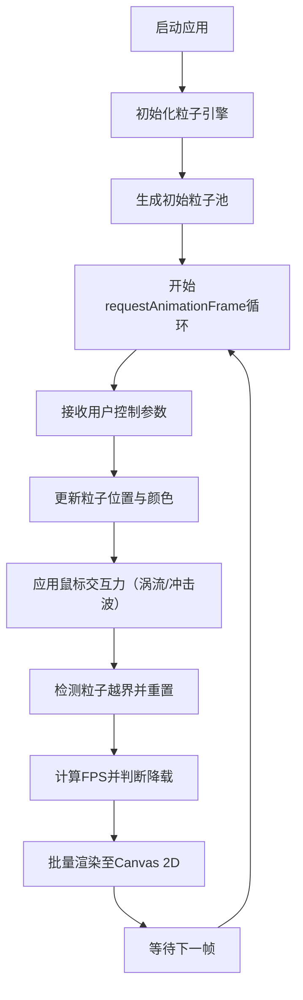
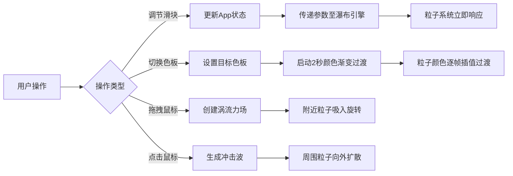

## 1. 产品概述

「流光像素瀑布」是一款基于浏览器的交互式数字艺术生成器，专为数字艺术爱好者和创意人群打造。通过高性能Canvas 2D渲染引擎，实时生成数千个彩色像素粒子从高处倾泻而下的动态瀑布效果，用户可通过直观的控制面板调节各项参数，并通过鼠标交互产生涡流、冲击波等视觉反馈。

- **核心目标**：提供沉浸式、可交互的像素粒子艺术创作体验
- **目标用户**：数字艺术爱好者、视觉设计师、创意开发者
- **市场价值**：填补浏览器端高性能像素粒子艺术工具的空白，兼具观赏性与交互性

## 2. 核心特性

### 2.1 功能模块清单

1. **主画布页面**：全屏Canvas渲染区、FPS性能监视器、控制面板
2. **粒子系统引擎**：5000+像素粒子实时渲染、尾迹效果、碰撞重置
3. **动态颜色系统**：5种预设色板、2秒平滑过渡动画
4. **参数控制面板**：粒子密度、坠落速度、生成频率滑块
5. **交互反馈系统**：鼠标拖拽涡流、点击冲击波
6. **性能自适应系统**：FPS监控、自动降载机制
7. **响应式布局**：桌面悬浮面板、移动端抽屉式面板

### 2.2 页面详情

| 页面名称 | 模块名称 | 功能描述 |
|-----------|-------------|---------------------|
| 主画布页 | 全屏Canvas区域 | 占据整个视口，渲染像素瀑布粒子流，支持鼠标拖拽涡流和点击冲击波交互 |
| 主画布页 | FPS性能计数器 | 右上角实时显示当前帧率，低于30fps时触发自动降载 |
| 主画布页 | 控制面板（桌面） | 右下方半透明磨砂玻璃悬浮面板，包含色板切换按钮和三个调节滑块 |
| 主画布页 | 控制面板（移动端） | 底部抽屉式面板，默认折叠为图标，点击后从底部滑入展开 |

## 3. 核心流程

### 3.1 主渲染循环

### 3.2 用户交互流程

## 4. 用户界面设计

### 4.1 设计风格

- **主色调**：深空黑背景 `#0a0a0f`，半透明磨砂玻璃面板 `rgba(20,20,30,0.6)`
- **色板主题**：
  - 极光绿-蓝：`#00ff88 → #00aaff`
  - 日落橙-紫：`#ff8800 → #aa00ff`
  - 霓虹粉-黄：`#ff00aa → #ffee00`
  - 深海蓝-白：`#0044ff → #ffffff`
  - 熔岩红-金：`#ff2200 → #ffcc00`
- **按钮风格**：圆角 `8px`，点击 `scale(0.95→1.0)` 过渡 `100ms`
- **滑块风格**：渐变填充轨道，圆形手柄，圆角设计
- **字体**：现代无衬线字体，清晰可辨的数字显示用于FPS计数器
- **布局风格**：桌面端悬浮式控制面板，桌面优先布局
- **视觉动效**：粒子尾迹透明度渐变（1.0→0.3，持续0.5秒），色板切换平滑过渡

### 4.2 页面设计概览

| 页面名称 | 模块名称 | UI元素 |
|-----------|-------------|-------------|
| 主画布页 | 全屏Canvas | 深色背景`#0a0a0f`，像素粒子流带尾迹，动态彩色渐变 |
| 主画布页 | FPS计数器 | 右上角固定定位，等宽字体数字，60fps绿色/45fps黄色/30fps红色 |
| 主画布页 | 控制面板（桌面） | 右下角悬浮，磨砂玻璃效果`rgba(20,20,30,0.6)`，1px白色边框，内部padding |
| 主画布页 | 控制面板（移动） | 底部抽屉，默认显示圆形展开按钮，点击后从底部向上滑入 |

### 4.3 响应式设计

- **桌面优先**：默认1024px+视口完整展示悬浮控制面板
- **平板适配**：768px-1024px控制面板缩小尺寸，滑块紧凑排列
- **移动端适配**：<768px控制面板折叠为右下角抽屉图标，点击后底部滑入全屏半高面板，触摸事件替代鼠标事件

### 4.4 性能预算

- **Canvas渲染目标**：60fps，单帧渲染时间<16ms
- **粒子数量**：默认5000，最高10000，动态自适应
- **内存占用**：粒子数据结构紧凑，单粒子占用<64字节
- **浏览器兼容**：Chrome最新版、Firefox最新版
