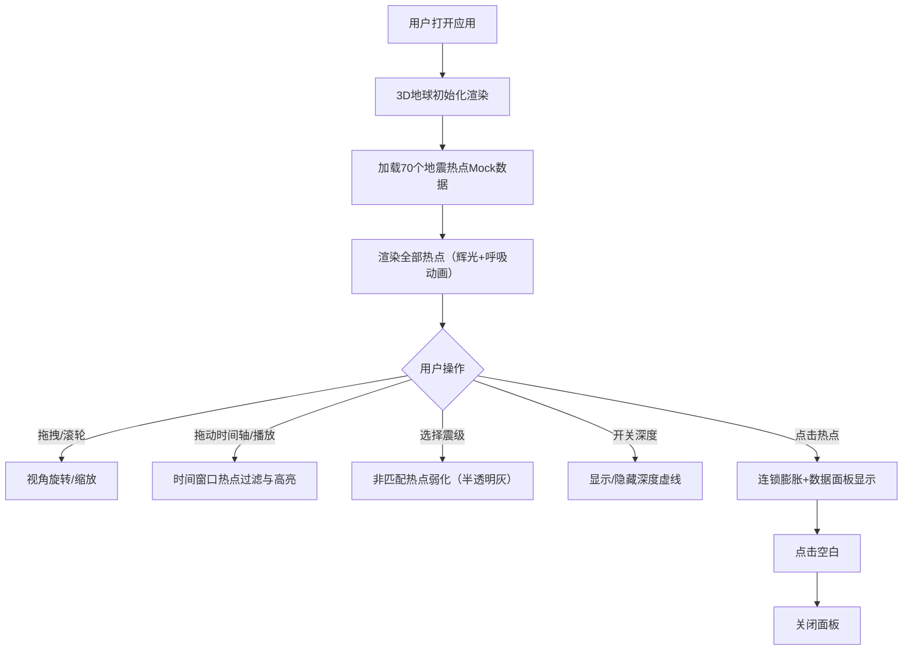
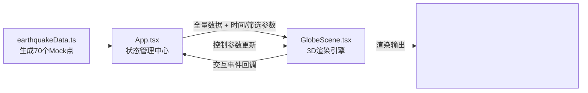

# 地动之眼（Earthquake Eye）产品需求文档

## 1. 产品概述

「地动之眼」是面向数据新闻编辑与公众的全球实时地震数据3D交互式可视化工具。通过三维地球场景直观呈现地震发生的地理位置、震级、深度与频次变化，支持时间轴动态回放、空间筛选与热点交互分析。

- **核心目标**：让非专业用户直观理解全球地震活动的时空分布规律
- **目标用户**：数据新闻记者、科普工作者、教育工作者、对地球科学感兴趣的公众
- **产品价值**：将抽象的地震数据转化为可交互、可探索的沉浸式视觉体验

---

## 2. 核心功能

### 2.1 用户角色

| 角色 | 进入方式 | 核心权限 |
|------|----------|----------|
| 数据新闻编辑 | 浏览器直接访问 | 创建内容、筛选数据、导出截图、时间轴控制 |
| 普通用户 | 浏览器直接访问 | 浏览3D场景、交互热点、时间轴回放 |

### 2.2 功能模块

1. **3D地球场景模块**：高分辨率地壳纹理地球、自转控制、鼠标拖拽旋转、滚轮缩放
2. **地震热点渲染模块**：70个模拟热点，震级映射半径与颜色，深度映射透明度，辉光光晕效果
3. **时间轴回放模块**：0-24小时滑块，播放/暂停/倍速控制（1x/2x/4x），时间窗口热点显示
4. **热点交互与聚类模块**：点击触发连锁膨胀动画、数据面板、粒子爆炸效果
5. **筛选与高亮模块**：震级筛选下拉（4-6/6-8/8-9/全部）、深度可视化虚线开关

### 2.3 页面详情

| 页面名称 | 模块名称 | 功能描述 |
|----------|----------|----------|
| 主页面 | 3D地球场景 | 渲染地壳纹理地球，支持OrbitControls阻尼旋转与缩放，自转速度0.5°/s可暂停 |
| 主页面 | 地震热点粒子群 | 70个发光球体，半径1-8线性映射震级4-9，透明度0.3-0.9映射深度，颜色绿→红渐变，1.5倍光晕 |
| 主页面 | 时间轴控件 | 底部毛玻璃风格时间轴，范围0-24h，播放按钮含1x/2x/4x倍速切换，±30min时间窗口 |
| 主页面 | 震级筛选面板 | 左上角下拉筛选器，不符合条件热点变为半透明灰色且不响应点击 |
| 主页面 | 深度可视化开关 | 左上角toggle开关，开启后显示深度比例虚线（1:10比例尺） |
| 主页面 | 热点信息面板 | 点击热点后显示浮层：震级、深度、时间戳、经纬度；点击空白处关闭 |

---

## 3. 核心流程

### 3.1 用户主流程

用户打开应用后，默认看到自转的3D地球及全部地震热点。用户可通过拖拽旋转视角、滚轮缩放远近。拖动底部时间轴或点击播放，观察不同时段地震活动分布。通过左上角震级筛选聚焦特定规模地震，开启深度可视化辅助理解震源结构。点击任意热点触发连锁膨胀动画并查看详细数据。

### 3.2 数据流向

---

## 4. 用户界面设计

### 4.1 设计风格

- **主色调**：深空黑 #0a0a1a（背景）、翠绿 #00ff88（低震级）、深红 #ff0044（高震级）
- **辅助色**：毛玻璃白 rgba(255,255,255,0.08)、边框线 rgba(255,255,255,0.3)
- **地球纹理**：高分辨率地壳卫星贴图（程序生成蓝色大理石纹 + 大陆浅绿纹理）
- **辉光效果**：UnrealBloomPass（强度0.3，半径0.5，阈值0.1）
- **字体**：标题使用 Space Grotesk，正文使用 Inter（等宽数字用于震级显示）
- **按钮风格**：圆角8px，半透明毛玻璃，悬停时 scale:1.05（0.2s平滑），点击回弹 0.95→1.05→1.0（0.15s）

### 4.2 页面设计概览

| 页面区域 | 模块名称 | UI元素与动效 |
|----------|----------|--------------|
| 全屏背景 | 深空场景 | #0a0a1a 纯色 + 微妙噪点纹理，轻微径向渐变中心稍亮 |
| 画面中心 | 3D地球 | 半径2的球体，蓝色纹理带大陆区块，柔和方向光+环境光 |
| 画面中心 | 地震热点 | 发光球体 + 光晕，当前时间窗口热点有呼吸动画（2s周期） |
| 顶部区域 | 标题栏 | 「地动之眼」大标题 + 副标题副标题「全球地震实时可视化」，左对齐，20px内边距 |
| 左上角 | 筛选面板 | 毛玻璃卡片，含震级筛选下拉 + 深度显示开关，悬停背景提升至rgba(255,255,255,0.15) |
| 左上角 | 自转控制 | 播放/暂停按钮（地球自转），圆形图标按钮 |
| 底部 | 时间轴控件 | 毛玻璃长条，进度条+刻度+播放按钮组+倍速切换，时间标签显示HH:MM |
| 热点旁 | 数据面板 | 浮层卡片，震级大号数字、深度、时间、经纬度，小箭头指向热点 |

### 4.3 响应式设计

- **桌面端（≥768px）**：时间轴横向展开为全长条，筛选面板固定左上角
- **移动端（<768px）**：
  - 时间轴折叠为右下角悬浮圆形按钮，点击展开全屏模态时间轴
  - 筛选面板整合入顶部汉堡菜单
  - 字号整体缩小1级，触控目标≥44×44px
  - 地球默认半径缩小为1.6

### 4.4 3D场景指导

- **环境与氛围**：深空 #0a0a1a 背景，无HDRI，手动灯光模拟太阳光
- **灯光设置**：方向光1盏（强度1.2，位置(5,3,5)）+ 半球光（天#1a1a3a/地#0a0a1a，强度0.4）+ 热点自发光
- **相机设置**：PerspectiveCamera fov 45，初始位置 (0,0,6)，目标点原点
- **交互方式**：OrbitControls（enableDamping=true, dampingFactor=0.1, minDistance=1, maxDistance=10）
- **动画系统**：地球自转（0.5°/s 可暂停），热点呼吸（sin波形2s周期），连锁膨胀（easeOutQuad 1s），粒子爆炸（requestAnimationFrame驱动，300粒子上限）
- **后期处理**：EffectComposer → RenderPass → UnrealBloomPass(strength 0.3, radius 0.5, threshold 0.1)
- **性能策略**：热点使用 InstancedMesh（≤80实例，1次draw call），粒子爆炸使用 BufferGeometry + Points

---
