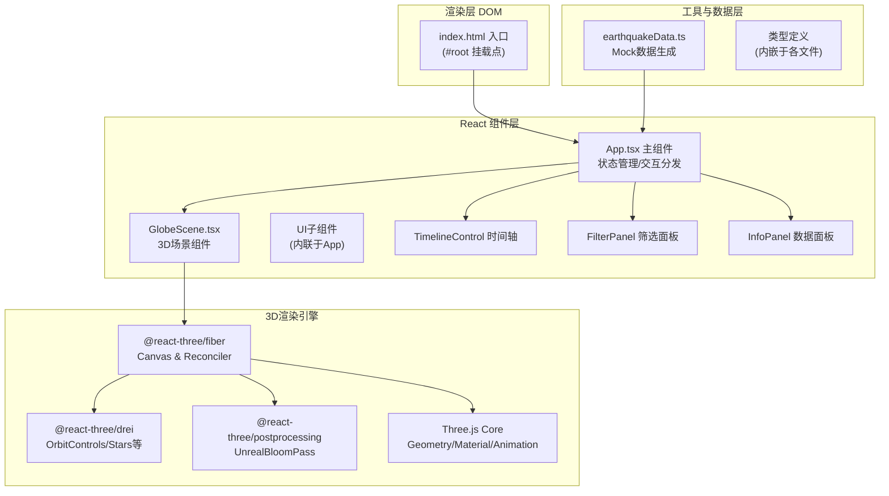

# 地动之眼（Earthquake Eye）技术架构文档

## 1. 架构设计



## 2. 技术栈说明

| 层级 | 技术选型 | 版本建议 | 用途说明 |
|------|----------|----------|----------|
| 前端框架 | React | ^18.2.0 | UI组件化、状态管理、Hooks生命周期 |
| 语言 | TypeScript | ^5.0.0 | 严格类型约束、ES2020目标编译 |
| 构建工具 | Vite | ^5.0.0 | 极速HMR开发、ESBuild编译、生产打包 |
| Vite插件 | @vitejs/plugin-react | ^4.0.0 | React JSX/TSX转换、Fast Refresh |
| 3D引擎 | three | ^0.160.0 | WebGL底层：几何体、材质、相机、灯光 |
| R3F | @react-three/fiber | ^8.15.0 | Three.js React声明式绑定、reconciler |
| drei | @react-three/drei | ^9.90.0 | 常用3D组件：OrbitControls、Stars、Billboard等 |
| 后期处理 | @react-three/postprocessing | ^2.15.0 | EffectComposer + UnrealBloomPass辉光 |
| 类型定义 | @types/three | ^0.160.0 | Three.js TypeScript类型支持 |

**构建命令**：
- 开发启动：`npm run dev`（vite --host --port 5173）
- 生产构建：`npm run build`（tsc + vite build）
- 类型检查：`npm run check`（tsc --noEmit）

---

## 3. 路由定义

本应用为**单页无路由**（SPA单视图），所有功能模块均在同一页面内通过组件状态切换呈现。

| 路由路径 | 组件挂载 | 用途 |
|----------|----------|------|
| `/` | App.tsx → GlobeScene + UI组件 | 主应用视图，全屏3D场景叠加交互控件 |

---

## 4. 数据模型定义

### 4.1 地震数据点类型

```typescript
interface EarthquakePoint {
  id: number;              // 唯一标识 0-69
  lat: number;             // 纬度 -90 ~ 90
  lon: number;             // 经度 -180 ~ 180
  depth: number;           // 深度 km (0 ~ 700，实际使用0-300区间)
  magnitude: number;       // 震级 4.0 ~ 9.0
  timestamp: number;       // 时间戳 (ms)，范围：基准时间 + 0~24h
}
```

### 4.2 应用状态类型

```typescript
interface AppState {
  // 时间控制
  currentTime: number;         // 当前回放时间 (ms偏移量 0~86400000)
  isPlaying: boolean;          // 是否正在播放
  playbackSpeed: 1 | 2 | 4;    // 播放倍速
  // 筛选控制
  magnitudeFilter: 'all' | '4-6' | '6-8' | '8-9';
  showDepth: boolean;          // 是否显示深度虚线
  // 自转控制
  autoRotate: boolean;         // 地球自转开关
  // 交互状态
  selectedId: number | null;   // 当前点击选中的热点id
  chainAnimIds: Set<number>;   // 连锁膨胀动画中的热点id集合
}
```

### 4.3 参数映射公式

| 参数 | 输入范围 | 输出范围 | 映射公式 |
|------|----------|----------|----------|
| 半径 | 震级 4~9 | 1~8 | r = 1 + (magnitude - 4) * 7/5 |
| 透明度 | 深度 0~300km | 0.3~0.9 | a = 0.9 - (depth/300) * 0.6 |
| 颜色 | 震级 4~9 | #00ff88 ~ #ff0044 | RGB线性插值 t=(m-4)/5 |
| 时间窗口 | 当前±30min | 显示/虚影 | |t_evt - t_cur| ≤ 1800000 |
| 连锁范围 | 200km地表距离 | 被波及集合 | 大圆圆心角 < 200/6371 rad |

---

## 5. 文件结构与调用关系

```
auto8/
├── .trae/documents/
│   ├── 地动之眼-PRD.md          # 产品需求文档
│   └── 地动之眼-技术架构.md      # 本文档
├── package.json                  # 依赖声明 (见下方6.1)
├── vite.config.js                # Vite + React + TS 配置
├── tsconfig.json                 # 严格模式 TS 配置
├── index.html                    # 全屏黑色背景入口
└── src/
    ├── main.tsx                  # React入口：<App /> 挂载到 #root
    │     ↑ 被 index.html 引用
    ├── App.tsx                   # 主组件（状态中心 + UI组装）
    │     ↓ 导入: earthquakeData.ts → 使用 generateEarthquakes()
    │     ↓ 导入: GlobeScene.tsx → 传递 props: {data, filters, time, callbacks}
    │     内含: TimelineControl / FilterPanel / InfoPanel (子组件)
    ├── components/
    │   └── GlobeScene.tsx        # 3D场景核心组件
    │         ↓ 使用: <Canvas> / <OrbitControls> (drei)
    │         ↓ 内含: <Earth> 子组件 (球体+纹理)
    │         ↓ 内含: <EarthquakePoints> (InstancedMesh)
    │         ↓ 内含: <ExplosionParticles> (Points)
    │         ↓ 内含: <DepthLines> (LineSegments，开关控制)
    │         ↓ 使用: <EffectComposer> + <Bloom> (postprocessing)
    └── utils/
        └── earthquakeData.ts     # Mock数据生成器
              ↓ 输出: generateEarthquakes(): EarthquakePoint[]
```

**组件调用链（自上而下）**：

1. `index.html` → `main.tsx` → `<App />`
2. `App.tsx` → `generateEarthquakes()` 获取70条数据
3. `App.tsx` → 管理所有状态（时间、筛选、选中热点）
4. `App.tsx` → 渲染 `<GlobeScene {...props} />` + 顶层UI覆盖层
5. `GlobeScene.tsx` → `<Canvas>` → `<Earth />` + `<EarthquakePoints />` + `<EffectComposer>`
6. 用户点击热点 → `GlobeScene` 回调 → `App` 更新 `selectedId` → 重新渲染 `InfoPanel`

---

## 6. 配置文件规范

### 6.1 package.json 依赖清单

```json
{
  "name": "earthquake-eye",
  "private": true,
  "version": "1.0.0",
  "type": "module",
  "scripts": {
    "dev": "vite",
    "build": "tsc -b && vite build",
    "check": "tsc --noEmit",
    "preview": "vite preview"
  },
  "dependencies": {
    "react": "^18.2.0",
    "react-dom": "^18.2.0",
    "three": "^0.160.0",
    "@react-three/fiber": "^8.15.0",
    "@react-three/drei": "^9.90.0",
    "@react-three/postprocessing": "^2.15.0"
  },
  "devDependencies": {
    "typescript": "^5.2.2",
    "vite": "^5.0.0",
    "@vitejs/plugin-react": "^4.2.0",
    "@types/three": "^0.160.0",
    "@types/react": "^18.2.0",
    "@types/react-dom": "^18.2.0"
  }
}
```

### 6.2 vite.config.js

```javascript
import { defineConfig } from 'vite'
import react from '@vitejs/plugin-react'

export default defineConfig({
  plugins: [react()],
  server: {
    port: 5173,
    host: true,
    open: false
  }
})
```

### 6.3 tsconfig.json

```json
{
  "compilerOptions": {
    "target": "ES2020",
    "useDefineForClassFields": true,
    "lib": ["ES2020", "DOM", "DOM.Iterable"],
    "module": "ESNext",
    "skipLibCheck": true,
    "moduleResolution": "bundler",
    "allowImportingTsExtensions": false,
    "resolveJsonModule": true,
    "isolatedModules": true,
    "noEmit": true,
    "jsx": "react-jsx",
    "strict": true,
    "noUnusedLocals": false,
    "noUnusedParameters": false,
    "noFallthroughCasesInSwitch": true
  },
  "include": ["src"]
}
```

---

## 7. 性能预算与优化策略

| 指标 | 目标值 | 实现手段 |
|------|--------|----------|
| FPS | 稳定60 | InstancedMesh合并热点；避免每帧创建新对象 |
| Draw Calls | ≤20 | 热点≤80个用InstancedMesh；粒子用Points |
| 内存占用 | ≤200MB | 程序生成纹理避免外部资源；粒子爆炸上限300个 |
| 首屏加载 | ≤3s | 纯前端无后端；所有依赖Esm预构建；代码体积<1MB |
| 包体积 (gzip) | ≤500KB | Three.js按需引入；无UI库依赖 |

**关键实现注意事项**：

1. **热点合并渲染**：使用 `THREE.InstancedMesh` 渲染全部70个球体与光晕，通过 `setMatrixAt()` 和 `setColorAt()` 每帧更新实例矩阵，仅产生2次draw call
2. **动画循环**：使用 `useFrame()` hook（R3F封装requestAnimationFrame），在同一回调中完成地球自转、呼吸动画、连锁膨胀、粒子爆炸更新
3. **避免GC卡顿**：每帧复用临时 `THREE.Matrix4`、`THREE.Vector3`、`THREE.Color` 对象，不在 `useFrame` 内部 `new` 任何对象
4. **深度虚线**：使用 `THREE.LineSegments` + `BufferGeometry`，在 `showDepth` 切换时挂载/卸载整组对象，不在每帧重建几何
5. **CSS层面**：UI覆盖层使用 `position: fixed` + `pointer-events: auto`（仅交互区域），3D Canvas用 `pointer-events: auto`，避免不必要的合成层重绘

---
