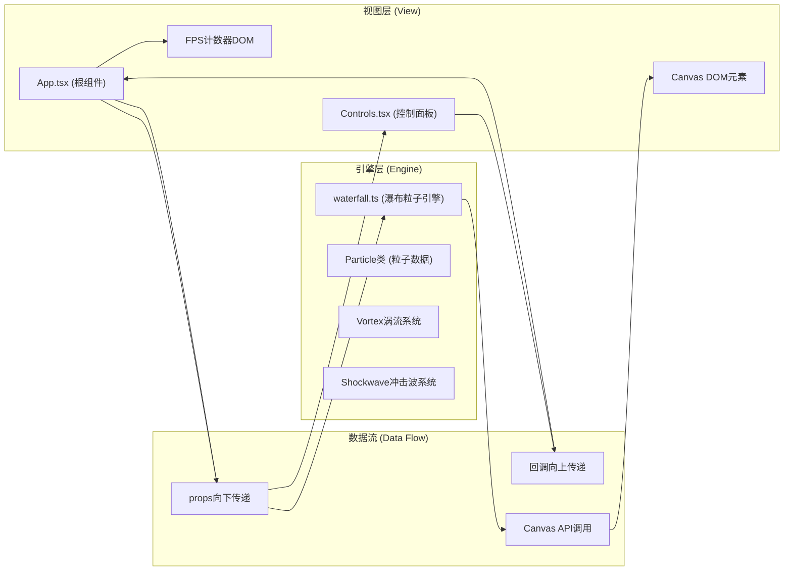
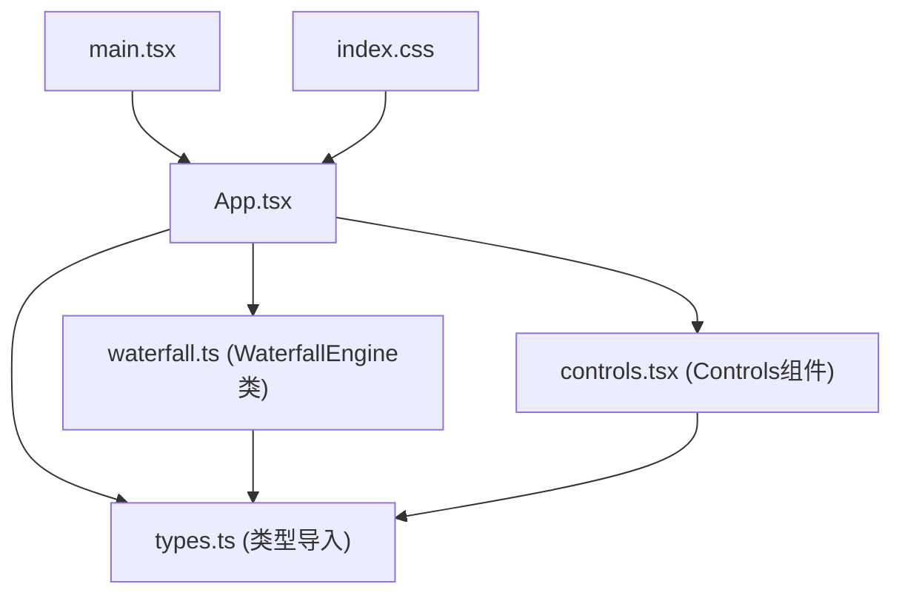

## 1. 架构设计



**调用关系说明：**
1. `App.tsx` → 持有瀑布配置状态，通过props传递给`Controls.tsx`和`waterfall.ts`引擎实例
2. `Controls.tsx` → 用户交互触发回调，更新`App.tsx`中的状态
3. `waterfall.ts` → 独立的粒子引擎类，接收配置参数，直接操作Canvas 2D上下文
4. 数据单向流动：Controls → App → WaterfallEngine → Canvas，避免循环依赖

## 2. 技术选型说明

| 技术 | 版本 | 用途 | 选型理由 |
|-------|------|------|---------|
| React | ^18.2.0 | UI框架 | 用户要求指定，组件化开发便于控制面板与Canvas解耦 |
| ReactDOM | ^18.2.0 | DOM渲染 | 配合React使用 |
| TypeScript | ^5.3.0 | 类型系统 | 用户要求严格模式，保证类型安全与可维护性 |
| Vite | ^5.1.0 | 构建工具 | 用户要求指定，极速热更新与启动速度，适用于Canvas高频渲染调试 |
| @vitejs/plugin-react | ^4.2.0 | Vite React插件 | 支持JSX编译与HMR |
| Canvas 2D API | 原生 | 粒子渲染 | 1px像素粒子性能最优，比WebGL实现更简单且足够5000+粒子 |
| requestAnimationFrame | 原生 | 渲染循环 | 浏览器原生帧同步，60fps动画标准 |
| CSS Modules/内联样式 | 原生 | 样式 | 轻量无依赖，磨砂玻璃效果通过CSS backdrop-filter实现 |

## 3. 文件结构与职责

```
project-root/
├── package.json                  # 项目依赖与脚本 (npm run dev启动)
├── vite.config.js                # Vite配置：React插件、端口号、服务器配置
├── tsconfig.json                 # TS严格模式配置：strict:true、esModuleInterop等
├── index.html                    # 入口HTML：挂载点<div id="root"></div>
└── src/
    ├── App.tsx                   # 根组件：状态管理、引擎初始化、响应式判断
    ├── main.tsx                  # 应用入口：ReactDOM.createRoot挂载
    ├── waterfall.ts              # 瀑布引擎：核心类WaterfallEngine
    ├── controls.tsx              # 控制面板组件：滑块、按钮、响应式抽屉
    ├── types.ts                  # 共享类型定义（可选，便于引用）
    └── index.css                 # 全局样式：CSS Reset、字体、根元素大小
```

### 文件间调用关系图


## 4. 核心模块设计

### 4.1 瀑布引擎模块 (waterfall.ts)

**核心类：WaterfallEngine**

```typescript
// 公开接口
interface WaterfallEngineConfig {
  particleCount: number;      // 粒子总数 1000-10000
  fallSpeed: number;          // 坠落速度 0.5-3.0
  spawnRate: number;          // 生成频率 1-10
  colorPalette: ColorPalette; // 当前色板
}

interface Particle {
  x: number; y: number;       // 位置
  vx: number; vy: number;     // 速度
  colorIndex: number;         // 色板索引 (0-1)
  life: number;               // 生命值用于尾迹透明度
  size: 1;                    // 固定1px
}

class WaterfallEngine {
  constructor(canvas: HTMLCanvasElement)
  setConfig(config: Partial<WaterfallEngineConfig>): void
  setTargetPalette(palette: ColorPalette): void  // 启动2秒过渡
  createVortex(x: number, y: number): void       // 鼠标拖拽涡流
  createShockwave(x: number, y: number): void    // 点击冲击波
  updateVortexPosition(x: number, y: number): void
  clearVortex(): void
  onFpsUpdate(callback: (fps: number) => void): void
  start(): void
  stop(): void
  destroy(): void
}
```

**渲染循环内部流程：**
1. 半透明背景填充（`rgba(10,10,15,0.15)`）实现尾迹拖影
2. 遍历活动粒子：更新位置→应用涡流/冲击波力→检测越界重置
3. 根据生成频率补充新粒子到池
4. 颜色插值：粒子`colorIndex`在当前色板与目标色板之间按过渡进度插值
5. 批量`fillRect`绘制像素（避免状态切换开销）
6. FPS计算：`performance.now()`时间差滑动窗口平均

### 4.2 控制面板模块 (controls.tsx)

```typescript
interface ControlsProps {
  particleCount: number;
  fallSpeed: number;
  spawnRate: number;
  currentPalette: PaletteName;
  isMobile: boolean;
  onParticleCountChange: (v: number) => void;
  onFallSpeedChange: (v: number) => void;
  onSpawnRateChange: (v: number) => void;
  onPaletteChange: (p: PaletteName) => void;
}
```

**桌面端布局**：右下方绝对定位悬浮面板
**移动端布局**：`useMediaQuery`检测<768px，使用`useState`管理抽屉展开状态，`transform: translateY`滑入动画

### 4.3 App.tsx根组件状态管理

```typescript
// useState定义
const [particleCount, setParticleCount] = useState(5000);
const [fallSpeed, setFallSpeed] = useState(1.0);
const [spawnRate, setSpawnRate] = useState(5);
const [currentPalette, setCurrentPalette] = useState<PaletteName>('aurora');
const [fps, setFps] = useState(60);
const [isMobile, setIsMobile] = useState(false);
const [autoReduced, setAutoReduced] = useState(false); // 标记是否已自动降载
```

**useRef使用**：
- `canvasRef`：Canvas DOM引用
- `engineRef`：WaterfallEngine实例引用（避免重渲染重新创建）

**useEffect副作用**：
1. 引擎初始化（仅一次，deps=[]）
2. 配置变更→`engineRef.current.setConfig(...)`
3. 色板变更→`engineRef.current.setTargetPalette(...)`
4. FPS监听回调→低于30fps触发自动降载：`setParticleCount(v => Math.floor(v * 0.7))`
5. 响应式监听：`window.matchMedia('(max-width: 768px)')`
6. 组件卸载→`engineRef.current.destroy()`清理

## 5. 性能优化策略

### 5.1 Canvas渲染优化
- **离屏缓冲**：粒子预计算颜色，避免每帧`createLinearGradient`
- **批量绘制**：相同颜色粒子合并到一次`fillRect`调用或使用`ImageData`
- **背景拖影**：使用半透明`fillRect`而非每次清屏，天然实现尾迹
- **DPR适配**：`window.devicePixelRatio`缩放Canvas分辨率但CSS尺寸不变

### 5.2 粒子数据优化
- **数组而非对象**：使用`Float32Array`存储位置、速度数组（SoA布局）减少GC
- **对象池模式**：粒子越界不销毁而是重置属性到顶部，避免频繁分配
- **TypedArray**：颜色数据使用`Uint8ClampedArray`便于插值计算

### 5.3 自动降载机制
- FPS采样窗口：最近10帧的移动平均值避免抖动
- 降载冷却：触发一次降载后冷却5秒才能再次降载，避免持续降低
- 降载标记：通知用户已自动优化，提供手动恢复选项

## 6. 交互实现细节

### 6.1 涡流（鼠标拖拽）
```
作用力公式（极坐标转换）：
dx = particle.x - vortex.x
dy = particle.y - vortex.y
dist = sqrt(dx² + dy²)
if dist < vortexRadius:
  // 向心力（吸入）
  attract = (1 - dist/radius) * strength
  // 切向旋转
  angle = atan2(dy, dx) + π/2
  particle.vx += cos(angle) * rotateStrength + (-dx/dist) * attract
  particle.vy += sin(angle) * rotateStrength + (-dy/dist) * attract
```

### 6.2 冲击波（点击）
```
作用力公式（向外扩散）：
t = elapsed / 0.3s
waveRadius = startRadius + maxRadius * t
dx = particle.x - center.x
dy = particle.y - center.y
dist = sqrt(dx² + dy²)
if |dist - waveRadius| < thickness:
  force = (1 - t) * strength
  particle.vx += (dx/dist) * force
  particle.vy += (dy/dist) * force
```

### 6.3 颜色过渡
```
每帧更新进度：
progress = min(1, elapsed / 2000ms)
currentColor = lerp(fromPalette[i], toPalette[i], progress)
粒子绘制颜色 = samplePalette(currentColor, particle.colorIndex)
```

## 7. 数据流向总结

```
用户操作
   ↓ (onChange/onClick回调)
Controls.tsx
   ↓ (setState更新)
App.tsx [state: particleCount, fallSpeed, spawnRate, palette]
   ↓ (setConfig/setTargetPalette方法调用)
WaterfallEngine ←(onFpsUpdate回调)─ FPS监视 → 自动降载(→App state)
   ↓ (直接操作)
Canvas 2D Context (fillRect批量绘制)
```

整个架构严格遵循单向数据流原则，引擎层与React组件层完全解耦，引擎只操作Canvas不触碰React状态，组件只管理UI不参与粒子计算，保证渲染性能。
