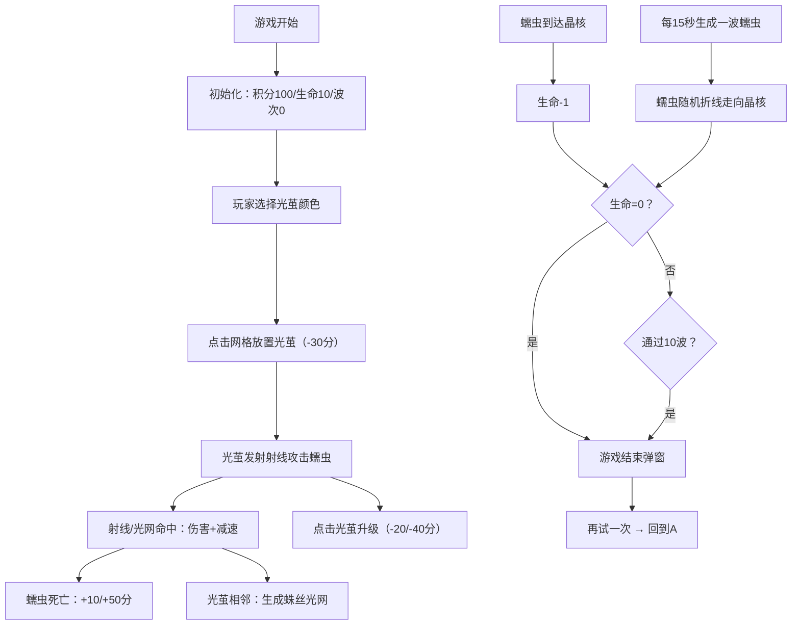

## 1. 产品概述

「光织蛛网」是一款在浏览器中运行的2D策略塔防游戏，玩家在黑暗森林背景中放置不同颜色的"光茧"塔，通过放射蛛丝射线交织成动态光网，阻挡和消灭从四周涌来的暗影蠕虫。游戏创新性地引入了动态路径生成、颜色克制机制和粒子交互反馈，解决了传统塔防游戏路径固定、视觉反馈单调的问题。

- 核心玩法：策略性放置与升级光茧塔，利用颜色克制和光网协同效应抵御10波暗影蠕虫的进攻
- 目标用户：休闲策略游戏爱好者、喜欢视觉特效的玩家
- 市场价值：以Canvas 2D实现的精美粒子特效和动态光网效果，提供差异化的塔防游戏体验

## 2. 核心功能

### 2.1 功能模块

1. **游戏主界面**：Canvas游戏画布、顶部信息栏、光茧选择面板、游戏结束弹窗
2. **光茧系统**：放置、升级、颜色选择、射线发射、脉动光环
3. **蠕虫系统**：波次生成、随机折线路径、颜色属性、精英蠕虫机制
4. **粒子与光网系统**：命中粒子特效、相邻光茧蛛丝连接、高亮闪光、光网漩涡
5. **积分与生命系统**：积分获取与消耗、生命值管理、波次进度、晶核守护

### 2.2 页面详情

| 页面名称 | 模块名称 | 功能描述 |
|-----------|-------------|---------------------|
| 游戏主界面 | Canvas画布 | 渲染游戏世界、光茧、蠕虫、粒子、光网特效 |
| 游戏主界面 | 顶部信息栏 | 显示积分、当前波次、生命值，采用磨砂玻璃效果 |
| 游戏主界面 | 光茧选择面板 | 选择红/绿/蓝光茧进行放置，显示价格和已选状态 |
| 游戏主界面 | 升级交互 | 点击已有光茧显示升级按钮，花费积分升级 |
| 游戏主界面 | 游戏结束弹窗 | 显示最终积分和波次，提供"再试一次"按钮 |

## 3. 核心流程

### 主游戏流程

玩家进入游戏 → 初始积分100、生命10点、晶核在中心 → 选择光茧颜色 → 点击网格节点放置（花费30分）→ 光茧自动发射射线 → 蠕虫从四周生成（每15秒一波，共10波）→ 射线/光网命中蠕虫造成伤害和减速 → 击杀获得积分 → 光茧可升级（1→2需20分，2→3需40分）→ 蠕虫到达晶核扣生命 → 生命归零或通过10波 → 游戏结束显示结果 → 点击再试一次重新开始

## 4. 用户界面设计

### 4.1 设计风格

- **主色调**：深绿#0A1A0A到深蓝#0A0A1A的径向渐变背景（暗色森林主题）
- **强调色**：
  - 红色光茧：#FF3333
  - 绿色光茧：#33FF33
  - 蓝色光茧：#3333FF
  - 金色精英：#FFD700
  - 晶核：#FFFFFF半透明白色
- **按钮样式**：像素风格矩形按钮，hover时颜色加深，点击时弹性缩放（0.95→1.0）
- **字体**：'Press Start 2P' 像素风格字体
- **布局风格**：全屏Canvas居中，顶部固定信息栏（磨砂玻璃效果），游戏结束弹窗居中显示
- **光效**：所有光茧、蛛丝、射线使用Canvas shadowBlur+shadowColor实现辉光效果

### 4.2 页面设计概述

| 页面名称 | 模块名称 | UI元素 |
|-----------|-------------|-------------|
| 游戏主界面 | Canvas画布 | 全屏、深绿→深蓝径向渐变、10x8网格节点（淡色显示）、晶核（旋转发光球体中心）、4个入口（上/下/左/右边缘淡色指示） |
| 游戏主界面 | 顶部信息栏 | backdrop-filter:blur(8px)、背景rgba(0,0,0,0.6)、三列布局（左：积分、中：波次、右：生命值）、Press Start 2P字体12px |
| 游戏主界面 | 光茧选择面板 | 底部三列圆形按钮（红/绿/蓝）、选中状态外发光边框、价格标签30分、hover放大效果 |
| 游戏主界面 | 游戏结束弹窗 | 半透明黑色遮罩、白色边框面板、标题"游戏结束"、两行数据（最终积分、到达波次）、绿色"再试一次"按钮 |

### 4.3 响应式设计

- 采用Desktop-first设计，适配1024x768到1920x1080分辨率
- Canvas画布按比例缩放，游戏逻辑坐标系固定（内部逻辑坐标基于网格：10x8格，每格40px → 基础逻辑尺寸400x320px，通过缩放因子适配实际画布）
- 顶部信息栏和底部选择面板采用百分比宽度和flex布局
- 字体大小随画布缩放系数等比调整
