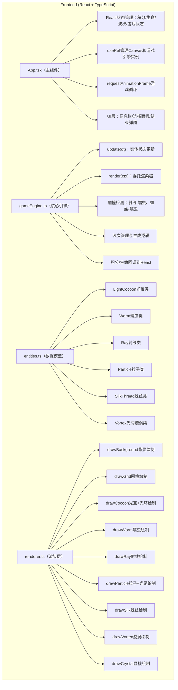

## 1. 架构设计



## 2. 技术选型说明

- **前端框架**：React@18 + TypeScript@5
- **构建工具**：Vite@5 + @vitejs/plugin-react
- **渲染引擎**：HTML5 Canvas 2D API（纯原生，无第三方游戏引擎）
- **状态管理**：React useState/useRef（轻量场景，无需zustand）
- **无后端/数据库**：纯前端游戏，游戏状态全部在内存中管理
- **初始化方式**：使用vite-init脚手架创建react-ts模板

## 3. 项目文件结构

| 文件路径 | 作用 |
|---------|------|
| `package.json` | 项目依赖与脚本（npm run dev） |
| `vite.config.js` | Vite构建配置，React插件 |
| `tsconfig.json` | TypeScript配置（严格模式，target ES2020） |
| `index.html` | 入口HTML，Canvas容器，加载Press Start 2P字体 |
| `src/App.tsx` | 主组件，游戏循环，UI渲染，事件绑定 |
| `src/gameEngine.ts` | 核心引擎：update/render循环、碰撞检测、波次管理 |
| `src/entities.ts` | 实体类定义：LightCocoon/Worm/Particle/SilkThread等 |
| `src/renderer.ts` | Canvas绘制函数集合 |

## 4. 核心数据模型

### 4.1 枚举和基础类型

```typescript
type CocoonColor = 'red' | 'green' | 'blue';
type WormColor = CocoonColor | 'gold';
type GameStatus = 'playing' | 'won' | 'lost';

interface Vec2 { x: number; y: number; }
```

### 4.2 实体类属性概览

| 类名 | 关键属性 |
|------|---------|
| LightCocoon | position(Vec2), color, level(1-3), fireInterval, rayLength, lastFireTime, rotation, fadeInAlpha, pulsePhase |
| Worm | position, color, hp, maxHp, speed, pathTarget, turnTimer, slowTimer, isElite, hitFlashTimer |
| Ray | start, end, color, lifetime, ownerId |
| Particle | position, velocity, color, radius, lifetime, maxLifetime, trail（光尾数组） |
| SilkThread | from(Vec2), to(Vec2), level, pulsePhase, opacity |
| Vortex | position, rotation, radius, cocoonCount |

### 4.3 颜色克制伤害表

| 光茧颜色 ↓ \ 蠕虫颜色 → | 红色 | 绿色 | 蓝色 | 金色 |
|-----------------------|------|------|------|------|
| 红色 | ×0.8 | ×1.5 | ×1.0 | ×1.0 |
| 绿色 | ×1.0 | ×0.8 | ×1.5 | ×1.0 |
| 蓝色 | ×1.5 | ×1.0 | ×0.8 | ×1.0 |

### 4.4 升级数据

| 等级 | 发射间隔 | 射线长度 | 光环半径 | 蛛丝脉动频率 | 升级花费 |
|------|---------|---------|---------|------------|---------|
| 1级 | 0.20s | 120px | 20px | 1Hz | 放置30分 |
| 2级 | 0.16s | 150px | 25px | 1.5Hz | 20分 |
| 3级 | 0.12s | 180px | 30px | 2Hz | 40分 |

## 5. 性能优化策略

- **粒子池限制**：粒子总数上限300，超出后按FIFO淘汰最旧粒子
- **光茧限制**：最多同时存在15个光茧
- **空间索引**：蠕虫位置按网格分块，光茧射线检测只检查附近网格块
- **组合数计算**：蛛丝距离检测每0.25秒重新计算一次（非每帧），避免O(n²)每帧计算
- **Canvas优化**：
  - 静态元素（背景、网格）离屏缓存到OffscreenCanvas
  - 批量绘制相同颜色的粒子/射线，减少状态切换
  - 使用整数坐标避免抗锯齿开销
- **60FPS目标**：update逻辑固定dt步长，render帧率跟随显示器刷新率
