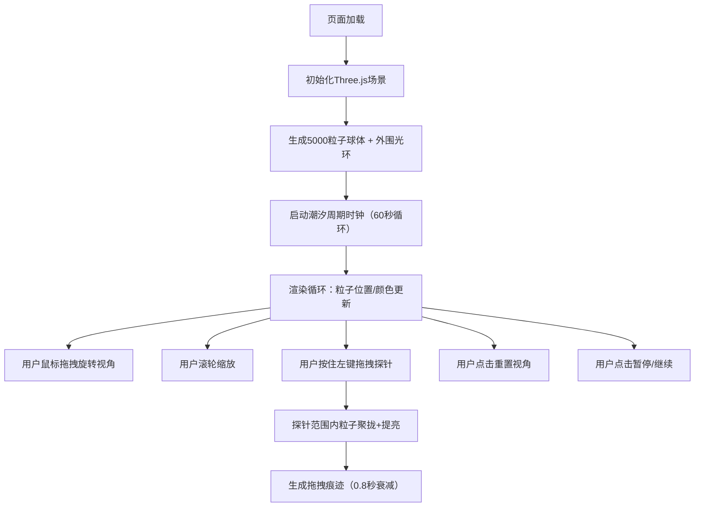

## 1. 产品概述

潮汐星盘是一个基于WebGL的三维交互可视化应用，通过Three.js构建由数千颗光点构成的动态星盘，模拟引力潮汐作用下的流体运动效果和色彩周期变化，为用户提供沉浸式的太空美学交互体验。

- 核心目的：解决传统静态星盘缺乏动态流体运动和色彩周期变化的沉浸感问题
- 目标用户：天文爱好者、视觉设计师、交互体验探索者
- 产品价值：通过粒子系统、潮汐周期模拟和探针交互，创造具有艺术美感和探索性的3D可视化体验

## 2. 核心特性

### 2.1 用户角色

| 角色 | 注册方式 | 核心权限 |
|------|----------|----------|
| 访客用户 | 无需注册，直接访问 | 自由观察星盘、拖拽旋转视角、滚轮缩放、探针交互、重置视角、暂停潮汐 |

### 2.2 功能模块

1. **主视口页面**：3D星盘渲染场景、潮汐粒子系统、外围光环、探针交互、UI覆盖层

### 2.3 页面详情

| 页面名称 | 模块名称 | 功能描述 |
|----------|----------|----------|
| 主视口 | 潮汐粒子系统 | 5000个粒子分布在球体表面，随潮汐相位沿法向偏移0-0.3单位，颜色从#87CEEB到#8A2BE2线性插值形成波浪 |
| 主视口 | 外围粒子光环 | 星盘外围半径大10%的粒子环，每秒旋转0.2弧度，永续旋转 |
| 主视口 | 探针交互系统 | 按住鼠标左键拖拽圆形探针（半径40px），探针周围80单位内粒子朝中心偏移0.5单位，亮度提升50%持续1.5秒，拖拽路径留下0.8秒发光痕迹 |
| 主视口 | 潮汐周期指示器 | 右下角半透明圆形进度环（直径100px），填充色绿(#00FF00)红(#FF0000)过渡，显示涨潮/退潮/高潮/低潮文本，60秒旋转一圈 |
| 主视口 | 视角重置按钮 | 左上角按钮，恢复默认距离15单位、角度0度 |
| 主视口 | 暂停潮汐按钮 | 左上角按钮，冻结粒子运动和颜色变化，指示器停止旋转并闪烁提示 |
| 主视口 | 自适应视角系统 | 环绕旋转0-360度，缩放距离5-30单位，粒子尺寸随缩放从2px动态收缩到0.5px |

## 3. 核心流程

用户访问页面后进入主视口，星盘自动开始潮汐周期运动，用户可通过鼠标自由观察和交互：

## 4. 用户界面设计

### 4.1 设计风格

- **主色调**：深空背景 #0B0C10，粒子色 #87CEEB（淡蓝）→ #8A2BE2（深紫），指示器 #00FF00（绿）→ #FF0000（红）
- **按钮风格**：毛玻璃半透明（backdrop-filter: blur(10px)），圆角矩形，微弱发光边框（box-shadow: 0 0 8px rgba(255,255,255,0.3)），悬停时发光增强至16px
- **字体**：无衬线现代字体，UI文本使用白色半透明
- **布局风格**：全屏沉浸式，UI元素浮于3D场景之上，绝对定位四角布局
- **视觉特色**：深空星芒氛围、动态流体色彩波浪、粒子光晕、毛玻璃控件

### 4.2 页面设计概览

| 页面名称 | 模块名称 | UI元素 |
|----------|----------|----------|
| 主视口 | 3D星盘 | 球体粒子集群，随潮汐波动起伏，颜色流动渐变，法向位移形成立体波浪纹理 |
| 主视口 | 外围光环 | 稀疏粒子组成的旋转环，半径1.1倍星盘，柔和发光 |
| 主视口 | 探针光标 | 圆形半透明光环（半径40px），按住拖拽时出现，白色边缘发光 |
| 主视口 | 拖拽痕迹 | 沿路径的发光点序列，透明度从1线性衰减至0，存在0.8秒 |
| 主视口 | 潮汐指示器 | 右下角圆形进度环，SVG绘制，环内文字指示潮汐状态 |
| 主视口 | 控制按钮组 | 左上角两个按钮，垂直排列，重置视角在上，暂停/继续在下 |

### 4.3 响应式设计

- 桌面端优先设计，视口自适应全屏
- UI元素使用固定像素尺寸，确保视觉一致性
- 触摸设备支持：双指捏合缩放、单指拖拽旋转视角、长按拖拽探针

### 4.4 3D场景指引

- **环境与氛围**：纯深空 #0B0C10 背景，无需HDRI，添加细微星点尘埃粒子增强深度感
- **光照设置**：场景使用Additive Blending进行粒子渲染，无传统光源，粒子自发光
- **相机设置**：PerspectiveCamera，默认距离15单位，fov 60度，near 0.1，far 1000，OrbitControls环绕控制
- **相机运动**：OrbitControls支持环绕旋转、缩放、禁用平移，最小距离5，最大距离30
- **构图与焦点**：星盘居中占视口60%，景深自然由缩放控制，UI四角分布不遮挡中心主体
- **交互与动画**：粒子每帧根据潮汐相位更新位置和颜色，光环匀速旋转，探针交互实时响应
- **后处理效果**：可选Bloom效果增强粒子辉光，控制性能开销
- **性能预算**：粒子总数5000+光环粒子，每帧更新<5ms，帧率目标>30FPS，使用BufferGeometry + ShaderMaterial优化
