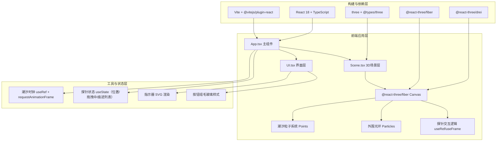
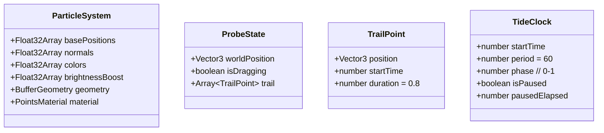

## 1. 架构设计

## 2. 技术描述

- **前端框架**：React 18 + TypeScript 5（严格模式，ESNext模块）
- **构建工具**：Vite 5 + @vitejs/plugin-react
- **3D渲染**：Three.js 0.160 + @react-three/fiber 8 + @react-three/drei 9
- **样式方案**：内联CSS + 全局样式标签，毛玻璃效果使用 backdrop-filter
- **状态管理**：React useState/useRef（轻量级场景，无需zustand）
- **后端**：无后端，纯前端渲染
- **数据库**：无

## 3. 路由定义

| 路由 | 用途 |
|------|------|
| / | 主视口，星盘3D场景 + UI覆盖层 |

## 4. API定义（无后端）

## 5. 服务器架构图（无后端）

## 6. 数据模型

### 6.1 核心数据结构

### 6.2 关键算法

1. **球面粒子分布**：使用斐波那契球面采样算法生成5000个均匀分布点，半径5单位
2. **潮汐波浪偏移**：每个粒子沿法向偏移 = 0.3 * sin(phase * 2π + dot(normal, tideAxis) * k)
3. **颜色插值**：RGB线性插值 #87CEEB → #8A2BE2，权重 = 0.5 + 0.5 * sin(phase * 2π + spatialOffset)
4. **探针聚拢计算**：粒子到探针距离d < 80时，偏移向量 = (probePos - particlePos).normalize() * 0.5 * (1 - d/80)
5. **亮度衰减**：brightnessBoost随时间指数衰减，半衰期约1.5秒
6. **潮汐阶段判定**：phase ∈ [0, 0.25)涨潮，[0.25, 0.5)高潮，[0.5, 0.75)退潮，[0.75, 1.0)低潮
7. **粒子尺寸缩放**：size = max(0.5, 2 - (cameraDistance - 5) * (1.5 / 25))
