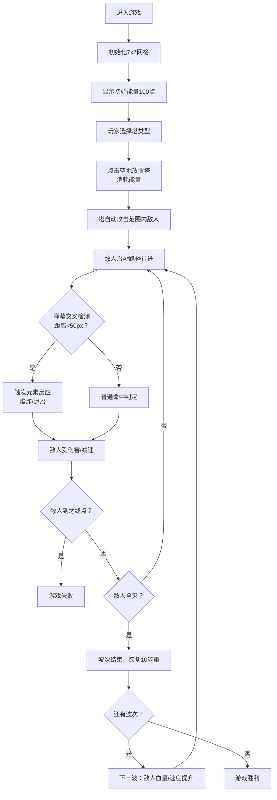

## 1. 产品概述

「晶塔守护·元素共振」是一款在浏览器中运行的2D塔防策略游戏，通过六边形网格地图、四种元素水晶塔和动态元素反应系统，解决传统塔防游戏性单调、缺乏动态交互的问题。玩家通过策略性放置风、火、水、土四种元素塔，利用元素间的化学反应（如火+风爆炸、水+土泥沼）击败沿路径行进的敌人波次。

- 核心玩法：策略布局 + 元素组合 + 塔防挑战
- 目标用户：休闲策略游戏爱好者、浏览器游戏玩家
- 产品价值：提供高策略深度的塔防体验，通过元素反应机制创造丰富的战术可能性

## 2. 核心功能

### 2.1 用户角色

| 角色 | 说明 | 核心权限 |
|------|------|----------|
| 玩家 | 单用户游戏 | 放置塔、升级塔、控制波次、重玩游戏 |

### 2.2 功能模块

1. **游戏主界面**：六边形网格地图、塔选择面板、信息面板、波次预览
2. **塔系统**：4种元素塔（风/火/水/土）、3级升级系统、放置/升级动画反馈
3. **弹幕与元素反应系统**：4种元素弹幕、交叉检测、火+风爆炸、水+土泥沼
4. **敌人波次系统**：3种敌人类型、A*动态寻路、波次递增难度
5. **资源与分数系统**：能量管理、击杀奖励、波次恢复、积分统计
6. **视觉特效系统**：呼吸光效、粒子溅射、屏幕光晕、60FPS渲染

### 2.3 页面详情

| 页面名称 | 模块名称 | 功能描述 |
|-----------|-------------|---------------------|
| 游戏主页面 | 六边形网格地图 | 7x7六边形网格，点击空地弹出塔选择，点击已放置塔显示升级选项 |
| 游戏主页面 | 塔选择面板（左侧） | 紧凑竖列展示4种塔图标，显示名称、元素颜色、消耗能量，悬停放大 |
| 游戏主页面 | 信息面板（右侧） | 波次信息、能量值、积分、敌人剩余数、路径进度条、下一波预览 |
| 游戏主页面 | 操作反馈层 | 放置/升级的扇形光晕扩散、元素反应的屏幕彩色光晕 |
| 游戏主页面 | 游戏结束层 | 显示胜利/失败状态、最终积分、重新开始按钮 |

## 3. 核心流程

玩家进入游戏后，首先看到7x7的六边形网格地图。初始能量为100点。玩家通过点击左侧面板或地图空地选择塔类型，然后在空地上放置塔（消耗能量）。塔会自动攻击范围内的敌人。当敌人波次开始时，敌人从左侧3个随机入口出现，沿A*算法计算的最短路径向右行进。弹幕飞行时若与其他元素弹幕交叉（距离<50px），会触发元素反应。击杀敌人获得能量和积分，敌人到达终点则扣除生命值（或直接失败）。每波结束后恢复10点能量，波次难度递增。当所有波次完成且敌人未清空终点时游戏胜利，否则失败。

## 4. 用户界面设计

### 4.1 设计风格

- **主色调**：深紫色 `#1a0a2e` 与暗蓝色 `#162447` 渐变背景
- **元素色**：风塔 `#00ffff`（青色）、火塔 `#ff4444`（红色）、水塔 `#4488ff`（蓝色）、土塔 `#cc8844`（棕色）
- **网格线**：半透明白色 `#ffffff20`
- **按钮风格**：圆角矩形，悬停0.2秒弹性放大（1.0→1.1倍），点击缩小至0.95再弹回，CSS transition实现
- **字体**：monospace（等宽字体），全局禁用文字选中
- **视觉风格**：赛博朋克低多边形美学，所有元素带发光效果

### 4.2 页面设计概述

| 页面名称 | 模块名称 | UI元素 |
|-----------|-------------|-------------|
| 游戏主页面 | 整体布局 | 三栏式：左侧塔面板（15%宽）+ 中部画布（70%宽，居中，高度≥700px）+ 右侧信息面板（15%宽） |
| 游戏主页面 | 塔选择面板 | 4个塔卡片竖列排列，每个卡片含彩色图标+名称+能量消耗，选中状态边框高亮，hover弹性动画 |
| 游戏主页面 | 画布区域 | Canvas 2D渲染：六边形网格（半透明白线）、塔基座（呼吸光效+攻击脉冲）、弹幕（旋转/拖尾/溅射/震荡）、敌人（绿/紫/红）、粒子特效 |
| 游戏主页面 | 信息面板 | 左上角：波次数字+能量条+积分；右上角：敌人剩余数+路径进度条；下方：下一波敌人预览（类型+数量） |
| 游戏主页面 | 操作反馈 | 放置/升级：0.3秒扇形光晕扩散（以塔为中心向外扩散）；元素反应：屏幕中心0.3秒彩色光晕（全屏透明度0.2） |
| 游戏主页面 | 响应式 | 1366px以上屏幕适配，画布宽度自适应但高度不低于700px |

### 4.3 响应式

- 桌面优先设计（Desktop-first），最小支持1366px宽度
- 画布宽度自适应父容器（70%），但高度保持最小700px
- 左右面板使用固定宽度，内容居中显示

### 4.4 性能优化

- 游戏循环使用requestAnimationFrame，锁定60FPS
- 粒子池管理，峰值≤500个粒子
- 元素反应检测：20次/秒，每次≤0.5ms
- 每帧渲染时间≤16ms
