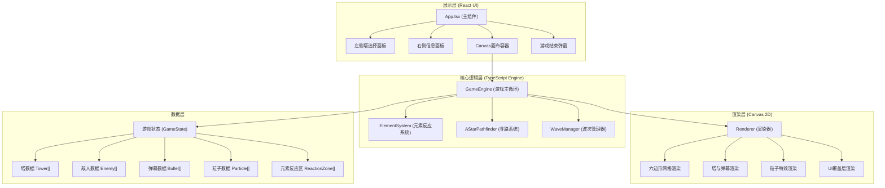

## 1. 架构设计



## 2. 技术描述

- **前端框架**：React@18 + TypeScript@5
- **构建工具**：Vite@5 + @vitejs/plugin-react@4
- **渲染引擎**：Canvas 2D API（原生浏览器API，无第三方库）
- **状态管理**：React useState/useRef（轻量级，游戏核心状态存储在useRef避免重渲染）
- **CSS**：原生CSS + CSS变量（不引入Tailwind，保持项目精简，专注Canvas渲染性能）
- **项目初始化**：Vite React+TypeScript模板

## 3. 文件结构与路由

### 3.1 文件组织（严格按用户要求）

| 文件路径 | 职责说明 |
|----------|----------|
| `package.json` | 项目依赖：react、react-dom、typescript、vite、@vitejs/plugin-react |
| `vite.config.js` | Vite构建配置，支持 @ → src 别名路径 |
| `tsconfig.json` | TypeScript严格模式配置 |
| `index.html` | 入口页面，含viewport meta和标题 |
| `src/gameEngine.ts` | 核心游戏循环管理：初始化、帧更新（60FPS）、波次调度、性能监控；导出GameEngine类 |
| `src/elementSystem.ts` | 元素反应逻辑：四种弹幕更新、碰撞检测、反应触发；导出ElementSystem类 |
| `src/renderer.ts` | Canvas渲染器：绘制网格、塔、弹幕、粒子、路径、特效；导出Renderer类 |
| `src/App.tsx` | React应用入口：状态管理、三栏布局、事件绑定、GameEngine初始化 |
| `src/types.ts` | 全局类型定义（补充：Tower/Enemy/Bullet/Particle等接口） |
| `src/pathfinder.ts` | A*寻路算法（补充：六边形网格上的A*实现） |
| `src/utils.ts` | 工具函数（补充：距离计算、六边形坐标转换、颜色处理等） |
| `src/main.tsx` | React入口文件 |
| `src/index.css` | 全局样式：背景渐变、布局、按钮动画等 |

### 3.2 路由

单页面应用，无路由需求，所有内容在单页展示。

## 4. 核心类与接口定义

### 4.1 GameState 类型

```typescript
// 元素类型
type ElementType = 'wind' | 'fire' | 'water' | 'earth';

// 敌人类型
type EnemyType = 'normal' | 'shield' | 'splitter';

// 六边形网格坐标（轴坐标系）
interface HexCoord {
  q: number;  // 列
  r: number;  // 行
}

// 屏幕像素坐标
interface Point {
  x: number;
  y: number;
}

// 塔数据
interface Tower {
  id: string;
  element: ElementType;
  level: 1 | 2 | 3;
  hex: HexCoord;
  position: Point;
  fireRate: number;       // 次/秒
  damage: number;
  range: number;          // 像素
  lastFireTime: number;
  targetId: string | null;
  attackPulse: number;    // 0-1 用于攻击时脉冲动画
}

// 弹幕数据
interface Bullet {
  id: string;
  element: ElementType;
  position: Point;
  velocity: Point;        // 速度向量
  damage: number;
  rotation: number;       // 旋转角度（风刃用）
  life: number;           // 剩余寿命（ms）
  towerLevel: 1 | 2 | 3;
  reacted: boolean;       // 是否已触发反应
}

// 敌人数据
interface Enemy {
  id: string;
  type: EnemyType;
  position: Point;
  hp: number;
  maxHp: number;
  baseSpeed: number;      // 基础速度 像素/秒
  currentSpeed: number;   // 当前速度（含减速）
  path: Point[];          // 当前路径点列表
  pathIndex: number;      // 当前行进到第几个路径点
  slowTimer: number;      // 减速剩余时间
  slowFactor: number;     // 减速系数 0-1（1为正常）
  reward: number;         // 击杀获得能量
}

// 粒子数据
interface Particle {
  id: string;
  position: Point;
  velocity: Point;
  color: string;
  life: number;           // 剩余寿命（ms）
  maxLife: number;
  size: number;
  type: 'spark' | 'smoke' | 'debris' | 'shockwave';
}

// 元素反应区域
interface ReactionZone {
  id: string;
  type: 'explosion' | 'mud';
  position: Point;
  radius: number;
  life: number;           // 剩余寿命（ms）
  maxLife: number;
  damage?: number;        // 爆炸伤害
  slowFactor?: number;    // 泥沼减速系数
  appliedTo: Set<string>; // 已受影响的敌人ID集合
}

// 塔放置/升级反馈动画
interface HaloEffect {
  id: string;
  position: Point;
  life: number;
  maxLife: number;
  color: string;
}

// 游戏状态
interface GameState {
  wave: number;
  maxWave: number;
  energy: number;
  score: number;
  lives: number;
  isPlaying: boolean;
  isWaveActive: boolean;
  gameOver: boolean;
  victory: boolean;
  towers: Tower[];
  enemies: Enemy[];
  bullets: Bullet[];
  particles: Particle[];
  reactionZones: ReactionZone[];
  haloEffects: HaloEffect[];
  screenFlash: { color: string; life: number; maxLife: number } | null;
  selectedHex: HexCoord | null;
  selectedTowerId: string | null;
  enemiesRemaining: number;  // 本波剩余敌人（含未生成）
  totalEnemiesInWave: number;
  pathProgress: number;      // 平均路径进度 0-1
}
```

### 4.2 核心类定义

```typescript
// GameEngine - 游戏主引擎
class GameEngine {
  constructor(canvas: HTMLCanvasElement, stateRef: React.MutableRefObject<GameState>, 
              onStateUpdate: (patch: Partial<GameState>) => void);
  
  start(): void;                    // 启动游戏循环
  stop(): void;                     // 停止
  placeTower(hex: HexCoord, element: ElementType): boolean;  // 放置塔
  upgradeTower(towerId: string): boolean;                    // 升级塔
  startNextWave(): void;           // 手动启动下一波
  restart(): void;                 // 重新开始
  
  private loop(): void;            // requestAnimationFrame循环
  private update(dt: number): void;  // 逻辑更新，dt=毫秒
  private updateTowers(dt: number): void;
  private updateBullets(dt: number): void;
  private updateEnemies(dt: number): void;
  private updateParticles(dt: number): void;
  private updateReactionZones(dt: number): void;
  private updateHaloEffects(dt: number): void;
  private spawnEnemy(entryIndex: number): void;
  private findPath(start: HexCoord, end: HexCoord): Point[];
}

// ElementSystem - 元素反应系统
class ElementSystem {
  constructor();
  
  checkReactions(bullets: Bullet[], deltaTime: number): {
    newReactionZones: ReactionZone[];
    consumedBulletIds: string[];
    newParticles: Particle[];
    screenFlash: { color: string; life: number; maxLife: number } | null;
  };
  
  private distance(a: Point, b: Point): number;
  private createExplosion(pos: Point, b1: Bullet, b2: Bullet): { zone: ReactionZone; particles: Particle[] };
  private createMud(pos: Point, b1: Bullet, b2: Bullet): { zone: ReactionZone; particles: Particle[] };
}

// Renderer - Canvas渲染器
class Renderer {
  constructor(ctx: CanvasRenderingContext2D, width: number, height: number);
  
  render(state: GameState): void;
  resize(width: number, height: number): void;
  
  private drawBackground(): void;
  private drawHexGrid(): void;
  private drawHex(coord: HexCoord, fill?: string, stroke?: string): void;
  private drawTowers(towers: Tower[], time: number): void;
  private drawTowerBase(tower: Tower, pulse: number): void;
  private drawTowerCrystal(tower: Tower): void;
  private drawBullets(bullets: Bullet[]): void;
  private drawWindBlade(bullet: Bullet): void;
  private drawFireball(bullet: Bullet): void;
  private drawWaterOrb(bullet: Bullet): void;
  private drawEarthRock(bullet: Bullet): void;
  private drawEnemies(enemies: Enemy[]): void;
  private drawHealthBar(enemy: Enemy): void;
  private drawReactionZones(zones: ReactionZone[]): void;
  private drawParticles(particles: Particle[]): void;
  private drawHaloEffects(halos: HaloEffect[]): void;
  private drawPath(enemies: Enemy[]): void;
  private drawScreenFlash(flash: GameState['screenFlash']): void;
}
```

## 5. 关键算法与技术要点

### 5.1 六边形网格系统
- 使用**轴坐标系（Axial Coordinates）**：q（列）r（行）
- 7x7 网格范围：q ∈ [0, 6]，r ∈ [0, 6]
- 坐标转换：`pixelX = size * (3/2 * q)`，`pixelY = size * (sqrt(3)/2 * q + sqrt(3) * r)`，size=六边形半径
- 点击拾取：将屏幕坐标转为轴坐标，取最近的整数格

### 5.2 A*寻路算法（六边形）
- 邻居方向：6个方向 `(+1,0), (+1,-1), (0,-1), (-1,0), (-1,+1), (0,+1)`
- 启发函数：六边形距离 `(abs(q1-q2) + abs(q1+r1-q2-r2) + abs(r1-r2)) / 2`
- 障碍：放置塔的格子不可通过，但需保证始终有至少一条通路（不可完全封锁）
- 动态重算：塔放置/移除时重新计算所有敌人路径

### 5.3 元素反应检测
- 频率：20次/秒（每50ms检测一次），非每帧检测以节省性能
- 检测逻辑：O(n²)遍历所有弹幕对，若不同元素且距离<50px则触发
- 反应类型：
  - **火+风** → 爆炸：半径80px，伤害=两者之和×2，粒子消散1秒
  - **水+土** → 泥沼：半径60px，持续3秒，减速50%，持续伤害
  - 其他组合：无特殊反应，正常计算各自命中

### 5.4 性能优化策略
1. **对象池**：粒子对象复用，避免频繁GC
2. **空间分区**：弹幕检测用网格分桶，减少O(n²)比较
3. **状态分离**：游戏高频状态存于useRef，仅UI相关状态用useState，避免React重渲染
4. **离屏Canvas**：静态网格预渲染至离屏Canvas，每帧直接贴图
5. **限制粒子**：上限500，超出时丢弃最旧的
6. **批处理绘制**：同类型粒子/弹幕批量setTransform后draw

## 6. 性能指标与监控

- FPS监控：通过performance.now()计算每帧间隔，若<16ms则空闲等待
- 粒子计数：每帧检查particles.length，>500时splice(0, N)
- 反应检测耗时：用performance.mark/measure记录，若>0.5ms则在下一检测周期跳过部分弹幕
- 调试信息（可在控制台输出，不渲染到UI）：FPS、粒子数、弹幕数、敌人数量
