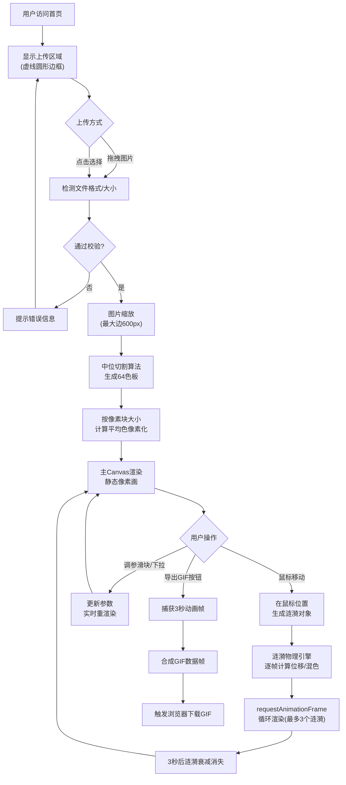

# 光栅涟漪 - 产品需求文档 (PRD)

## 1. 产品概述

「光栅涟漪」是一款在浏览器中运行的交互式像素动画生成器，通过将用户上传的图片进行像素化处理，结合实时鼠标交互产生水面涟漪般的扭曲与颜色混合效果，打造具有艺术表现力的动态像素光影作品。

- 主要用途：为设计师、艺术家和普通用户提供一个无需专业软件即可快速创作像素艺术动画的工具，解决传统图片滤波处理缺乏实时动态交互和艺术表现力的痛点。
- 目标用户：数字艺术家、社交媒体创作者、设计爱好者、教育场景师生。
- 产品价值：将静态图片转化为可交互的动态艺术作品，降低像素艺术创作门槛，支持一键导出GIF便于分享传播。

---

## 2. 核心功能

### 2.1 用户角色

本产品为单角色工具型应用，无需注册登录。

| 角色 | 使用方式 | 核心权限 |
|------|----------|----------|
| 访客用户 | 直接访问页面 | 上传图片、调整参数、交互体验、导出GIF |

### 2.2 功能模块

1. **首页（唯一页面）**：
   - 图片上传区域（拖拽/点击上传）
   - 像素化Canvas画布展示区
   - 参数控制面板（滑块 + 下拉选择器）
   - GIF导出操作区

### 2.3 页面详情

| 页面名称 | 模块名称 | 功能描述 |
|----------|----------|----------|
| 首页 | 图片上传区域 | 居中虚线圆形边框，支持拖拽和点击上传，限制文件格式jpg/png，最大8MB；拖拽时有scale弹跳动画；上传后自动缩放到最大边长600px保持宽高比。 |
| 首页 | 像素画布展示区 | Canvas 2D渲染，支持鼠标移动触发涟漪效果；单帧渲染≤16ms，60FPS流畅运行；离屏Canvas做缓冲计算。 |
| 首页 | 参数控制面板 | 三个滑块（涟漪半径10-80px、扭曲强度0-30px、扩散速度1-10）+ 像素风格下拉（经典马赛克、点阵圆形、八位色盒）；半透明毛玻璃效果；调整后立即生效。 |
| 首页 | GIF导出区 | "导出GIF"按钮，捕获约3秒一轮动画循环，自动下载为GIF文件。 |

---

## 3. 核心流程

### 3.1 主用户流程

用户访问页面 → 看到居中上传提示 → 拖拽或点击上传图片 → 图片自动缩放并像素化渲染到Canvas → 用户鼠标滑过Canvas产生涟漪扭曲效果 → 用户通过滑块和下拉框调整参数实时预览不同效果 → 点击"导出GIF"按钮 → 浏览器自动下载生成的GIF文件。

### 3.2 流程图

---

## 4. 用户界面设计

### 4.1 设计风格

- **主色板**：深色主题，背景采用从 `#16213e` 到 `#0f3460` 的垂直线性渐变，基底色 `#1a1a2e`。
- **强调色**：霓虹蓝 `#00d9ff`（悬停高亮、滑块轨道）、薄荷绿 `#3ddc97`（按钮激活态）、暖橙 `#ff8c42`（错误提示）。
- **按钮风格**：圆角胶囊状（border-radius: 999px），半透明背景（rgba(255,255,255,0.08)），悬停时背景亮度提升 + 外发光；点击时轻微下沉（scale: 0.97）；0.2s ease过渡。
- **字体选择**：
  - 标题：`'Space Grotesk'` 或 `'Orbitron'`（等宽未来感，Google Fonts引入）。
  - 正文/控件标签：`'JetBrains Mono'` 或 `'Roboto Mono'`（代码风 monospace，小字号清晰）。
- **布局风格**：单页居中布局，画布居中，控制面板贴靠画布下方，整体有呼吸感的留白。
- **视觉细节**：
  - 控制面板毛玻璃效果：`backdrop-filter: blur(10px)` + `rgba(255,255,255,0.05)` 底色 + 1px 半透明白色描边。
  - 上传区虚线边框：`border: 2px dashed rgba(0,217,255,0.4)`，拖拽时边框变实色 + 阴影。
  - Canvas外发光：`box-shadow: 0 0 40px rgba(0,217,255,0.15)`。
  - 全局噪点纹理：SVG noise filter 叠加，增加胶片颗粒感。
- **图标风格**：纯CSS + emoji，上传区用 🌊，导出用 🎞️，滑块用 🎚️ 风装饰。

### 4.2 页面设计概述

| 页面名称 | 模块名称 | UI元素描述 |
|----------|----------|-----------|
| 首页 | 顶部品牌区 | 左上角Logo "光栅涟漪 RIPPLE·PIX"，霓虹蓝渐变字，下方副标题"Interactive Pixel Ripple Generator"，小字号半透明白。 |
| 首页 | 图片上传区域 | 居中，240px×240px（半径120px圆形），虚线边框，内部居中显示图标🌊 + "拖拽图片到此处或点击上传" + "支持 JPG / PNG，最大 8MB"，两行文字颜色层级分明；拖拽hover时scale 1→1.05→1弹跳动画。 |
| 首页 | 画布容器 | 居中显示，自适应图片宽高比，最大宽600px；Canvas圆角12px，外发光阴影；加载时有淡入动画。 |
| 首页 | 参数控制面板 | 画布下方16px处，宽度匹配画布；毛玻璃卡片；内部横向排列（桌面端）：三个滑块组+下拉选择器+导出按钮；每个滑块有标签+数值显示（当前值右侧）。 |
| 首页 | 滑块组件 | 自定义滑轨（底部半透明条 + 霓虹蓝填充进度），圆形滑块按钮（白心蓝光晕），拖动时按钮放大1.1倍；数值显示用等宽字体右对齐。 |
| 首页 | 下拉选择器 | 与滑块同风格的毛玻璃框，右侧▼指示，下拉选项深色背景 + 悬停高亮。 |
| 首页 | 导出按钮 | 胶囊形，渐变背景（#00d9ff→#3ddc97），白色文字，点击时显示短暂"生成中..."loading态。 |

### 4.3 响应式设计

- **设计策略**：桌面端优先（Desktop-first），断点 768px 适配移动端。
- **桌面端（≥768px）**：控制面板横向排列，滑块标签在左、数值在右，下拉和按钮靠右。
- **移动端（<768px）**：
  - 画布宽度缩放到 92vw，居中。
  - 控制面板折叠为**紧凑一行**，使用 flex-wrap: wrap，所有控件缩小间距。
  - 滑块标签改到上方，数值直接嵌在滑块末端。
  - 导出按钮单独占满整行宽度。
  - 上传区域缩小到 180px 直径，字体缩小。
- **触控优化**：移动端滑块和按钮点击区域放大到至少 44×44px，涟漪同时支持 touchmove 事件触发。

### 4.4 动画与动效规范

| 动效名称 | 场景 | 参数 |
|----------|------|------|
| 弹跳缩放 | 上传区拖拽悬停 | scale 1→1.05→1，cubic-bezier(0.34,1.56,0.64,1)，300ms |
| 悬停高亮 | 按钮/滑块/下拉 | 背景/边框亮度+0.15，外发光 0 0 12px rgba(0,217,255,0.4)，200ms ease |
| 点击反馈 | 所有可点击元素 | scale 0.97，200ms ease-out |
| 淡入 | 上传完成画布出现 | opacity 0→1，400ms ease |
| 涟漪扩散 | 鼠标交互 | Canvas逐帧渲染，径向渐变透明度 |
| Loading | GIF导出中 | 按钮文字切换 + 旋转圆点动画 |
