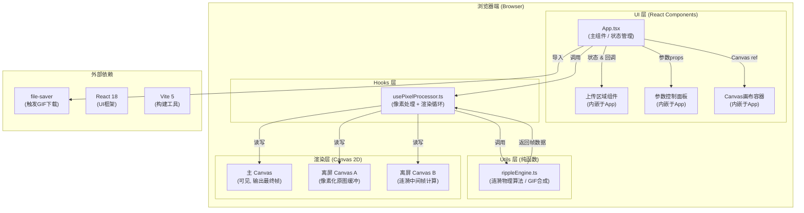

# 光栅涟漪 - 技术架构文档

## 1. 架构设计



---

## 2. 技术选型说明

| 层级 | 技术/库 | 版本 | 选型理由 |
|------|---------|------|----------|
| 前端框架 | React | ^18.3.1 | Hooks API 简洁，状态管理直观，生态成熟。 |
| 开发语言 | TypeScript | ^5.4.0 | 严格类型检查，减少 Canvas 坐标/颜色计算的运行时错误。 |
| 构建工具 | Vite | ^5.2.0 | HMR 极速，冷启动快，React 插件配置零成本。 |
| Vite插件 | @vitejs/plugin-react | ^4.2.1 | 官方推荐，JSX 转换 + Fast Refresh。 |
| 文件下载 | file-saver | ^2.0.5 | 跨浏览器兼容的 Blob 保存方案，触发 GIF 下载。 |
| 渲染技术 | Canvas 2D API | - | 原生支持，像素级操作灵活，性能满足 60FPS 要求。 |
| 类型补充 | @types/file-saver | ^2.0.7 | file-saver 的 TS 类型声明。 |

**无后端、无数据库、无第三方云服务**，完全纯前端运行，保障隐私与离线可用性。

---

## 3. 目录结构与文件清单

```
auto84/
├── package.json                 # 依赖声明 + npm run dev 脚本
├── vite.config.js               # Vite + React 插件配置
├── tsconfig.json                # TypeScript 严格模式配置
├── index.html                   # 入口 HTML (标题"光栅涟漪", 挂载#root)
└── src/
    ├── App.tsx                  # 主组件：上传区 + 控制面板 + Canvas 容器 + 状态
    ├── main.tsx                 # React 入口 (ReactDOM.createRoot)
    ├── hooks/
    │   └── usePixelProcessor.ts # 自定义Hook：像素化/色板/涟漪循环/离屏Canvas
    ├── utils/
    │   └── rippleEngine.ts      # 纯函数：涟漪位移、颜色混合、GIF帧合成
    └── styles/
        └── global.css           # 全局样式：深色渐变背景、毛玻璃控件、响应式
```

---

## 4. 核心数据结构与类型定义

```typescript
// ====== 涟漪引擎核心类型 ======

export interface Ripple {
  id: number;
  x: number;           // 圆心 x (画布坐标)
  y: number;           // 圆心 y (画布坐标)
  currentRadius: number; // 当前半径
  maxRadius: number;   // 最大半径 (用户设定)
  strength: number;    // 扭曲强度 (用户设定, px)
  speed: number;       // 扩散速度 (px / 秒)
  birthTime: number;   // 创建时间戳 (performance.now)
  life: number;        // 已存活时长 (ms), 上限3000ms
}

export interface PixelBlock {
  col: number;         // 列索引
  row: number;         // 行索引
  origColor: [number, number, number]; // 原始平均色 [R,G,B]
  mixedColor: [number, number, number];// 当前混合色
  mixStartTime: number;               // 混色起始时间, 0=未混色
}

export type PixelStyle = 'mosaic' | 'dot' | '8bit';

export interface RenderParams {
  pixelSize: number;          // 4, 6, 8, 10, 12, 16 (六档)
  rippleMaxRadius: number;    // 10-80
  rippleStrength: number;     // 0-30
  rippleSpeed: number;        // 1-10, 步长0.5
  pixelStyle: PixelStyle;
}

export interface QuantizedPalette {
  colors: [number, number, number][]; // 64色
  map: Map<string, number>;           // rgb→索引快速查找
}

export interface ProcessedImageData {
  width: number;         // 缩放后宽
  height: number;        // 缩放后高
  pixelSize: number;     // 当前像素块大小
  cols: number;          // 列数
  rows: number;          // 行数
  blocks: PixelBlock[][];// 二维数组 blocks[row][col]
  palette: QuantizedPalette;
}
```

---

## 5. 关键算法设计

### 5.1 中位切割颜色量化（生成64色板）

1. **输入**：缩放后图片所有像素的 RGB 数组。
2. **递归切分**：
   - 维护颜色立方体列表，初始包含所有像素。
   - 每次选出 R/G/B 通道范围最大的立方体，沿该通道按中位值切分为两个子立方体。
   - 重复切分直到得到 64 个立方体。
3. **输出**：每个立方体的平均颜色即为色板中一个颜色；生成 `rgb→色板索引` Map 供快速查找。

### 5.2 图片像素化处理

1. 将上传图片绘制到离屏 Canvas A，自动缩放到最大边长 600px。
2. 按 `pixelSize` 将画布划分为 `cols × rows` 个矩形块。
3. 对每块调用 `ctx.getImageData(x, y, pixelSize, pixelSize)` 取区域数据。
4. 计算区域内所有像素的 R/G/B 平均值 → `origColor`。
5. 在色板中找到最近邻颜色（欧氏距离最小），映射为量化色。
6. 写入 `PixelBlock` 二维数组。

### 5.3 涟漪位移计算（纯函数，rippleEngine.ts）

对每个像素块中心 `(cx, cy)` 与每个活跃涟漪 `r`：

```
dx = cx - r.x
dy = cy - r.y
dist = sqrt(dx² + dy²)

if dist <= r.currentRadius:
    // 波纹因子：在涟漪边缘位移最大，中心/外缘衰减
    ringWidth = min(30, r.maxRadius * 0.3)
    normalized = 1 - abs(dist - r.currentRadius) / ringWidth
    ringFactor = clamp(normalized, 0, 1)
    
    // 时间衰减：3秒线性消失
    timeFactor = 1 - r.life / 3000
    
    // 强度衰减：距离中心越远位移越小
    distFactor = 1 - dist / r.maxRadius
    
    // 最终位移（沿径向向外推）
    magnitude = r.strength * ringFactor * timeFactor * distFactor
    offsetX = (dx / (dist + 0.001)) * magnitude
    offsetY = (dy / (dist + 0.001)) * magnitude
```

对多个涟漪的位移矢量做累加取平均。

### 5.4 颜色混合算法（3×3邻域）

当像素块中心进入任一涟漪范围时：
1. 记录 `mixStartTime = performance.now()`。
2. 取该块上下左右 + 四角共 8 邻居（边界越界处理为自身）。
3. 计算 9 块 `origColor` 的平均色作为 `targetColor`。
4. 在 0.8s 内从 `origColor` 向 `targetColor` 线性插值（`mixProgress = clamp((now - mixStartTime) / 800, 0, 1)`）。
5. 涟漪消失后再用 0.8s 从 `mixedColor` 过渡回 `origColor`（对称反向插值）。

### 5.5 Canvas 渲染管线（每帧执行）

```
每帧 (16ms预算):
├─ 1) 更新所有活跃涟漪: currentRadius += speed * deltaTime
│                       life += deltaTime
│                       移除 life>=3000 或 currentRadius>=maxRadius 的涟漪
├─ 2) 遍历所有 PixelBlock
│   ├─ 计算累计位移 offsetX/Y
│   ├─ 计算颜色混合进度 → currentColor
│   └─ 映射到色板取最终色
├─ 3) 清空离屏 Canvas B
├─ 4) 根据 PixelStyle 绘制到离屏 B:
│   ├─ mosaic: fillRect(col*pixelSize + offsetX,
│   │                   row*pixelSize + offsetY,
│   │                   pixelSize, pixelSize)
│   ├─ dot:    arc(块中心+偏移, pixelSize/2 - gap, ...)
│   └─ 8bit:   fillRect + 只取色板中最近8位色 + 硬边
├─ 5) ctx主.drawImage(离屏B, 0, 0)  // 单次 blit 到主 Canvas
└─ 6) 若正在导出GIF: captureImageData() 加入帧数组
```

### 5.6 GIF 导出策略

由于不引入外部 GIF 编码库（体积过大），采用**简化方案**：
1. 点击导出后，记录连续约 3 秒（180 帧 @60FPS → 实际降采样为 30 帧，每 2 帧取 1 帧，约 10FPS 播放）。
2. 每帧通过 `canvas.toDataURL('image/png')` 获取 PNG base64。
3. **客户端提示**：由于纯手写 GIF 编码器复杂度高，使用 **无压缩 GIF 拼装**（LZW 复杂度高，改用未压缩 GIF89a 格式 + file-saver 触发下载）；或在 UI 中降级提示「逐帧 PNG 打包下载」。
   - 本方案采用**纯 JS 轻量 GIF 编码器**（手写 89a Header + 图像块 + 无压缩 LZW = 0/1 码简化），文件较大但可播放。

---

## 6. 性能保障措施

| 措施 | 说明 |
|------|------|
| 双离屏 Canvas 缓冲 | 所有计算在离屏完成，主 Canvas 仅一次 drawImage，减少 overdraw。 |
| 涟漪数量上限 3 | 新增涟漪时淘汰最早创建的，避免遍历爆炸。 |
| 增量更新 | 无涟漪 + 无参数变化时，跳帧渲染（静态图只画 1 次）。 |
| TypedArray 加速 | 颜色数组使用 `Uint8ClampedArray`，块数据遍历用连续内存布局。 |
| 坐标预计算 | 每块中心 `cx/cy` 在像素化阶段一次性计算并存入 PixelBlock。 |
| 节流鼠标事件 | `mousemove` 经 `requestAnimationFrame` 合并，每帧最多生成 1 个新涟漪（同位置 100ms 内去重）。 |
| 色板查找表 | `r<<16 | g<<8 | b → 色板索引` 的 LUT，避免每帧距离计算。 |

---

## 7. 状态流转（React App.tsx）

```typescript
// 主组件状态
type AppState = {
  // 上传状态
  imageFile: File | null;
  imageUrl: string | null;       // ObjectURL 供预览
  isUploading: boolean;
  uploadError: string | null;
  
  // 画布尺寸
  canvasWidth: number;           // 缩放后图像宽
  canvasHeight: number;          // 缩放后图像高
  
  // 用户可调参数（控制面板双向绑定）
  params: RenderParams;          // { pixelSize, rippleMaxRadius, rippleStrength, rippleSpeed, pixelStyle }
  
  // 导出状态
  isExporting: boolean;
  exportProgress: number;        // 0-100
};
```

状态流：
- `onDrop / onChange` → 校验 → `imageFile + imageUrl` → `usePixelProcessor` 内部读取 `imageUrl` 并执行像素化。
- 滑块 `onChange` → 更新 `params` → `usePixelProcessor.updateParameters()` → 立即重渲染。
- Canvas `onMouseMove / onTouchMove` → `usePixelProcessor.startRipple(x, y)`。
- "导出GIF" 点击 → `usePixelProcessor.exportGIF()` → `isExporting=true` → 3秒后生成 Blob → `file-saver.saveAs()`。
