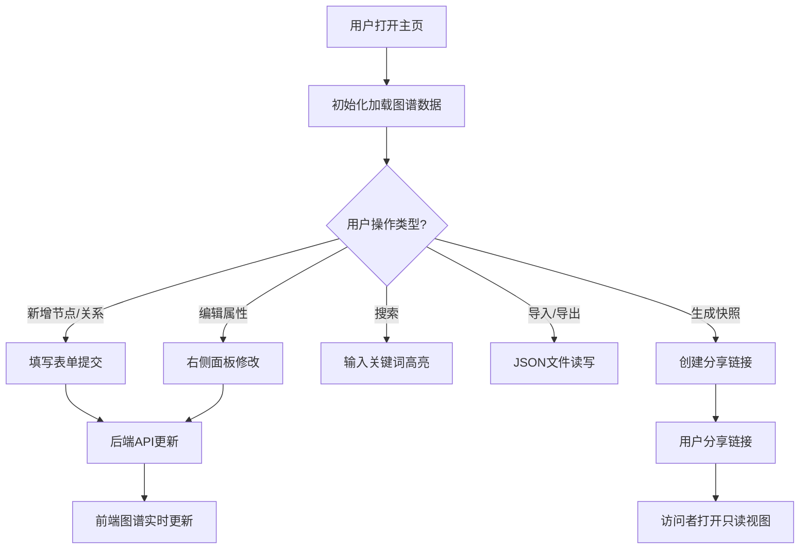

## 1. 产品概述

记忆图谱是一款帮助用户可视化管理人际关系与事件关联的Web应用，通过力导向图的形式将人与事件以节点和连线的方式呈现，解决用户容易遗忘重要人际关系和事件关联的问题。

- **目标用户**：需要管理复杂社交关系、项目协作关系或事件脉络的个人用户和团队
- **核心价值**：以直观的可视化方式呈现关系网络，支持快速检索、动态交互和快照分享

## 2. 核心功能

### 2.1 用户角色

| 角色 | 注册方式 | 核心权限 |
|------|---------|---------|
| 普通用户 | 匿名使用（数据存储于服务端内存） | 创建/编辑/删除节点与关系、搜索、导入导出、生成快照 |
| 快照访问者 | 通过链接访问 | 只读查看图谱，不可编辑 |

### 2.2 功能模块

1. **图谱主视图**：力导向图渲染、拖拽交互、缩放平移、高亮动画
2. **工具栏**：新增节点、新增关系、搜索框、导入、导出、快照生成
3. **属性面板**：节点详情编辑、关系详情编辑、删除操作
4. **快照分享**：唯一短链接生成、只读视图渲染
5. **数据管理**：JSON格式导入导出、格式校验

### 2.3 页面详情

| 页面名称 | 模块名称 | 功能描述 |
|---------|---------|---------|
| 主页面 | 图谱主视图区 | D3.js力导向图渲染，支持拖拽节点、滚轮缩放、双击复位 |
| 主页面 | 顶部工具栏 | 新增节点按钮、新增关系按钮、搜索输入框、导入/导出按钮、快照按钮 |
| 主页面 | 右侧属性面板 | 点击节点/关系后显示详情表单，支持编辑属性和删除操作 |
| 快照页面 | 只读图谱视图 | 加载快照数据渲染图谱，禁用所有编辑功能，显示只读标识 |

## 3. 核心流程

### 3.1 创建节点流程
用户点击「新增节点」→ 弹出表单填写名称/描述/颜色/大小 → 提交后POST到后端 → 后端生成UUID返回 → 前端图谱动态插入节点（从中心放大弹出动画）

### 3.2 创建关系流程
用户点击「新增关系」→ 弹出下拉选择源节点和目标节点 → 填写关系类型和权重 → 提交后POST到后端 → 前端连线动态渲染

### 3.3 搜索高亮流程
用户在搜索框输入关键词 → 前端模糊匹配节点名称 → 匹配节点与直接相连节点高亮（金色外发光脉冲）→ 其余节点半透明 → 清除搜索后恢复

### 3.4 快照分享流程
用户点击「生成快照」→ POST当前图谱状态到后端 → 后端生成短ID并存入内存 → 返回链接 `/snapshot/abc123` → 用户复制分享 → 访问者打开链接GET快照数据 → 只读模式渲染

## 4. 用户界面设计

### 4.1 设计风格
- **主色调**：深色主题，背景 `#1a1a2e`
- **节点色系**：`#e94560`（珊瑚红）、`#0f3460`（深海蓝）、`#16213e`（暗靛蓝）
- **高亮色**：`#ffaa00`（金色）用于搜索高亮和高权重连线
- **关系线**：基础色 `#888`，透明度0.5，按权重线性过渡至金色
- **字体**：标题使用 Playfair Display（优雅衬线体），正文使用 IBM Plex Sans（现代无衬线体）
- **动效**：节点创建从中心 scale(0→1) 0.3s，删除 scale(1→0) 0.2s，高亮脉冲 1.5s 周期

### 4.2 页面设计概述

| 页面名称 | 模块名称 | UI元素 |
|---------|---------|--------|
| 主页面 | 图谱视图区 | 70%宽度，SVG画布，节点为圆形带文字标签，关系线中部显示关系类型文字 |
| 主页面 | 顶部工具栏 | 深色背景条，按钮为圆角胶囊样式，搜索框带搜索图标，悬停微亮效果 |
| 主页面 | 属性面板 | 30%宽度，卡片式表单，输入框深色背景金色边框聚焦效果 |
| 快照页面 | 只读标识 | 顶部显示「快照视图 · 只读」横幅，金色边框提示 |

### 4.3 响应式设计
- **桌面端（≥768px）**：左侧图谱70% + 右侧面板30% 横向布局
- **移动端（<768px）**：图谱占满屏幕，属性面板折叠为底部抽屉，点击节点从底部滑出

### 4.4 交互细节
- 节点拖拽时光标变为 grab/grabbing
- 连线粗细根据权重 1-5px 线性映射
- 所有文字标签使用 SVG `text-anchor: middle` 且始终正向显示（不随缩放翻转）
- 搜索框支持回车触发、ESC清除
