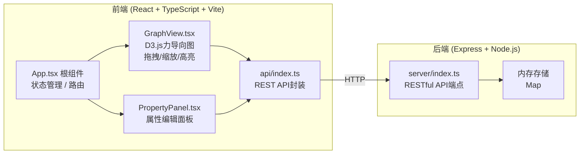
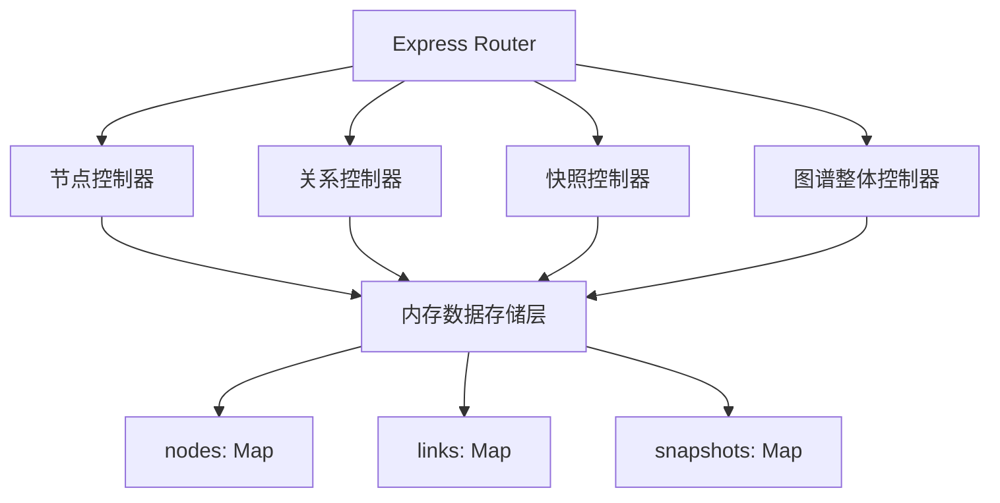
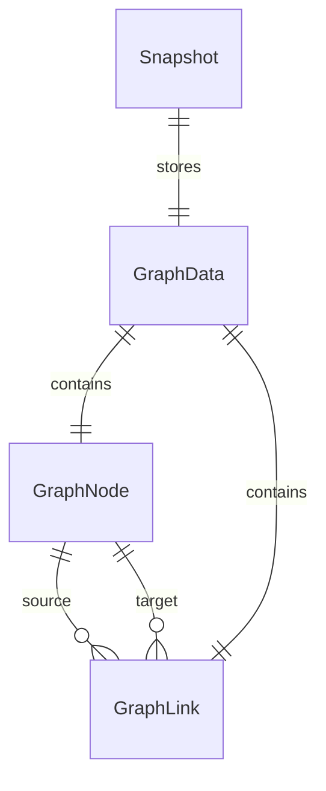

## 1. 架构设计



## 2. 技术描述

- **前端框架**：React@18 + TypeScript@5（严格模式）
- **构建工具**：Vite@5 + @vitejs/plugin-react
- **图谱渲染**：D3.js v7（d3-force 力模拟）
- **路由**：React Router（快照路由）
- **后端框架**：Express@4 + TypeScript
- **后端运行**：ts-node 直接执行 TypeScript
- **数据存储**：Node.js 内存（Map 对象，服务重启后清空）
- **ID生成**：uuid 库（v4）

## 3. 路由定义

| 路由 | 目的 |
|------|------|
| `/` | 主图谱编辑页面 |
| `/snapshot/:id` | 快照只读视图页面 |

## 4. API 定义

### 4.1 类型定义

```typescript
interface GraphNode {
  id: string;           // UUID
  name: string;         // 节点名称
  description: string;  // 描述
  color: string;        // 颜色 (hex)
  size: number;         // 节点半径 (15-40)
  x?: number;           // 力导向位置 x
  y?: number;           // 力导向位置 y
  vx?: number;
  vy?: number;
  fx?: number | null;   // 固定位置 x
  fy?: number | null;   // 固定位置 y
}

interface GraphLink {
  id: string;           // UUID
  source: string;       // 源节点 ID
  target: string;       // 目标节点 ID
  type: string;         // 关系类型 (朋友/同事/家人...)
  weight: number;       // 权重 1-10
}

interface GraphData {
  nodes: GraphNode[];
  links: GraphLink[];
}

interface Snapshot {
  id: string;           // 短ID (6位随机)
  data: GraphData;
  createdAt: number;
}
```

### 4.2 端点列表

| 方法 | 路径 | 请求体 | 响应 | 说明 |
|------|------|--------|------|------|
| GET | `/api/graph` | - | `GraphData` | 获取完整图谱数据 |
| POST | `/api/nodes` | `Omit<GraphNode, 'id'>` | `GraphNode` | 新增节点，生成UUID |
| PUT | `/api/nodes/:id` | `Partial<GraphNode>` | `GraphNode` | 更新节点 |
| DELETE | `/api/nodes/:id` | - | `{ success: true }` | 删除节点及关联关系 |
| POST | `/api/links` | `Omit<GraphLink, 'id'>` | `GraphLink` | 新增关系 |
| PUT | `/api/links/:id` | `Partial<GraphLink>` | `GraphLink` | 更新关系 |
| DELETE | `/api/links/:id` | - | `{ success: true }` | 删除关系 |
| POST | `/api/snapshots` | `GraphData` | `{ id: string, url: string }` | 生成快照，返回短ID |
| GET | `/api/snapshots/:id` | - | `Snapshot` | 获取快照数据 |
| PUT | `/api/graph` | `GraphData` | `{ success: true }` | 导入覆盖整个图谱 |

## 5. 服务器架构



## 6. 数据模型

### 6.1 实体关系



### 6.2 内存数据结构

```typescript
// server/index.ts 内部存储
const storage = {
  nodes: new Map<string, GraphNode>(),    // key: node.id
  links: new Map<string, GraphLink>(),    // key: link.id
  snapshots: new Map<string, Snapshot>(), // key: snapshot short id
};

// 预置初始示例数据
const seedNodes: GraphNode[] = [
  { id: uuidv4(), name: '我', description: '中心节点', color: '#e94560', size: 30 },
  { id: uuidv4(), name: '张三', description: '大学室友', color: '#0f3460', size: 22 },
  { id: uuidv4(), name: '李四', description: '同事', color: '#16213e', size: 20 },
];
```

## 7. 性能优化策略

- **D3力模拟优化**：200节点时降低 alphaDecay 至 0.02，velocityDecay 至 0.3
- **渲染节流**：tick 事件中每帧使用 `requestAnimationFrame` 批量更新 DOM
- **搜索索引**：前端维护 `Map<string, Set<nodeId>>` 倒排索引，模糊匹配 <100ms
- **SVG 优化**：关系线使用 `<line>` 而非 `<path>`，文字标签避免过多 DOM
- **Vite 代理**：开发环境 `/api` 代理至 `http://localhost:3001`
