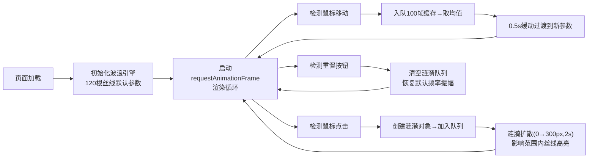

## 1. 产品概述
「时序微澜」是一款面向数字艺术爱好者的浏览器端交互式彩色波浪生成器，通过Canvas 2D实时渲染数百条动态丝线，让用户通过鼠标移动和点击创造独特的抽象艺术画面。

- 核心价值：提供即时、流畅、富有美感的数字艺术创作体验，无需专业技能即可生成独特视觉作品
- 目标用户：数字艺术爱好者、创意设计师、冥想放松用户

## 2. 核心特性

### 2.2 功能模块
1. **主画布模块**：全屏Canvas渲染，120根丝线实时动态波浪，自动颜色渐变
2. **鼠标交互模块**：水平/垂直移动控制频率和振幅，点击触发涟漪扩散
3. **控制面板模块**：重置按钮，恢复默认参数并清空涟漪
4. **性能优化模块**：对象池复用、帧率稳定、单帧绘制<12ms

### 2.3 页面详情
| 页面名称 | 模块名称 | 功能描述 |
|---------|---------|---------|
| 主页面 | 画布渲染 | 120根丝线×80控制点，正弦波叠加算法，60FPS实时渲染 |
| 主页面 | 鼠标控制 | 水平→频率(0.2-2.0Hz)，垂直→振幅(20-120px)，离屏恢复默认 |
| 主页面 | 涟漪系统 | 点击生成300px半径扩散圆，丝线临时高亮#FFD700持续0.3s |
| 主页面 | 颜色系统 | 色相蓝→粉→青循环，周期10s，相邻丝线色相差≤30° |
| 主页面 | 平滑过渡 | 100帧鼠标队列取均值，0.5s缓动过渡避免突变 |
| 主页面 | 控制面板 | 重置按钮，悬停高亮，点击恢复默认参数 |

## 3. 核心流程
用户进入页面后，全屏显示动态波浪画布。通过移动鼠标控制波形形态，点击任意位置触发涟漪扩散高亮效果。可通过右侧控制面板重置所有状态。

## 4. 用户界面设计

### 4.1 设计风格
- **主色**：深灰蓝背景 #1A1A2E，营造沉浸式暗色艺术氛围
- **辅色**：高亮涟漪 #FFD700（金色），丝线渐变蓝#4A90D9→粉#FF6B9D→青#00D4AA
- **按钮**：暗色#2D2D44，悬停亮#3D3D5C，圆角设计
- **字体**：18px 字重300 浅灰#CCCCCC 提示文字
- **布局**：全屏画布，左上提示文字，右上控制面板
- **鼠标**：画布区域十字准星crosshair，点击闪白0.1s

### 4.2 页面设计概述
| 页面名称 | 模块名称 | UI元素 |
|---------|---------|--------|
| 主页面 | 全屏画布 | 100vw×100vh 深灰蓝背景，无滚动条无边框 |
| 主页面 | 提示遮罩 | 半透明穿透层，左上固定，18px#CCCCCC字重300 |
| 主页面 | 控制面板 | 宽220px rgba(30,30,50,0.7)，圆角12px，右上定位 |
| 主页面 | 重置按钮 | #2D2D44背景#E0E0E0文字，hover→#3D3D5C |

### 4.3 响应式
- 桌面优先设计，画布自适应视口尺寸
- 支持窗口resize事件，自动重新计算画布尺寸
- 控制面板固定定位，不随画布变化
