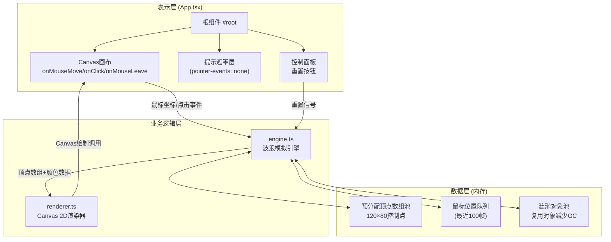

## 1. 架构设计



## 2. 技术说明
- 前端框架：React 18 + TypeScript 5
- 构建工具：Vite 5 + @vitejs/plugin-react
- 渲染技术：Canvas 2D API（原生浏览器API，无需额外依赖）
- 状态管理：React useState + useRef（避免重渲染开销，引擎使用ref直接操作）
- 动画驱动：requestAnimationFrame（浏览器原生帧率同步）
- 初始化工具：vite-init（创建React+TypeScript基础模板）

## 3. 路由定义
| 路由 | 用途 |
|-----|------|
| / | 主页面，全屏画布+控制面板，唯一页面 |

## 4. 核心文件结构与调用关系

```
src/
├── App.tsx         ← 根组件：管理Canvas引用、绑定DOM事件、启动渲染循环
├── engine.ts       ← 波浪引擎：计算顶点数据、处理鼠标输入、涟漪系统
└── renderer.ts     ← 渲染器：接收顶点数据，调用Canvas API绘制帧
```

**数据流向：**
1. `App.tsx` → `engine.ts`: 鼠标位置(x,y)、点击事件(px,py)、重置信号
2. `engine.ts` → `renderer.ts`: 顶点数组(Float32Array)、颜色数据(Uint8Array)、涟漪状态
3. `renderer.ts` → CanvasContext: beginPath、moveTo、lineTo、stroke、fillRect

## 5. 数据结构定义

### 5.1 引擎核心类型定义

```typescript
// engine.ts
export interface WaveParams {
  frequency: number;      // 当前频率 (0.2-2.0Hz)
  amplitude: number;      // 当前振幅 (20-120px)
  targetFrequency: number; // 目标频率（缓动用）
  targetAmplitude: number; // 目标振幅（缓动用）
}

export interface Ripple {
  x: number;              // 涟漪中心X坐标
  y: number;              // 涟漪中心Y坐标
  startTime: number;      // 开始时间戳(ms)
  duration: number;       // 持续时间(2000ms)
  maxRadius: number;      // 最大半径(300px)
}

export interface SilkThread {
  baseY: number;          // 丝线基准Y坐标
  phase: number;          // 基础相位偏移
  hueOffset: number;      // 色相偏移量
}

export interface EngineOutput {
  vertices: Float32Array;   // [x1,y1,x2,y2,...] 总长度120*80*2=19200
  colors: Uint8ClampedArray; // [r,g,b,a,...] 总长度120*80*4=38400
  ripples: Ripple[];        // 当前活跃涟漪列表
  threadCount: number;      // 丝线数量=120
  pointsPerThread: number;  // 每丝控制点=80
}
```

### 5.2 性能关键设计

1. **预分配数组池**：顶点数组(Float32Array)和颜色数组在引擎初始化时一次性分配，每帧复用，不创建新对象
2. **涟漪对象池**：维护空闲涟漪对象列表，复用以减少GC压力
3. **鼠标队列**：固定长度100的环形缓冲区，O(1)入队，O(n)求和取平均
4. **缓动算法**：线性插值Lerp，系数0.02，500ms完成约90%过渡：`current += (target - current) * 0.02`

## 6. 颜色计算算法

色相循环：蓝(#4A90D9, HSL 210,65%,57%) → 粉(#FF6B9D, HSL 340,100%,71%) → 青(#00D4AA, HSL 165,100%,42%) → 蓝

```
周期10秒，时间因子 t = (now % 10000) / 10000
丝线索引 i (0-119)，基础色相位：baseHue = (i/120 * 30° + t*360°) % 360°
映射三段循环，确保相邻丝线色相差≤30°
```

## 7. 涟漪影响检测

每帧遍历涟漪，计算其当前半径：`radius = elapsed/duration * maxRadius`
对每根丝线每个控制点，检测到涟漪中心的距离是否在 `[radius-30, radius+30]` 环形范围内，若在范围内则颜色混合 #FFD700，0.3秒后淡出回原色。
