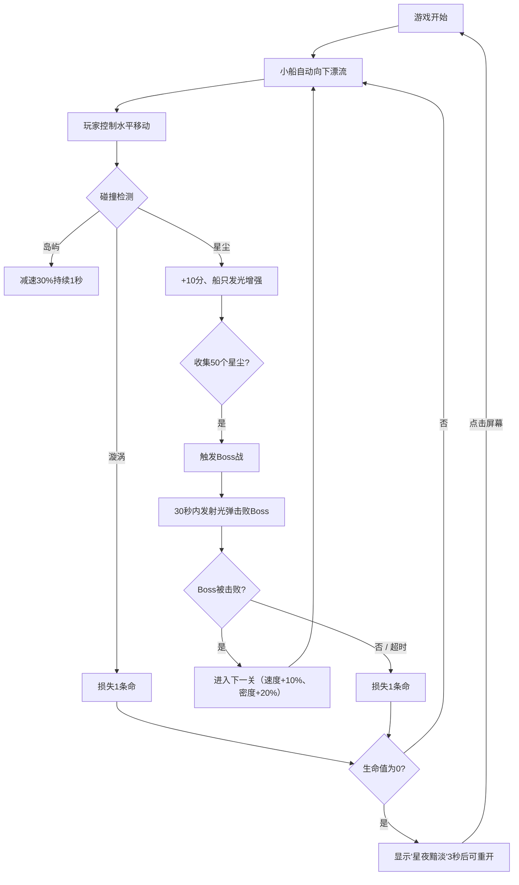

## 1. 产品概述

「星夜归途」是一款基于浏览器的2D冒险游戏，玩家操控一艘由闪烁星光构成的小船，在充满发光岛屿和暗流漩涡的河流上漂流，收集星尘点亮船只，击败暗影水怪，最终抵达银河彼岸。

- 目标用户：独立游戏爱好者、休闲玩家
- 产品价值：沉浸式的视觉体验、简单易上手的操控、渐进式的关卡挑战

## 2. 核心功能

### 2.1 功能模块

1. **游戏主界面**：Canvas游戏画布、生命值显示、得分面板
2. **漂流操控系统**：小船自动漂流、鼠标/键盘水平控制、粒子拖尾效果
3. **障碍收集系统**：岛屿生成、漩涡生成、星尘收集、碰撞检测与效果
4. **Boss战系统**：暗影水怪生成、光弹发射、Boss血量、关卡进阶
5. **生命与结束系统**：生命值管理、游戏结束动画、重新开始功能
6. **音效配乐系统**：环境流水音、收集音效、碰撞音效、Boss战节奏

### 2.2 页面详情

| 页面名称 | 模块名称 | 功能描述 |
|-----------|-------------|---------------------|
| 游戏主界面 | Canvas游戏区 | 80%视口高度的Canvas，渲染所有游戏实体、粒子和特效 |
| 游戏主界面 | HUD状态栏 | 3颗星星表示生命值、数字显示当前得分、当前关卡指示 |
| 游戏主界面 | 游戏结束层 | 浮现"星夜黯淡"渐变文字、点击屏幕重新开始 |
| 游戏主界面 | Boss战UI | Boss血量条、30秒倒计时、蓄力能量指示 |

## 3. 核心流程

## 4. 用户界面设计

### 4.1 设计风格

- **主色调**：深蓝色夜空渐变（顶部#0B0B2B → 底部#1A1A3E）
- **河流区域**：中心#4A90D9 → 两侧#1A1A3E的径向渐变
- **强调色**：金色#FFD700（小船发光、星尘、拖尾粒子）、青色（岛屿、漩涡螺旋线）、深紫色（Boss）
- **布局**：页面水平居中，游戏画布占视口高度80%，下方为HUD状态栏
- **动画**：小船闪烁（周期0.6s）、星尘闪烁（周期0.3s）、漩涡旋转（2rad/s）、碰撞冲击波、游戏结束文字渐变

### 4.2 游戏实体视觉

| 实体类型 | 视觉表现 | 尺寸参数 |
|-----------|-------------|-------------|
| 小船 | 白色三角形，金色外发光，周期性闪烁 | 边长20px |
| 岛屿 | 绿→青径向渐变椭圆，半透明光晕 | 宽60-100px，高40-80px |
| 漩涡 | 黑色中心+青色旋转螺旋线 | 半径40px，线宽2px |
| 星尘 | 金黄色闪烁圆点 | 半径6px |
| Boss | 深紫色多边形（8-12顶点），暗红色边缘光晕 | 初始半径80-120px |
| 粒子 | 金色星光拖尾 / 碰撞冲击波 | 2-4px / 50px |

### 4.3 响应式设计

- 桌面优先：Canvas固定宽度（建议800px），高度为视口80%
- 移动端：Canvas自适应屏幕宽度，保持比例
- 操控方式：桌面支持鼠标+键盘，移动端支持触摸滑动

### 4.4 动效设计

- 水面波纹：使用Canvas绘制动态波纹
- 背景星光：随机位置的闪烁粒子背景
- 碰撞特效：发光冲击波（半径50px，0.3秒内透明度从0.6降至0）
- 游戏结束：文字从白色渐变为暗蓝色，持续3秒
