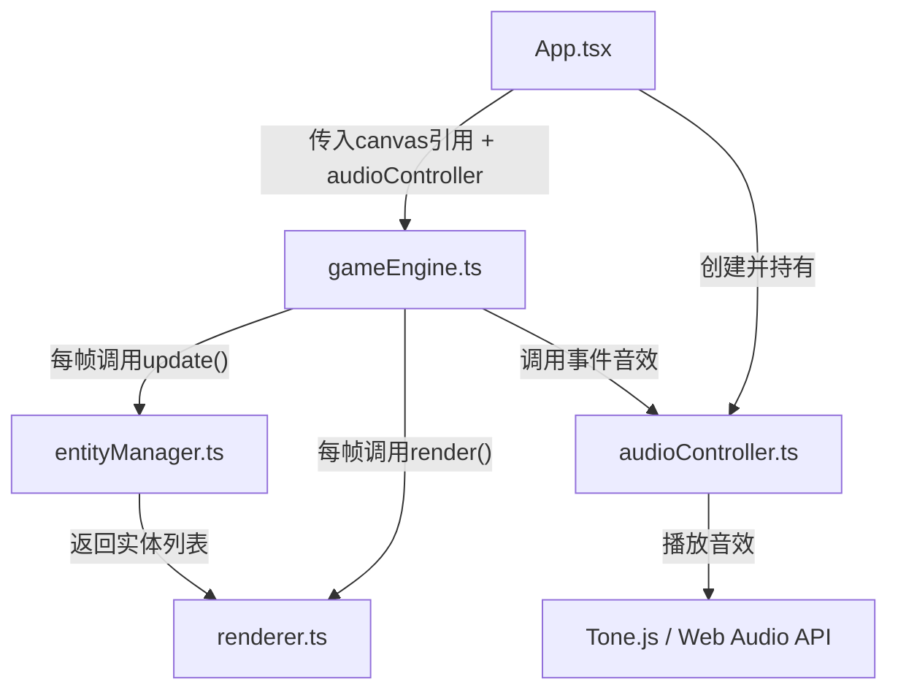

## 1. 架构设计



**分层说明：**
- **视图层 (App.tsx)**：React主组件，挂载Canvas元素，创建AudioController，初始化GameEngine
- **引擎层 (gameEngine.ts)**：游戏主循环(RAF)，碰撞检测，关卡逻辑，状态管理
- **实体层 (entityManager.ts)**：实体CRUD、位置更新、碰撞体积计算、生命周期管理
- **渲染层 (renderer.ts)**：Canvas 2D绘制所有实体、背景、粒子、特效
- **音效层 (audioController.ts)**：Tone.js封装，管理背景音和事件音效

## 2. 技术描述

| 类别 | 选型 | 说明 |
|------|------|------|
| 前端框架 | React 18 | 用户指定，用于组件化和状态管理 |
| 渲染引擎 | Canvas 2D | 用户指定，所有游戏实体和粒子特效 |
| 构建工具 | Vite 5 | 用户指定，快速开发构建 |
| 类型系统 | TypeScript 5 | 严格模式(strict: true) |
| 音效引擎 | Tone.js 14 | 用户指定，合成环境音和事件音效 |
| 状态管理 | React useState + 引擎内部状态 | 不引入额外状态库，保持轻量 |

## 3. 文件结构与调用关系

```
auto9/
├── package.json                      # 项目配置与依赖
├── vite.config.js                    # Vite构建配置
├── tsconfig.json                     # TS严格模式配置
├── index.html                        # 入口页面
└── src/
    ├── App.tsx                       # [1] 主组件 → 调用gameEngine.start()
    ├── main.tsx                      # React入口，渲染App
    ├── index.css                     # 全局样式（深蓝色主题）
    ├── types/
    │   └── gameTypes.ts              # 所有实体类型、接口、枚举定义
    ├── audio/
    │   └── audioController.ts        # [2] 音效控制器 → 被App.tsx创建, gameEngine调用
    ├── engine/
    │   ├── gameEngine.ts             # [3] 核心引擎 → 被App.tsx启动
    │   ├── entityManager.ts          # [4] 实体管理 → 被gameEngine每帧调用
    │   └── renderer.ts               # [5] 渲染器 → 被gameEngine每帧调用
    └── utils/
        └── helpers.ts                # 辅助函数：碰撞检测、随机数等
```

**数据流向：**
```
App.tsx 
  ├─ 创建 AudioController 
  ├─ 挂载 canvasRef 
  └─ 调用 gameEngine.start(canvasRef, audioController)
      ↓
gameEngine.ts (主循环 requestAnimationFrame)
  ├─ 每帧: entityManager.update(deltaTime, gameState) → 更新所有实体位置/状态
  ├─ 执行碰撞检测 (AABB + 圆形碰撞)
  ├─ 处理游戏事件 (收集/碰撞/Boss战/关卡)
  ├─ audioController.playXXX() → 触发对应音效
  └─ 每帧: renderer.render(entities, cameraY, effects) → Canvas绘制
```

## 4. 核心数据模型

### 4.1 实体类型定义

```typescript
// 实体基类
interface BaseEntity {
  id: string;
  x: number;
  y: number;
  type: EntityType;
  alive: boolean;
}

// 小船
interface BoatEntity extends BaseEntity {
  type: 'boat';
  speed: number;        // 向下漂流速度 (px/s)
  horizontalSpeed: number;
  glowIntensity: number;// 发光强度 0-100%
  glowTimer: number;    // 发光剩余时间
  slowTimer: number;    // 减速剩余时间
  trailParticles: Particle[];
}

// 岛屿
interface IslandEntity extends BaseEntity {
  type: 'island';
  width: number;        // 60-100px
  height: number;       // 40-80px
  rotation: number;
}

// 漩涡
interface VortexEntity extends BaseEntity {
  type: 'vortex';
  radius: number;       // 40px
  rotation: number;     // 当前角度
  rotationSpeed: number;// 2rad/s
}

// 星尘
interface StardustEntity extends BaseEntity {
  type: 'stardust';
  radius: number;       // 6px
  blinkPhase: number;   // 闪烁相位
}

// Boss暗影水怪
interface BossEntity extends BaseEntity {
  type: 'boss';
  radius: number;       // 80-120px，每次击中-5px
  initialRadius: number;
  vertices: number;     // 8-12
  horizontalSpeed: number;
  direction: 1 | -1;
  health: number;
}

// 光弹 (玩家向Boss发射)
interface ProjectileEntity extends BaseEntity {
  type: 'projectile';
  radius: number;
  velocityY: number;
}

// 粒子（拖尾/冲击波）
interface Particle {
  x: number;
  y: number;
  size: number;         // 2-4px 或冲击波半径
  life: number;         // 剩余生命(秒)
  maxLife: number;
  color: string;
  type: 'trail' | 'shockwave' | 'background';
}
```

### 4.2 游戏状态

```typescript
interface GameState {
  phase: GamePhase;           // 'playing' | 'boss' | 'gameover'
  score: number;
  lives: number;              // 3
  level: number;
  cameraY: number;            // 相机垂直偏移
  stardustCollected: number;  // 当前关卡收集数，每50触发Boss
  bossTimer: number;          // Boss战剩余30秒
  riverSpeed: number;         // 基础60px/s，每关+10%
  islandDensity: number;      // 基础值，每关+20%
  effects: Effect[];          // 冲击波等临时特效
  lastProjectileTime: number; // 光弹发射计时
}
```

## 5. 性能预算

| 指标 | 目标 | 说明 |
|------|------|------|
| FPS | 60 稳定，实体满载≥50 | 使用 requestAnimationFrame |
| 最大实体数 | 岛屿20 + 漩涡15 + 星尘30 + Boss1 + 粒子200 | 超出时回收远处实体 |
| Canvas绘制 | 单层离屏缓冲背景 | 背景静态元素缓存 |
| 内存 | < 50MB | 对象池复用粒子和实体 |
| 音效 | Tone.js 单例，预创建节点 | 避免重复创建AudioNode |

## 6. 初始化命令

- 创建项目: `npm init vite-init@latest -y . -- --template react-ts --force`
- 安装依赖: `npm install`
- 启动开发: `npm run dev`
- 类型检查: `npx tsc --noEmit`
