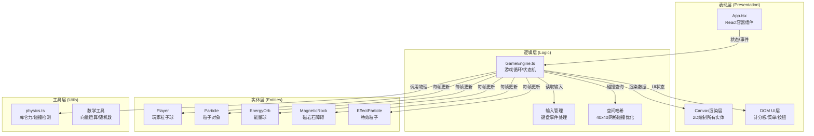

## 1. 架构设计



## 2. 技术描述

### 2.1 技术栈

- **前端框架**：React 18 + TypeScript 5
- **构建工具**：Vite 5（支持热更新HMR）
- **渲染引擎**：Canvas 2D API（原生）
- **状态管理**：React useState/useRef（轻量级，避免zustand因实时更新导致性能问题）
- **样式方案**：内联样式 + CSS（无tailwind，减少依赖，Canvas项目以程序化渲染为主）
- **物理引擎**：自研简化物理系统（库仑力、碰撞检测）

### 2.2 文件结构

```
project-root/
├── index.html                        # 入口HTML，全屏暗色背景
├── package.json                      # 依赖配置
├── vite.config.js                    # Vite构建配置
├── tsconfig.json                     # TypeScript严格模式配置
├── src/
│   ├── main.tsx                      # React挂载入口
│   ├── App.tsx                       # 主游戏容器/状态机/UI层
│   ├── engine/
│   │   └── GameEngine.ts             # 核心游戏循环 + 物理模拟
│   ├── entities/
│   │   ├── Particle.ts               # 粒子基类定义
│   │   ├── Player.ts                 # 玩家实体类
│   │   ├── EnergyOrb.ts              # 能量球类
│   │   ├── MagneticRock.ts           # 磁岩石障碍类
│   │   └── EffectParticle.ts         # 特效粒子类
│   └── utils/
│       ├── physics.ts                # 物理计算：库仑力/碰撞/向量
│       └── SpatialHash.ts            # 空间哈希网格优化
```

### 2.3 数据流向说明

1. **输入流**：App.tsx捕获键盘事件 → 传给GameEngine.inputState
2. **逻辑流**：GameEngine.update()每帧调用 → 调用physics.ts计算力 → 更新entities/*位置状态
3. **碰撞流**：GameEngine通过SpatialHash查询邻近实体 → 检测圆碰撞/边界碰撞
4. **渲染流**：GameEngine每帧输出状态 → Canvas 2D绘制所有实体和特效
5. **UI流**：GameEngine状态变化 → App.tsx React渲染 → DOM UI更新（分数、冷却条）

## 3. 核心类型定义

### 3.1 游戏状态类型

```typescript
type GameState = 'menu' | 'playing' | 'gameover';

interface PlayerState {
  id: 1 | 2;
  x: number;
  y: number;
  vx: number;
  vy: number;
  radius: number;
  charge: 'positive' | 'negative';
  health: number;      // 0-100 粒子生命值
  score: number;
  isAlive: boolean;
  respawnTimer: number;
  fieldCooldown: number;   // 0-3 冷却时间
  fieldActive: boolean;    // 电荷场是否激活
  fieldTimer: number;      // 0-2 持续时间
  color: string;
}

interface ChargeField {
  x: number;
  y: number;
  radius: number;      // 60px
  charge: 1 | -1;      // +1正电(吸引), -1负电(排斥)
  opacity: number;     // 0.8→0
  remainingTime: number;
}

interface CollisionCircle {
  x: number;
  y: number;
  radius: number;
}
```

### 3.2 游戏参数常量

```typescript
const GAME = {
  WIDTH: 800,
  HEIGHT: 600,
  GRID_SIZE: 40,          // 空间哈希网格大小
  MAX_PARTICLES: 500,     // 粒子总数上限
  FPS: 60,
  PLAYER_SPEED: 4,        // 移动速度 px/frame
  PLAYER_RADIUS: 18,
  FIELD_RADIUS: 60,
  FIELD_DURATION: 2,      // 秒
  FIELD_COOLDOWN: 3,      // 秒
  HEALTH_DRAIN_RATE: 10,  // 每秒
  INITIAL_HEALTH: 100,
  RESPAWN_TIME: 5,        // 秒
  ORB_SPAWN_INTERVAL: 5,  // 秒
  ORB_SCORE: 5,
  ORB_MIN_DISTANCE: 150,  // 距玩家最小距离
};
```

## 4. 物理计算模块 (physics.ts)

### 4.1 核心函数列表

| 函数名 | 参数 | 返回值 | 功能描述 |
|--------|------|--------|----------|
| `coulombForce` | (q1, q2, distance, k=50) | `{fx, fy}` | 计算两点电荷间的库仑力向量 |
| `circleCollision` | (c1: CollisionCircle, c2) | boolean | 两圆碰撞检测 |
| `resolveCollision` | (p1, p2, elasticity=0.8) | void | 圆碰撞速度分离求解 |
| `boundaryCollision` | (x, y, r, w, h) | `{x, y, vx, vy}` | 矩形边界反弹求解 |
| `distance` | (x1, y1, x2, y2) | number | 两点欧氏距离 |
| `normalize` | (x, y) | `{x, y}` | 向量归一化 |
| `clamp` | (val, min, max) | number | 数值范围裁剪 |
| `randomRange` | (min, max) | number | 均匀分布随机数 |

### 4.2 库仑力公式

$$ F = k \cdot \frac{q_1 \cdot q_2}{r^2} $$

- 正电荷(q>0)与正电荷：排斥力（正方向远离）
- 正电荷与负电荷：吸引力（负方向靠近）
- 电荷场激活时：玩家电荷放大100倍，作用半径限制在FIELD_RADIUS内

## 5. 空间哈希优化 (SpatialHash.ts)

```typescript
class SpatialHash {
  cellSize: number;
  grid: Map<string, CollisionCircle[]>;
  constructor(cellSize: number);
  clear(): void;
  insert(obj: CollisionCircle): void;
  query(x: number, y: number, r: number): CollisionCircle[];
}
```

- **网格大小**：40x40px，约等于2倍玩家半径
- **查询优化**：只查询目标对象周围3x3=9个网格，避免O(n²)全量检测

## 6. 性能约束实现方案

1. **帧率锁定**：requestAnimationFrame + deltaTime计算，物理步长固定为1/60秒
2. **粒子管理**：EffectParticle使用队列结构，超限时FIFO淘汰最旧粒子
3. **渲染优化**：Canvas离屏缓冲策略，静态元素（边界墙、障碍物）预渲染至离屏canvas
4. **内存池**：EffectParticle对象池复用，避免频繁GC
5. **物理步长**：每帧最多一次物理更新，复杂碰撞采用早期退出(Early Exit)策略
6. **UI节流**：分数/冷却条DOM更新使用requestAnimationFrame，避免React过度重渲染

## 7. 游戏胜负逻辑

- 玩家生命值归0 → 角色破裂 + 5秒后重生（不直接结束游戏）
- 游戏结束条件：可在后续扩展，当前版本以用户手动结束或某玩家达到特定分数(50分)获胜
