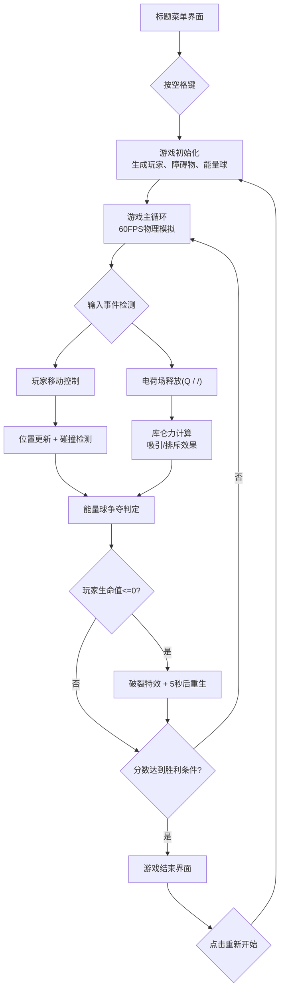

## 1. 产品概述

「磁力重构·粒子竞技场」是一款基于浏览器的2D双人对战模拟游戏，玩家操控由带电粒子组成的小球，在封闭竞技场内通过释放正负电荷场吸引或排斥对手与障碍物，争夺核心能量球积累分数，最终磁场失衡者被吸入空间裂缝而失败。

- 目标用户：独立游戏爱好者、同屏双人对战玩家
- 核心价值：独特的磁力操控玩法、流畅的粒子特效、紧张刺激的竞技体验

## 2. 核心功能

### 2.1 用户角色

| 角色 | 注册方式 | 核心权限 |
|------|----------|----------|
| 玩家1 | WASD控制 | 移动、释放正电荷场(Q键) |
| 玩家2 | 方向键控制 | 移动、释放负电荷场(/键) |

### 2.2 功能模块

1. **菜单界面**：标题画面、操作说明、开始提示
2. **游戏主界面**：Canvas游戏画布、计分板、冷却条UI
3. **游戏引擎**：物理模拟、碰撞检测、电荷力计算
4. **实体系统**：玩家粒子球、能量球、障碍物、特效粒子
5. **结束界面**：胜负判定、重新开始

### 2.3 页面详情

| 页面名称 | 模块名称 | 功能描述 |
|----------|----------|----------|
| 菜单界面 | 标题展示 | "磁力重构"80px大号像素字体，流动渐变光效 |
| 菜单界面 | 操作说明 | 列出WASD/Q和方向键//的操作方式 |
| 菜单界面 | 开始提示 | "按空格开始"闪烁提示 |
| 游戏主界面 | 游戏画布 | 800x600竞技场，Canvas 2D渲染 |
| 游戏主界面 | 计分板 | 顶部左右显示玩家分数，玩家1青色(#00FFFF)，玩家2洋红(#FF00FF) |
| 游戏主界面 | 冷却条 | 角色下方弧形冷却进度条，蓄满发光闪烁 |
| 游戏主界面 | 电荷场特效 | 释放时角色周围动态光圈(半径60px，透明度0.8→0) |
| 游戏主界面 | 能量球 | 黄-橙闪烁粒子球(30颗粒子)，碰撞得5分 |
| 游戏主界面 | 障碍物 | 4-6个磁岩石多边形，带发光，受电场影响旋转 |
| 游戏主界面 | 边界光墙 | 蓝-紫渐变脉冲光墙(脉动2px) |
| 游戏主界面 | 粒子特效 | 得分光环、破裂粒子、尾迹粒子、颤动效果 |
| 结束界面 | 胜负展示 | 胜利者放大1.5倍+金色粒子光晕，显示"玩家X获胜" |
| 结束界面 | 重新开始 | 点击按钮重置所有游戏状态 |

## 3. 核心流程

## 4. 用户界面设计

### 4.1 设计风格

- **主色调**：深空背景色 #0B0E1F
- **霓虹蓝（UI描边）**：#00D4FF
- **玩家1色**：#00FFFF（青色）
- **玩家2色**：#FF00FF（洋红）
- **能量球色**：黄(#FFD700) → 橙(#FF8C00) 循环
- **字体**：Courier New, monospace（无衬线等宽字体）

### 4.2 元素风格

- **按钮样式**：霓虹发光边框，半透明填充，hover时亮度提升
- **计分板**：50px大号数字，带发光阴影
- **冷却条**：弧形半透明进度条，完成时发光脉冲
- **边界墙**：蓝紫渐变，脉动2px振幅动画

### 4.3 页面设计概览

| 页面名称 | 模块名称 | UI元素 |
|----------|----------|--------|
| 菜单界面 | 标题区 | 80px像素字体+流动渐变光效，居中 |
| 菜单界面 | 操作说明区 | 两列布局，玩家1/2操作对比 |
| 菜单界面 | 提示区 | "按空格开始"闪烁动画 |
| 游戏主界面 | 画布区 | 800x600居中，16:9/16:10适配，vw/vh单位 |
| 游戏主界面 | 顶部UI | 左右计分板，顶部安全区 |
| 游戏主界面 | 角色UI | 弧形冷却条在角色正下方 |
| 结束界面 | 胜利展示 | 中央大文字+胜利者放大特效 |
| 结束界面 | 操作区 | "重新开始"霓虹按钮 |

### 4.4 响应式设计

- 桌面优先设计，适配16:9和16:10屏幕比例
- 游戏画布使用视口单位(vw/vh)进行缩放，保持800x600的4:3基础比例
- 最小显示尺寸：800x600像素
- 所有UI元素相对画布定位，使用CSS transform进行整体缩放
