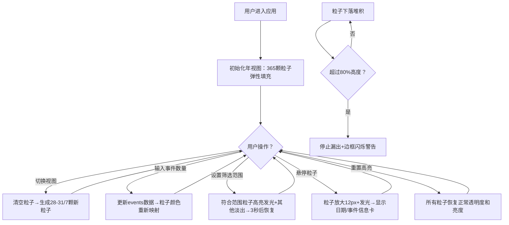

## 1. 产品概述
「时光沙漏·粒子日历」是一款基于Canvas 2D的时间可视化Web应用，将抽象的时间流逝具象化为动态的粒子沙漏效果。每颗粒子代表一天，通过颜色和物理运动直观展示时间的流动与事件的堆积，为用户提供沉浸式的时间感知体验。

- 主要用途：通过动态粒子沙漏可视化日历数据，解决传统日历缺乏时间流逝具象化表达的痛点
- 目标用户：需要直观感知时间分布、事件密度的个人用户和数据可视化爱好者
- 产品价值：将枯燥的日历数据转化为可交互的动态艺术作品，提升时间管理的视觉体验

## 2. 核心功能

### 2.1 用户角色
本应用为单用户工具型应用，无需角色区分。

### 2.2 功能模块
1. **沙漏可视化主区域**：Canvas 2D粒子渲染、物理模拟、粒子交互（悬停/点击信息卡）
2. **侧边栏控制面板**：事件数量输入、筛选范围设置、视图模式切换（年/月/周）
3. **粒子引擎核心**：粒子生成（弹性动画）、下落物理模拟（重力+随机偏移）、堆积算法（自然沙丘）
4. **颜色映射系统**：事件密度→颜色分级映射（浅灰/冷色/暖色/红紫色渐变）
5. **高亮筛选模式**：按事件数量范围筛选粒子，3秒自动恢复或手动重置

### 2.3 页面详情
| 页面名称 | 模块名称 | 功能描述 |
|-----------|-------------|---------------------|
| 主页面 | 沙漏可视化区域 | 渲染上方容器（粒子生成区）、漏斗颈、下方容器（沙丘堆积区），包含365/28-31/7颗粒子的动态模拟，鼠标悬停显示信息卡，溢出时闪烁警告 |
| 主页面 | 侧边栏控制面板 | 日期选择+事件数量输入（0-10整数）、筛选范围输入框（如3-6）、三个视图切换按钮（年/月/周）、重置高亮按钮 |
| 主页面 | 响应式适配层 | 桌面端80%画布+20%侧边栏，移动端（<768px）100%画布+底部抽屉式侧边栏 |

## 3. 核心流程
用户进入应用后，默认显示年视图，365颗浅灰色粒子从上方容器顶部依次弹性坠落，充满容器。用户可：
1. 切换视图模式→重新生成对应数量的粒子
2. 在侧边栏输入某日期的事件数量→对应粒子颜色即时更新
3. 输入筛选范围→符合条件的粒子高亮发光3秒
4. 鼠标悬停粒子→粒子放大发光并浮出信息卡
5. 粒子持续漏下堆积成沙丘→超过80%时容器边框闪烁警告

## 4. 用户界面设计

### 4.1 设计风格
- **主色调**：深色主题，垂直渐变背景 #1A1A2E → #16213E
- **强调色**：冷色#64B5F6/#81C784 → 暖色#FFB74D/#FF8A65 → 高饱和#E57373/#BA68C8，高亮光晕#FFD54F
- **按钮样式**：圆角玻璃质感，8px间距，半透明背景rgba(255,255,255,0.08)，悬停背景加深
- **字体**：使用 JetBrains Mono 等宽字体（数字时间显示）+ Noto Sans SC 中文展示
- **布局风格**：左右分栏（80%/20%），桌面端侧边栏固定240px最小宽度，移动端底部抽屉
- **玻璃质感**：沙漏容器rgba(255,255,255,0.05)半透明+1px #4A4A6A边框+模糊背投

### 4.2 页面设计概述
| 页面名称 | 模块名称 | UI元素 |
|-----------|-------------|-------------|
| 主页面 | 沙漏可视化 | Canvas全屏渲染，上方倒三角容器+漏斗颈+下方矩形容器，沙丘渐隐网格线(20px间距, rgba(255,255,255,0.05))，粒子半径5-7px悬停12px发光半径20px |
| 主页面 | 侧边栏面板 | 深色玻璃卡片，表单标签小字号白色，数字输入框带加减按钮，范围输入双字段，视图切换按钮组带激活态发光，重置按钮红色边框 |
| 主页面 | 信息卡气泡 | 圆角8px，rgba(0,0,0,0.8)背景，白色文字，10px内边距，0.3秒淡入淡出动画 |
| 主页面 | 底部抽屉 | 移动端展开高度40vh，顶部拖拽条，平滑展开/收起动画 |

### 4.3 响应式
- **桌面优先**：屏幕≥768px采用80%画布+20%侧边栏（最小240px）双栏布局
- **移动适配**：屏幕<768px时画布占满100%宽度，侧边栏转为底部抽屉式面板，默认收起，点击悬浮按钮展开
- **触摸优化**：粒子点击区域扩大，按钮最小高度44px，消除点击延迟

### 4.4 性能优化
- 使用 requestAnimationFrame 循环渲染，帧率锁定60fps
- Canvas 2D离屏渲染，避免DOM操作
- 年视图365颗粒子，每帧逻辑更新<16ms
- 物理计算简化：重力9.8px/s²，随机水平偏移-2~2px，堆积间隙1px
