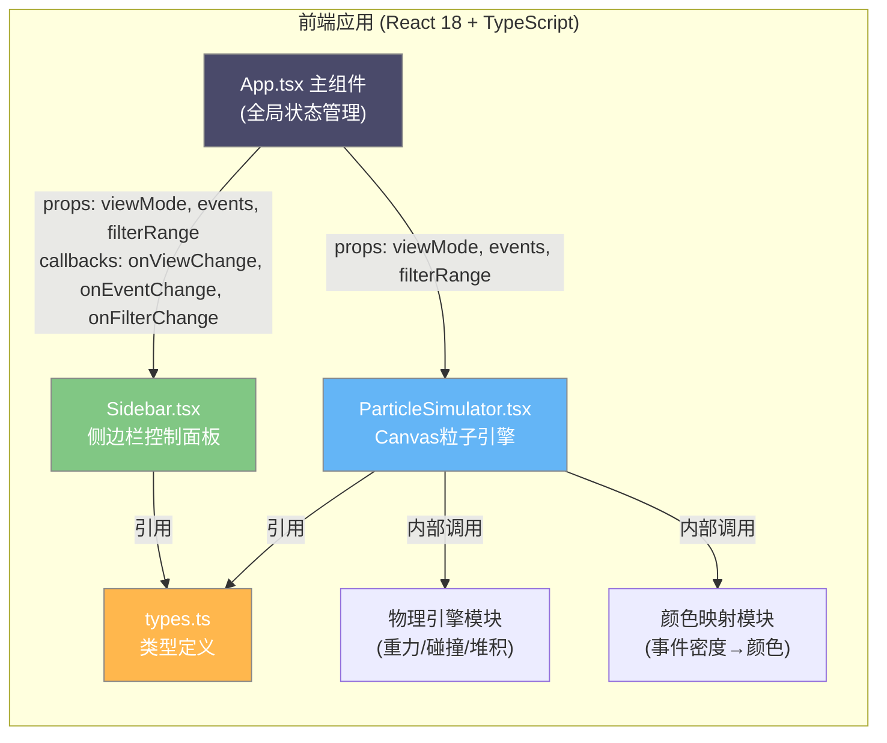

## 1. 架构设计



## 2. 技术说明
- **前端框架**：React@18 + TypeScript@5
- **构建工具**：Vite@5 + @vitejs/plugin-react@4（server.port=3000）
- **渲染技术**：Canvas 2D + requestAnimationFrame 离屏渲染循环
- **状态管理**：React useState/useEffect（轻量场景，无需额外库）
- **样式方案**：原生CSS + CSS变量 + Media Query响应式
- **无后端**：纯前端应用，事件数据保存在内存/React state中

## 3. 路由定义
本应用为单页应用(SPA)，无需路由配置。

| 路由 | 用途 |
|-------|---------|
| / | 沙漏日历主页面（唯一页面） |

## 4. 数据模型

### 4.1 核心类型定义（types.ts）

```typescript
// 视图模式
export type ViewMode = 'year' | 'month' | 'week';

// 筛选范围
export interface FilterRange {
  min: number;
  max: number;
}

// 事件数据映射：日期字符串(YYYY-MM-DD) → 事件数量(0-10)
export type EventsMap = Record<string, number>;

// 粒子接口
export interface Particle {
  id: number;           // 唯一标识
  x: number;            // 当前x坐标
  y: number;            // 当前y坐标
  vx: number;           // 水平速度
  vy: number;           // 垂直速度
  targetX: number;      // 目标x坐标（填充动画用）
  targetY: number;      // 目标y坐标（填充动画用）
  radius: number;       // 渲染半径(5-7px)
  baseRadius: number;   // 基础半径
  color: string;        // 填充颜色(hex)
  glowRadius: number;   // 发光半径
  glowAlpha: number;    // 发光透明度
  date: string;         // 对应日期(YYYY-MM-DD)
  eventCount: number;   // 事件数量(0-10)
  state: 'filling' | 'waiting' | 'falling' | 'settled' | 'hovered';
  settleY: number;      // 堆积后的最终y坐标
  scale: number;        // 悬停缩放系数
  highlighted: boolean; // 是否处于高亮筛选状态
  opacity: number;      // 渲染透明度
}

// 沙漏容器配置
export interface HourglassConfig {
  topContainer: { x: number; y: number; width: number; height: number };
  neck: { x: number; y: number; width: number; height: number };
  bottomContainer: { x: number; y: number; width: number; height: number };
}

// 应用全局状态
export interface AppState {
  viewMode: ViewMode;
  events: EventsMap;
  filterRange: FilterRange | null;
  currentDate: Date;
}
```

### 4.2 颜色映射算法
事件数量(0-10) → 颜色分级映射，分级内部线性插值：

| 事件数量 | 颜色区间 | 起始色 | 结束色 |
|---------|---------|--------|--------|
| 0 | 浅灰 | #E0E0E0 | #E0E0E0 |
| 1-3 | 冷色渐变 | #64B5F6 (蓝) | #81C784 (绿) |
| 4-6 | 暖色渐变 | #FFB74D (橙) | #FF8A65 (珊瑚) |
| 7-10 | 高饱和红紫 | #E57373 (红) | #BA68C8 (紫) |

线性插值公式：`lerp(a, b, t) = a + (b - a) * t`，对RGB三个通道分别插值。

### 4.3 物理模拟参数
- 重力加速度：9.8 px/s²（每帧：9.8/60 ≈ 0.163px）
- 水平随机偏移：-2 ~ +2 px/帧
- 粒子基础半径：5-7px（随机分布）
- 堆积间隙：1px（避免完全重叠）
- 填充弹性动画：阻尼系数0.7，总耗时2秒
- 悬停放大：半径→12px，发光半径20px，透明度0.5，动画0.3秒
- 高亮效果：亮度+30%，光晕宽度2px(#FFD54F)，非高亮opacity=0.2

## 5. 文件结构

```
auto92/
├── package.json
├── vite.config.ts
├── tsconfig.json
├── index.html
├── .trae/
│   └── documents/
│       ├── PRD.md
│       └── architecture.md
└── src/
    ├── App.tsx              # 主组件，全局状态与布局
    ├── ParticleSimulator.tsx # 核心：Canvas粒子引擎(≈400行)
    ├── Sidebar.tsx          # 侧边栏：表单与控制面板
    ├── types.ts             # TypeScript接口与类型
    └── index.css            # 全局样式与CSS变量
```

## 6. 性能优化策略
1. **Canvas脏区域重绘**：仅重绘粒子运动区域，而非全屏清屏
2. **对象池复用**：切换视图时复用Particle对象，减少GC压力
3. **空间网格索引**：堆积碰撞检测时用网格分桶，避免O(n²)
4. **requestAnimationFrame时间戳**：用deltaTime实现帧率无关的物理更新
5. **离屏画布缓存**：沙丘网格线、沙漏容器预渲染至OffscreenCanvas
6. **节流/防抖**：侧边栏输入事件用useCallback防抖，避免频繁重渲染
