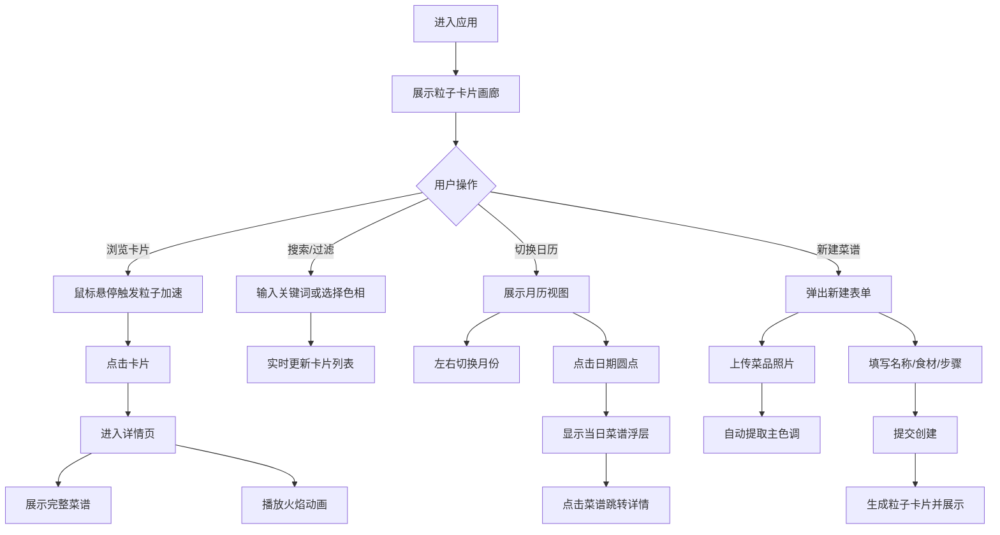

# 食光手帐 产品需求文档 (PRD)

## 1. 产品概述

「食光手帐」是一款面向美食博主和烹饪爱好者的全栈Web应用，提供菜谱记录、动态粒子卡片展示与日历式浏览的沉浸式体验。

- 核心目的：帮助用户以可视化的数字卡片形式记录每日烹饪心得，通过粒子动效和火焰动画提升分享体验
- 目标用户：美食博主、家庭厨师、烹饪爱好者
- 产品价值：将平凡的菜谱记录转化为具有艺术感的数字收藏品，激发持续记录和分享的动力

---

## 2. 核心功能

### 2.1 用户角色
| 角色 | 注册方式 | 核心权限 |
|------|----------|----------|
| 普通用户 | 无需注册，本地使用 | 上传菜谱、浏览菜谱、搜索过滤、查看详情 |

### 2.2 功能模块

1. **主页（画廊视图）**：粒子卡片画廊、搜索框、色相过滤选择器、切换日历/画廊视图按钮
2. **日历视图**：月份日历网格、日期圆点标记、当日菜谱浮层
3. **菜谱详情页**：背景虚化大图、完整菜谱信息、火焰动画、返回按钮
4. **新建菜谱弹窗**：图片上传、名称输入、食材列表、烹饪步骤、提交按钮

### 2.3 页面详情

| 页面名称 | 模块名称 | 功能描述 |
|----------|----------|----------|
| 主页-画廊 | 粒子卡片网格 | 显示所有菜谱卡片，支持响应式布局，鼠标悬停触发粒子加速和光晕效果 |
| 主页-画廊 | 搜索过滤栏 | 支持按名称/食材模糊搜索，色相环点击筛选主色调区间菜谱 |
| 主页-画廊 | 新建按钮 | 浮动操作按钮，点击弹出新建菜谱表单 |
| 日历视图 | 月份切换 | 左右拖拽/箭头按钮切换月份，带平滑滑动动画 |
| 日历视图 | 日期标记 | 有菜谱的日期显示彩色圆点（颜色对应当日菜品主色调） |
| 日历视图 | 当日列表浮层 | 点击日期显示当日菜谱缩略图和名称列表 |
| 菜谱详情 | 背景虚化 | 菜品图片全屏虚化作为背景层 |
| 菜谱详情 | 信息展示 | 完整展示名称、食材列表、分步骤烹饪说明 |
| 菜谱详情 | 火焰动画 | Canvas渲染80个橙红色粒子模拟炉火燃烧效果 |
| 新建弹窗 | 图片上传 | 支持jpg/png，≤8MB，自动提取中心100x100像素主色调 |
| 新建弹窗 | 表单填写 | 名称输入框、动态添加/删除食材、多行步骤输入 |

---

## 3. 核心流程

### 主用户流程描述
用户进入应用后，默认展示粒子卡片画廊。用户可：①浏览现有卡片并点击查看详情（触发火焰动画）；②使用搜索框或色相环筛选菜谱；③切换至日历视图按月浏览，点击日期查看当日菜谱；④点击新建按钮上传菜品照片并填写信息，系统自动提取主色调生成粒子卡片。

---

## 4. 用户界面设计

### 4.1 设计风格

- **主色调**：深灰底色 #1A1A2E，暖橙点缀色 #E94560
- **辅助色**：每道菜谱自动提取的主色调及其互补色（色相差180°）
- **卡片风格**：半磨砂玻璃效果，backdrop-filter: blur(8px)，背景 rgba(255,255,255,0.08)
- **按钮样式**：圆角矩形（12px），悬停时微放大（scale 1.03），暖橙色渐变填充
- **字体选择**：标题使用 "Noto Serif SC"（思源宋体，提升美食文化感），正文使用 "Noto Sans SC"（思源黑体，可读性强）
- **布局风格**：画廊采用不规则网格错落排布，日历使用圆角矩形网格
- **图标风格**：线性简约图标，统一使用暖橙色调

### 4.2 页面设计概述

| 页面名称 | 模块名称 | UI元素设计 |
|----------|----------|------------|
| 主页-画廊 | 顶部导航 | 深色渐变背景，左侧Logo（食光手帐+火焰图标），中间搜索框，右侧色相环选择器+视图切换按钮 |
| 主页-画廊 | 卡片网格 | 4列（桌面）/ 2列（平板）/ 1列（手机），间距16px，卡片悬停时 scale 1.02 + 阴影加深 |
| 主页-画廊 | 粒子动画 | Canvas覆盖卡片底部70%区域，粒子缓慢向上飘散，悬停时粒子数从20增至60，速度×2 |
| 日历视图 | 月份标题 | 居中大号月份年份文字，左右箭头按钮，支持触摸左右滑动切换 |
| 日历视图 | 日期网格 | 7列布局，每日单元格圆角8px，选中/有记录日期高亮，圆点位于单元格底部中央 |
| 日历视图 | 浮层面板 | 日期下方弹出，圆角16px，列出当日菜谱缩略图（40x40）+名称，点击任意项跳转 |
| 菜谱详情 | 背景层 | 菜品图片全屏 + blur(20px) + 深色蒙层（rgba(26,26,46,0.7)） |
| 菜谱详情 | 内容卡片 | 半透明磨砂玻璃容器，max-width 800px，居中显示 |
| 菜谱详情 | 火焰Canvas | 步骤下方固定高度区域（200px），橙红粒子翻滚上升 |
| 新建弹窗 | 模态框 | 居中显示，圆角20px，磨砂玻璃背景，外部点击区域半透明遮罩 |
| 新建弹窗 | 上传区 | 虚线边框区域，拖拽或点击上传，上传后实时预览缩略图+主色调色块 |

### 4.3 响应式设计

- **桌面端（≥1024px）**：画廊4列，日历文字正常大小，左右箭头按钮
- **平板端（768-1023px）**：画廊2列，日历单元格缩小20%，触摸优化间距
- **手机端（<768px）**：画廊单列，日历文字缩小至12px，圆点半径减小，月份切换改为左右滑动为主，按钮为辅
- **触摸优化**：所有可点击元素最小尺寸44x44px，滑动手势支持（月份切换）

### 4.4 动效设计

- 月份切换：CSS transition 0.4s ease-in-out，水平滑动
- 卡片悬停：scale 1.02 + box-shadow 0 8px 20px rgba(0,0,0,0.5)，0.3s 过渡
- 悬停光晕：卡片边框 box-shadow inset + 外发光，持续2s渐隐
- 弹窗出现：scale 0.9→1 + opacity 0→1，0.35s cubic-bezier(0.34, 1.56, 0.64, 1)
- 粒子动画：requestAnimationFrame 驱动，30FPS+
- 火焰动画：粒子速度周期性随机波动（周期0.5-1.2s）
