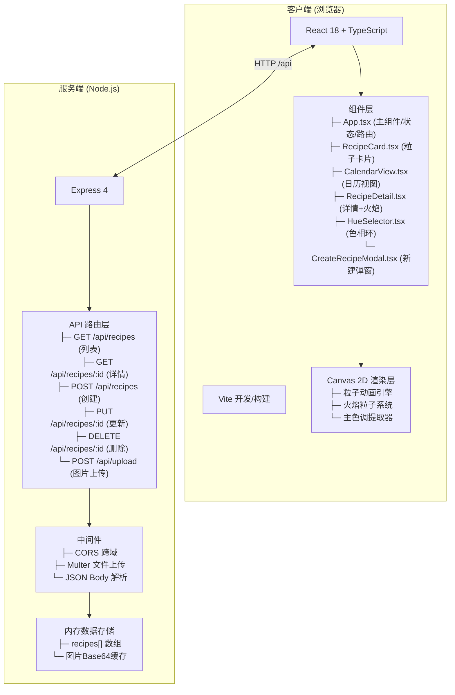
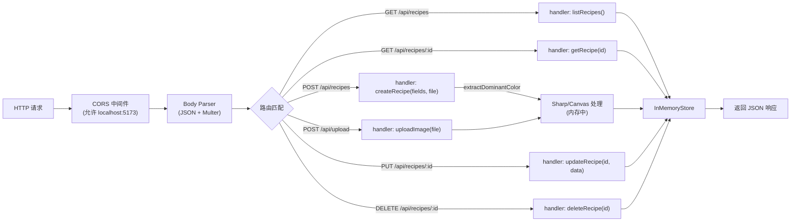
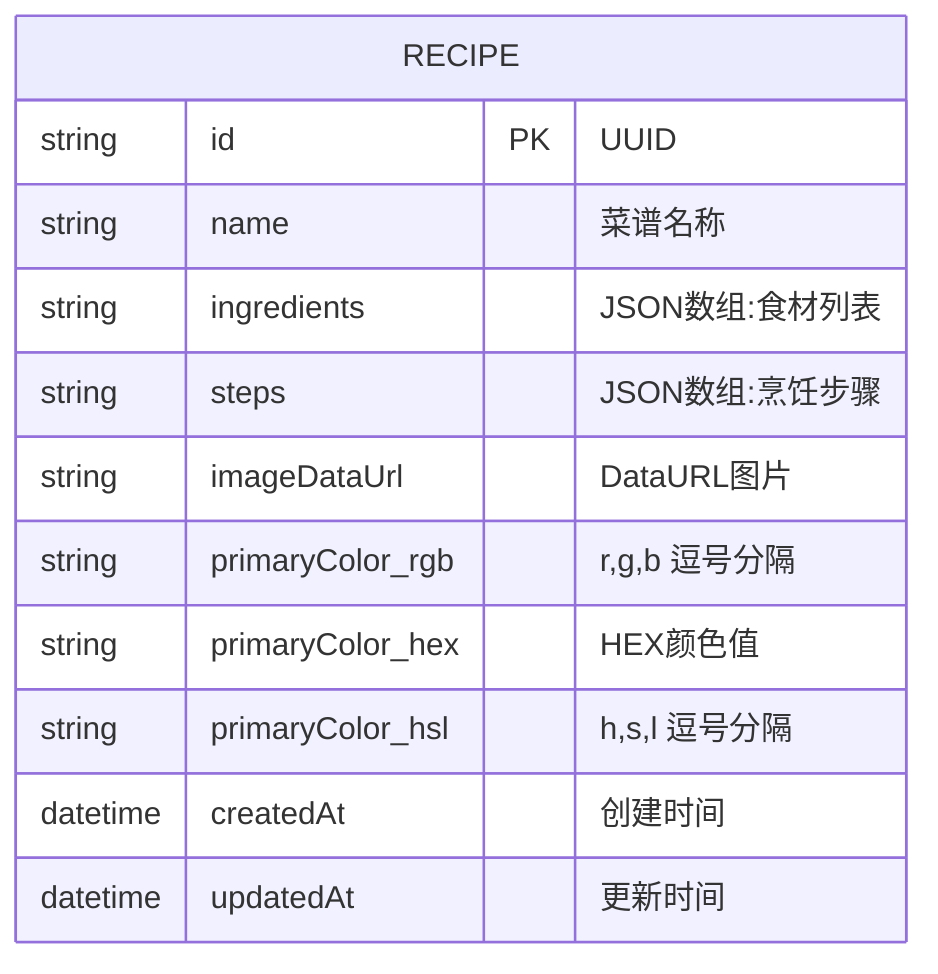

# 食光手帐 技术架构文档

## 1. 架构设计



## 2. 技术描述

- **前端框架**：React 18 + TypeScript 5（严格模式）
- **构建工具**：Vite 5 + @vitejs/plugin-react
- **后端框架**：Express 4（Node.js）
- **文件上传**：Multer（内存存储模式）
- **跨域处理**：CORS 中间件
- **数据存储**：内存存储（Map/Array），图片以Base64/DataURL形式保存
- **动画渲染**：Canvas 2D API + requestAnimationFrame
- **开发模式**：Vite 开发服务器（端口5173）+ Express API 服务器（端口3001）并发运行

### 各文件职责与调用关系

```
项目根目录/
├── package.json              # 依赖管理 + dev脚本 (concurrently 前后端并发)
├── vite.config.js            # Vite配置 + 代理 /api -> :3001
├── tsconfig.json             # TS严格模式配置
├── index.html                # HTML入口，挂载 #app，引入字体
│
├── server/
│   └── index.ts              # Express服务入口
│                             # 调用关系：
│                             # 接收HTTP请求 → Multer处理文件 → CORS放行
│                             # → 路由处理器操作内存store → 返回JSON
│
└── src/
    ├── App.tsx               # 主组件，全局状态管理
    │                         # 调用关系：
    │                         # useEffect → GET /api/recipes → 保存state
    │                         # 用户操作 → POST/PUT/DELETE → 更新state
    │                         # 条件渲染: CalendarView / RecipeGrid / RecipeDetail
    │
    ├── components/
    │   ├── RecipeCard.tsx    # 粒子卡片组件
    │   │                     # 接收 props: recipe + onClick
    │   │                     # Canvas渲染: 初始化粒子池 → RAF循环更新/绘制
    │   │                     # 悬停回调: setState({hovered:true}) → 粒子参数变化
    │   │
    │   ├── CalendarView.tsx  # 日历视图组件
    │   │                     # 接收 props: recipes[] + onSelectRecipe
    │   │                     # 计算逻辑: 按日期分组 recipes → 生成月历网格
    │   │                     # 交互: touch事件 → 月份滑动 → 重新渲染
    │   │
    │   ├── RecipeDetail.tsx  # 详情+火焰动画组件
    │   │                     # 接收 props: recipe
    │   │                     # Canvas: 火焰粒子系统(80粒子) → RAF循环
    │   │
    │   ├── HueSelector.tsx   # 色相环选择器
    │   │                     # Canvas绘制色相环 → click事件 → 计算选中色相区间
    │   │
    │   └── CreateRecipeModal.tsx  # 新建菜谱弹窗
    │                         # 文件选择 → 客户端Canvas提取主色调 → 预览
    │                         # 提交 → POST FormData到 /api/recipes
    │
    └── utils/
        ├── colorUtils.ts     # 颜色处理工具
        │                     # extractDominantColor(img) → RGB/HSL
        │                     # getComplementaryColor(hsl) → 互补色
        │                     # hexToRgb, rgbToHsl, hslToHex
        │
        └── particleEngine.ts # 粒子系统引擎(可复用)
                              # Particle 类 / ParticleSystem 类
                              # update(progress) / render(ctx)
```

## 3. 路由定义（前端视图切换）

| 视图状态 | 触发条件 | 展示内容 |
|----------|----------|----------|
| gallery（默认） | 初始化 / 返回主页 | 粒子卡片网格 + 搜索栏 + 色相选择器 |
| calendar | 点击「日历」按钮 | 月历视图 + 日期圆点标记 |
| detail | 点击RecipeCard / 日历浮层项 | 菜谱详情页 + 火焰动画 |
| create | 点击「+」浮动按钮 | 新建菜谱模态框 |

## 4. API 定义

### TypeScript 类型定义
```typescript
// 共享类型 (前后端共用结构)
interface Recipe {
  id: string;                    // UUID
  name: string;                  // 菜谱名称
  ingredients: string[];         // 食材列表
  steps: string[];               // 烹饪步骤(按顺序)
  imageDataUrl: string;          // 图片 DataURL (Base64)
  primaryColor: {                // 提取的主色调
    r: number; g: number; b: number;
    hex: string;
    hsl: { h: number; s: number; l: number };
  };
  createdAt: string;             // ISO日期字符串 (YYYY-MM-DD)
  updatedAt: string;
}

interface CreateRecipePayload {
  name: string;
  ingredients: string[];
  steps: string[];
  image: File;                   // 上传的图片文件 (multer处理)
}
```

### API 接口详情

| 方法 | 路径 | 请求格式 | 响应格式 | 说明 |
|------|------|----------|----------|------|
| GET | `/api/recipes` | N/A | `{ success: true; data: Recipe[] }` | 获取全部菜谱列表 |
| GET | `/api/recipes/:id` | N/A | `{ success: true; data: Recipe }` | 获取单个菜谱详情 |
| POST | `/api/recipes` | `multipart/form-data` (image+JSON字段) | `{ success: true; data: Recipe }` | 创建新菜谱 (含图片上传) |
| PUT | `/api/recipes/:id` | `application/json` | `{ success: true; data: Recipe }` | 更新菜谱信息 |
| DELETE | `/api/recipes/:id` | N/A | `{ success: true }` | 删除指定菜谱 |
| POST | `/api/upload` | `multipart/form-data` (仅image) | `{ success: true; data: { imageDataUrl: string; primaryColor: object } }` | 仅上传图片并提取主色调(可选,用于客户端预览) |

### 请求/响应示例

**POST /api/recipes 请求 (multipart/form-data):**
```
------boundary
Content-Disposition: form-data; name="image"; filename="dish.jpg"
Content-Type: image/jpeg
[binary data]
------boundary
Content-Disposition: form-data; name="name"
番茄炒蛋
------boundary
Content-Disposition: form-data; name="ingredients"
["番茄","鸡蛋","葱花","盐","糖"]
------boundary
Content-Disposition: form-data; name="steps"
["鸡蛋打散","番茄切块","热锅下油","炒鸡蛋盛出","炒番茄出汁","加入鸡蛋翻炒","调味出锅"]
------boundary--
```

**成功响应:**
```json
{
  "success": true,
  "data": {
    "id": "a1b2c3d4-...",
    "name": "番茄炒蛋",
    "ingredients": ["番茄","鸡蛋","葱花","盐","糖"],
    "steps": ["鸡蛋打散", "..."],
    "imageDataUrl": "data:image/jpeg;base64,/9j/4AAQSkZJRg...",
    "primaryColor": {
      "r": 220, "g": 80, "b": 60,
      "hex": "#DC503C",
      "hsl": { "h": 8, "s": 70, "l": 55 }
    },
    "createdAt": "2026-06-09T15:30:00.000Z",
    "updatedAt": "2026-06-09T15:30:00.000Z"
  }
}
```

## 5. 服务端架构图



## 6. 数据模型

### 6.1 数据模型定义 (ER图)



### 6.2 内存数据结构 (Server-side)

```typescript
// server/index.ts 内部定义
interface RecipeStore {
  recipes: Map<string, Recipe>;  // 以id为key的Map, O(1)查找
  dateIndex: Map<string, string[]>;  // YYYY-MM-DD → [recipeId1, ...]
}

// 初始化示例数据 (首次启动时注入)
const seedRecipes: Recipe[] = [
  {
    id: 'seed-001',
    name: '红烧排骨',
    ingredients: ['排骨500g', '姜片5片', '八角2颗', '生抽2勺', '老抽1勺', '冰糖15g'],
    steps: ['排骨冷水下锅焯水', '锅中放油加冰糖炒糖色', '下排骨翻炒上色', '加水没过排骨,加香料', '大火烧开转小火炖40分钟', '大火收汁出锅'],
    imageDataUrl: 'data:image/svg+xml;base64,PHN2ZyB3aWR0aD0iNDAwIiBoZWlnaHQ9IjMwMCIgeG1sbnM9Imh0dHA6Ly93d3cudzMub3JnLzIwMDAvc3ZnIj48cmVjdCB3aWR0aD0iMTAwJSIgaGVpZ2h0PSIxMDAlIiBmaWxsPSIjYjU0NTJiIi8+PHRleHQgeD0iNTAlIiB5PSI1MCUiIGZvbnQtc2l6ZT0iMjQiIGZpbGw9IndoaXRlIiB0ZXh0LWFuY2hvcj0ibWlkZGxlIiBkb21pbmFudC1iYXNlbGluZT0ibWlkZGxlIj7nuqfnqIzmnaPotI88L3RleHQ+PC9zdmc+',
    primaryColor: {
      r: 181, g: 69, b: 43, hex: '#B5452B',
      hsl: { h: 12, s: 62, l: 44 }
    },
    createdAt: '2026-06-08T10:00:00.000Z',
    updatedAt: '2026-06-08T10:00:00.000Z'
  }
];
```

---

## 7. 性能优化策略

| 优化点 | 方案 |
|--------|------|
| 粒子动画性能 | 1. IntersectionObserver 检测卡片可见性，非可视区域暂停RAF循环<br>2. 单次重绘所有可见Canvas，避免多次layout<br>3. 离屏Canvas复用粒子对象池 |
| 主色调提取 | 客户端Canvas采样中心100x100像素，取平均色值（服务端仅做备份计算） |
| 图片处理 | Multer使用内存存储（memoryStorage），前端预览用FileReader+canvas，不写入磁盘 |
| 状态更新 | React使用useMemo/useCallback避免不必要重渲染，日历分组结果缓存 |
| 响应式渲染 | CSS Grid + media queries，不使用JS计算布局 |
