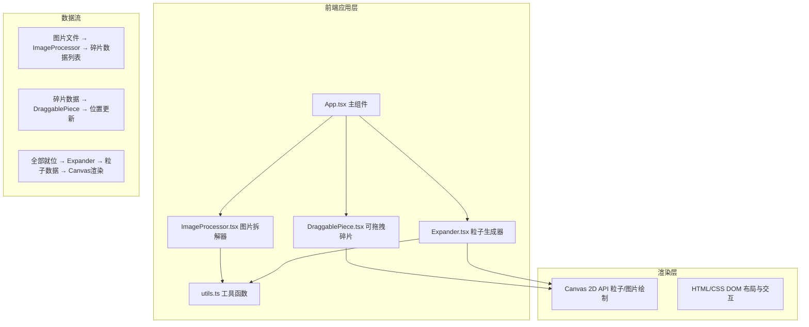

## 1. 架构设计



---

## 2. 技术选型

- **前端框架**：React 18 + TypeScript（严格模式）
- **构建工具**：Vite 5 + @vitejs/plugin-react
- **渲染技术**：Canvas 2D API（粒子系统）+ DOM（碎片交互）
- **状态管理**：React Hooks（useState/useRef/useEffect），无需额外状态库
- **样式方案**：原生 CSS + CSS Variables（暗色主题统一控制）

---

## 3. 文件结构与调用关系

```
src/
├── App.tsx              # 主组件：全局状态、文件选择、布局容器
│   │                    # 调用：ImageProcessor（获取碎片）→ DraggablePiece（渲染）→ Expander（粒子）
│   │                    # 数据流：File[] → PieceData[] → PositionUpdate → Particles
│   ├── ImageProcessor.tsx  # 纯逻辑组件：Canvas图片解析、拆解、主色调提取
│   │                    # 调用：utils.extractDominantColor()
│   │                    # 输出：PieceData[] 碎片数据列表
│   ├── DraggablePiece.tsx  # 单碎片组件：不规则裁切、拖拽交互、吸附动画
│   │                    # 调用：utils.distance() 计算吸附距离
│   │                    # 事件：onSnap(完成吸附) → App.tsx 统计进度
│   ├── Expander.tsx        # 粒子系统组件：300粒子生成、切线漂移、正弦波动
│   │                    # 调用：utils.distance()
│   │                    # 渲染：Canvas 2D requestAnimationFrame 循环
│   └── utils.ts            # 工具函数集合
│                        # - extractDominantColor(imageData): 中心100x100采样平均色
│                        # - distance(x1,y1,x2,y2): 欧几里得距离
│                        # - 辅助：颜色混合、网格吸附计算
```

---

## 4. 数据模型定义

### 4.1 核心类型

```typescript
// 单个拼图碎片数据
interface PieceData {
  id: string;                    // 唯一标识：imgIdx_pieceIdx
  imageIndex: number;            // 所属图片索引
  pieceIndex: number;            // 碎片在模板中的索引(0-6)
  imageSrc: string;              // 裁切后的图片DataURL
  dominantColor: string;         // 主色调 hex
  clipPath: string;              // SVG clip-path 多边形定义
  targetX: number;               // 目标网格中心X
  targetY: number;               // 目标网格中心Y
  centerX: number;               // 碎片自身中心X（相对图片）
  centerY: number;               // 碎片自身中心Y（相对图片）
  width: number;                 // 碎片包围盒宽度
  height: number;                // 碎片包围盒高度
}

// 碎片位置状态
interface PieceState {
  id: string;
  currentX: number;              // 当前位置X
  currentY: number;              // 当前位置Y
  isSnapped: boolean;            // 是否已吸附到位
  isDragging: boolean;           // 是否正在拖拽
  snapAnimation: number;         // 脉冲动画进度 0~1
}

// 粒子数据
interface Particle {
  x: number;
  y: number;
  vx: number;                    // 切线方向速度
  vy: number;
  size: number;                  // 2~4px 随机
  baseAlpha: number;             // 基础透明度
  phase: number;                 // 正弦波动相位
  color: string;                 // 混合主色调
  outlineIndex: number;          // 所属轮廓段索引
}
```

### 4.2 预设拼图模板（7块不规则多边形）

```typescript
// 每张图片的画布视为 400x400，按以下7个多边形裁切
// 形状包含：锯齿边缘、圆角边缘、凹凸边缘等特色造型
const PIECE_TEMPLATES: PolygonTemplate[] = [
  // 0: 左上 - 锯齿形边缘
  { points: [[0,0],[180,10],[195,85],[10,190],[0,180]], edgeType: 'jagged' },
  // 1: 中上 - 圆角凹凸
  { points: [[200,0],[390,20],[380,120],[210,115],[195,45]], edgeType: 'rounded' },
  // 2: 右上 - 不规则三角
  { points: [[400,0],[400,200],[290,180],[310,60]], edgeType: 'jagged' },
  // 3: 左中 - 波浪边缘
  { points: [[0,200],[120,205],[115,310],[20,320],[0,305]], edgeType: 'wavy' },
  // 4: 中心 - 六边形带凹凸
  { points: [[130,130],[270,125],[280,270],[135,280],[120,205]], edgeType: 'rounded' },
  // 5: 右中 - 不规则五边形
  { points: [[290,190],[400,210],[400,340],[300,330],[285,250]], edgeType: 'jagged' },
  // 6: 底部 - 横向长条带圆角
  { points: [[0,330],[140,325],[260,340],[400,345],[400,400],[0,400]], edgeType: 'rounded' },
];
```

---

## 5. 性能保证方案

### 5.1 拖拽性能
- 使用 `useRef` 存储拖拽状态，避免 React 重渲染
- 位置更新通过 DOM style.transform 直接设置，触发 GPU 合成
- `mousemove` 事件使用 `passive: true` 提升滚动性能
- 所有视觉变换使用 CSS transform，不触发 layout/paint

### 5.2 粒子系统性能
- 粒子总数硬限制 300
- 使用单 Canvas 一次性批量绘制，减少 API 调用
- 每帧粒子位置更新使用简单向量运算，计算复杂度 O(n)
- 粒子颜色预计算，每帧仅更新相位偏移

### 5.3 图片处理性能
- 图片拆解使用离屏 Canvas（OffscreenCanvas 或临时 DOM Canvas）
- 使用 `createImageBitmap` 异步解码图片，避免阻塞主线程
- 主色调提取仅采样中心 100x100 = 10,000 像素，计算量极小
