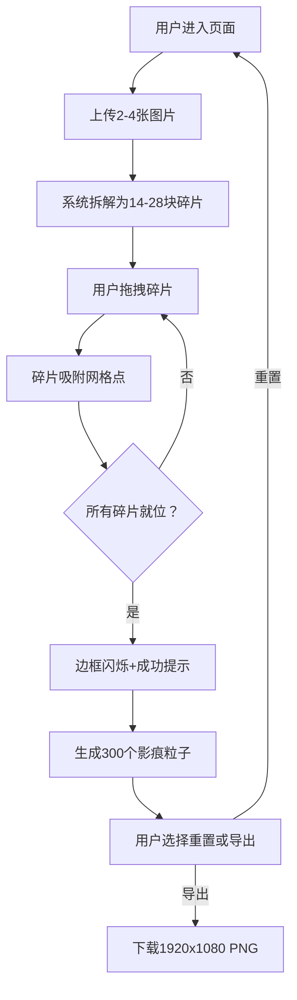

## 1. 产品概述

「影痕拓印·时光拼图」是一款面向创意工作者的浏览器端交互式拼贴绘画工具。用户上传照片素材后，系统自动拆解为不规则拼图碎片，经拖拽拼合后生成带有动态光效粒子的数字艺术拼贴画。

- 核心价值：将普通照片转化为带有艺术气息的动态拼贴作品，降低数字艺术创作门槛
- 目标用户：创意设计师、摄影爱好者、社交媒体内容创作者

---

## 2. 核心功能

### 2.1 用户角色

| 角色 | 注册方式 | 核心权限 |
|------|----------|----------|
| 创意工作者 | 无需注册，直接使用 | 上传图片、拖拽拼合、导出作品 |

### 2.2 功能模块

1. **主工作台页面**：文件上传区、操作控制面板、拼图画布、状态提示、粒子渲染层

### 2.3 页面详情

| 页面名称 | 模块名称 | 功能描述 |
|----------|----------|----------|
| 主工作台 | 文件上传模块 | 支持点击/拖拽上传2-4张图片（jpg/png，单张≤8MB） |
| 主工作台 | 图片拆解模块 | 将每张图片拆分为7块不规则多边形碎片，提取主色调 |
| 主工作台 | 碎片拖拽模块 | 鼠标拖拽碎片，实时跟随，松手吸附网格，脉冲反馈动画 |
| 主工作台 | 影痕粒子模块 | 全部拼合后，沿碎片轮廓生成300个动态发光粒子 |
| 主工作台 | 状态提示模块 | 左上角显示拼贴进度，完成时边框闪烁+弹窗提示 |
| 主工作台 | 重置/导出模块 | 重置清空画布，导出1920x1080 PNG |

---

## 3. 核心流程

**用户操作流程：**
1. 用户进入页面，看到左侧操作面板和右侧空白画布
2. 通过点击或拖拽方式上传2-4张图片素材
3. 系统自动拆解每张图片为7块不规则碎片，散落在画布上
4. 用户逐块拖拽碎片到目标网格位置，松手自动吸附
5. 左上角进度条实时更新已完成/总碎片数
6. 所有碎片拼合完成后，画布边框闪烁3次绿色，弹窗提示"拼贴完成！"
7. 碎片外围生成动态发光粒子，沿轮廓切线漂移
8. 用户可点击"重置"重新开始，或点击"导出"下载PNG作品

---

## 4. 用户界面设计

### 4.1 设计风格

- **主题色调**：暗色主题，主背景 `#1a1a2e`，画布背景 `#0f0f1c`，主题色 `#6c63ff` → `#8b5cf6` 渐变
- **按钮样式**：圆角矩形（圆角8px），悬停时紫色渐变，0.3s ease-in-out 过渡
- **字体**：标题使用「思源黑体 Bold」，正文使用「思源黑体 Regular」，避免 Inter 等通用字体
- **布局风格**：左右分栏（桌面）/上下分栏（移动端），左侧毛玻璃面板，右侧画布主区
- **视觉细节**：毛玻璃半透明面板（`rgba(255,255,255,0.05)` + `backdrop-filter: blur(8px)`），柔和投影，径向渐变粒子

### 4.2 页面设计概述

| 页面名称 | 模块名称 | UI 元素 |
|----------|----------|----------|
| 主工作台 | 操作面板 | 毛玻璃背景，280px宽，虚线上传区（悬停发光`#6c63ff`），重置/导出按钮 |
| 主工作台 | 拼图画布 | `#0f0f1c`背景，最小宽600px，碎片带`box-shadow`投影，拖拽时scale1.05 |
| 主工作台 | 状态提示 | 左上角半透明黑底白字卡片，显示"已完成 X/Y 块碎片" |
| 主工作台 | 粒子层 | Canvas 2D渲染，径向渐变圆形粒子（中心白→边缘透明） |

### 4.3 响应式设计

- **桌面端（≥768px）**：左右布局，左280px操作面板，右自适应画布
- **移动端（<768px）**：上下布局，上操作面板，下画布区域
- **触控优化**：支持触摸拖拽，增大点击热区至44px

### 4.4 性能优化

- 拖拽使用 `requestAnimationFrame` 驱动，帧率≥55fps
- 粒子总数≤300，每帧计算≤2ms
- 拖拽响应延迟≤50ms
