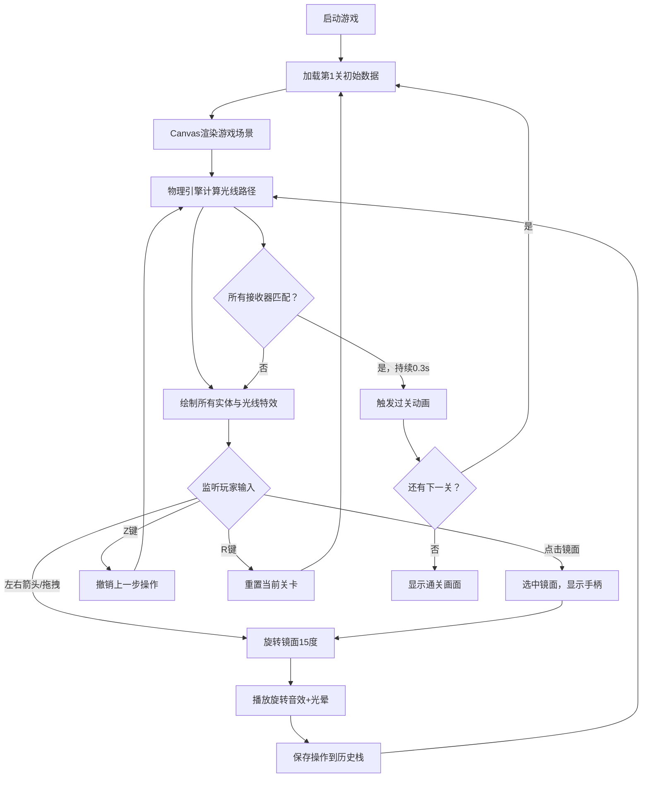

## 1. 产品概述

「镜面迷阵·幻光反射」是一款面向浏览器的2D逻辑解谜游戏，玩家通过旋转和移动散布在网格上的多棱镜与反射镜，引导彩色激光从发射器出发，经过镜面反射和色散后精准射入对应颜色的接收器，解锁通往下一关卡的传送门。

- 主要目的：提供兼具艺术性与逻辑挑战性的解谜体验
- 目标用户：独立游戏爱好者、逻辑解谜玩家
- 市场价值：在浏览器端提供流畅、精美的轻量级解谜游戏体验

## 2. 核心功能

### 2.1 功能模块
1. **游戏主界面**：Canvas渲染场景、8x8网格、UI信息显示
2. **光线物理系统**：激光发射、镜面反射、三棱镜色散、粒子特效
3. **交互系统**：镜面选中/旋转/拖拽、撤销/重置、键盘控制
4. **关卡系统**：3个预设关卡、胜利检测、传送门动画
5. **音效系统**：旋转音效、激活音效、胜利音效

### 2.2 功能详情
| 功能模块 | 子功能 | 详细描述 |
|---------|--------|---------|
| 光线系统 | 激光发射 | 白色激光从发射器三角形顶点持续射出，宽度2px，白色纯色线条 |
| 光线系统 | 镜面反射 | 按入射角等于反射角计算，最多5次反射，镜面辉光动画1秒周期 |
| 光线系统 | 色散分裂 | 三棱镜将白光分裂为红#FF3366、绿#33FF66、蓝#3366FF三束子激光 |
| 光线系统 | 粒子特效 | 路径每5px生成1px光点，透明度0.8，尾随流动效果 |
| 交互系统 | 镜面旋转 | 点击选中，左右箭头/拖拽手柄，每次15度增量，0.3秒动画过渡 |
| 交互系统 | 光晕音效 | 旋转时蓝色光晕半径扩20%，0.2秒消散，800-1000Hz金属摩擦声 |
| 交互系统 | 撤销重置 | Z键撤销（最多10步），R键重置+全屏白色闪烁0.2秒 |
| 关卡系统 | 胜利条件 | 所有接收器被对应颜色激光命中并持续0.3秒 |
| 关卡系统 | 过关动画 | 16光点螺旋传送门（每秒1圈），"Level Completed!"放大渐隐1.5秒 |
| UI系统 | 信息显示 | 左上：关卡编号+撤销步数，右下：传送门状态图标 |
| UI系统 | 悬停效果 | 交互元素悬停放大10%+补色投影0.3，点击投影0.6再回落 |

## 3. 核心流程

## 4. 用户界面设计

### 4.1 设计风格
- **设计调性**：深空科技感 + 霓虹光效美学
- **主色调**：深空蓝 `#0A0A2E`（背景）、纯白 `#FFFFFF`（激光/文字）
- **强调色**：红 `#FF3366`、绿 `#33FF66`、蓝 `#3366FF`（色散激光）、浅灰蓝 `#2A2A5E`（网格线）
- **材质质感**：半透明发光物体、辉光阴影、粒子流特效
- **动画风格**：平滑插值过渡、脉动发光、螺旋旋转

### 4.2 页面设计概述
| 区域 | 元素 | 样式描述 |
|-----|------|---------|
| 画布背景 | 8x8网格 | 深空蓝背景，浅灰蓝网格线0.5px，每格80px |
| 左侧边界 | 发射器 | 半透明白色三角形，边长24px，激光从顶点射出 |
| 右侧边界 | 接收器 | 彩色圆环（宽4px，外径24px），未激活透明度0.4，激活脉动 |
| 网格内部 | 反射镜 | 浅灰色矩形（20x80或80x20），斜向条纹纹理，随角度旋转 |
| 网格内部 | 三棱镜 | 等边三角形，色散分光功能 |
| 左上角 | 信息区 | 关卡编号（白色16px）+ 撤销步数（淡黄12px） |
| 右下角 | 传送门图标 | 30%透明度（未完成），完成后100%亮起并旋转 |
| 过关时 | 中央动画 | 16光点螺旋传送门 + 放大渐隐文字动画 |

### 4.3 响应式适配
- **桌面优先**：1080p默认尺寸（网格居中，周边20px内边距）
- **4K屏幕**：Canvas按比例缩放，网格保持居中布局
- **最小宽度**：720px，低于此尺寸显示横向滚动条

### 4.4 性能约束
- 游戏循环：稳定60FPS
- 物理计算：单次光线计算（5次反射+3次色散）≤ 0.5ms
- Canvas绘制：单帧总耗时 ≤ 8ms
- 内存占用：粒子对象池复用，避免频繁GC
