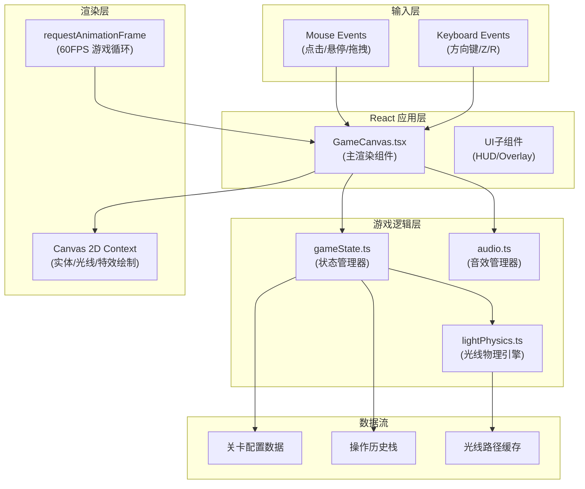
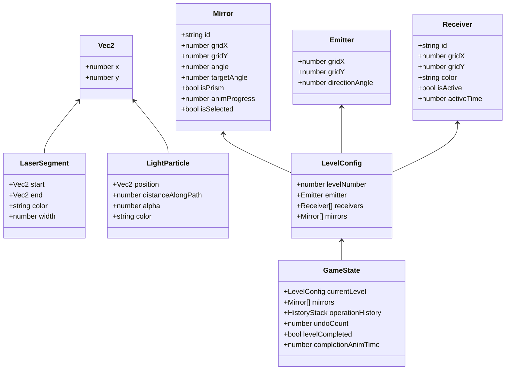

## 1. 架构设计



**调用关系说明：**
1. `GameCanvas.tsx` → 接收输入事件 → 调用 `gameState.ts` 的方法更新状态
2. `GameCanvas.tsx` → 每帧调用 `lightPhysics.ts` 计算光线路径 → 结果缓存到 `L`
3. `gameState.ts` → 维护关卡数据 `J` 和操作历史栈 `K`
4. `GameCanvas.tsx` → 旋转/操作时调用 `audio.ts` 播放音效
5. `GameCanvas.tsx` → 基于缓存的光线数据和状态数据，使用 Canvas 2D 绘制所有内容

## 2. 技术栈说明

| 技术 | 版本/用途 | 说明 |
|-----|----------|------|
| React | ^18.x | UI框架，负责组件生命周期与状态桥接 |
| React DOM | ^18.x | 渲染到DOM容器 |
| TypeScript | ^5.x | 严格类型检查（strict: true），target ES2020 |
| Vite | ^5.x | 构建工具，支持HMR快速开发 |
| @vitejs/plugin-react | ^4.x | Vite React插件 |
| Canvas 2D API | 原生 | 渲染游戏实体、光线、粒子特效 |
| Web Audio API | 原生 | 程序化生成旋转/激活/胜利音效 |
| requestAnimationFrame | 原生 | 60FPS游戏循环调度 |

**项目初始化方式：** `npm init vite-init@latest . -- --template react-ts --force`

## 3. 模块定义与职责

### 3.1 核心文件结构
```
src/
├── GameCanvas.tsx        # 主渲染组件（Canvas、游戏循环、输入处理）
├── gameState.ts          # 游戏状态管理（关卡/镜面/历史/胜利检测）
├── lightPhysics.ts       # 光线物理引擎（反射/色散/碰撞检测）
├── audio.ts              # Web Audio API音效管理
├── types.ts              # 全局类型定义
├── levels.ts             # 3个预设关卡配置
├── main.tsx              # React入口
├── App.tsx               # 根组件
└── index.css             # 全局样式（深空背景、响应式容器）
```

### 3.2 模块职责与调用关系
| 文件 | 职责 | 对外接口 | 被调用方 |
|-----|------|---------|---------|
| `types.ts` | 定义所有数据结构（Mirror, Prism, Laser, Level等） | 类型导出 | 所有其他模块 |
| `levels.ts` | 3个预设关卡的静态配置 | `LEVELS: LevelConfig[]` | `gameState.ts` |
| `gameState.ts` | 初始化关卡、镜面增删改查、旋转/移动操作、撤销/重置、胜利检测 | `createGameStore()` | `GameCanvas.tsx` |
| `lightPhysics.ts` | 光线路径追踪、反射计算、色散分裂、接收器碰撞检测 | `traceLaserPath(...)` | `GameCanvas.tsx` |
| `audio.ts` | Web Audio初始化、旋转音效、激活音效、胜利音效 | `playRotateSound()` 等 | `GameCanvas.tsx` |
| `GameCanvas.tsx` | Canvas初始化、60FPS游戏循环、实体渲染、粒子特效、输入事件分发 | 默认导出React组件 | `App.tsx` |

## 4. 数据模型定义



## 5. 关键算法

### 5.1 光线追踪算法（lightPhysics.ts）
- 使用迭代式光线步进法，最大迭代次数 = 反射次数上限（5次）× 色散分支数上限（3）
- 每步：计算当前光线与所有镜面/接收器/边界的线段相交 → 取最近交点 → 计算反射方向/色散方向 → 生成下一段光线
- 三棱镜色散：白光入射后分裂为3束，RGB各偏转 ±15°/0°/15°

### 5.2 碰撞检测（线段相交）
- 使用参数化线段相交公式，精度 1e-6
- 镜面视为有限长度线段，接收器视为圆形碰撞体（半径12px）

### 5.3 粒子系统
- 对象池模式：固定预分配100个粒子对象
- 每帧沿光线路径更新粒子位置（距离+速度），超出路径长度则循环重置

## 6. 性能优化策略

| 优化项 | 策略 |
|-------|------|
| 物理计算缓存 | 镜面无操作时，光线结果复用缓存，仅镜面动画插值时重算 |
| Canvas批处理 | 同类元素（粒子、线条）批量绘制，减少context切换 |
| 粒子对象池 | 预分配避免GC，复用LightParticle对象 |
| 离屏Canvas | 网格背景预渲染到离屏canvas，每帧仅blit一次 |
| 帧率控制 | requestAnimationFrame + deltaTime，动画与帧率解耦 |
| 懒计算 | 胜利条件检测每3帧执行1次，不必每帧检测 |
