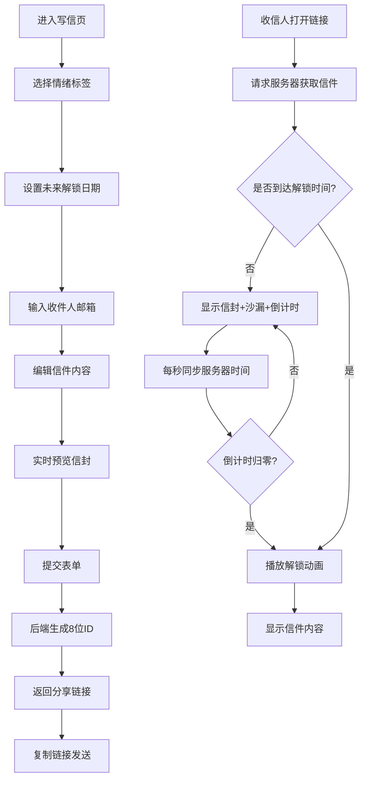

## 1. 产品概述

「时光信件」是一款带有时间胶囊概念的电子书信应用，让用户可以为未来的某人写下一封封带有时光锁的信件，到预设日期后收信人才能解锁阅读。通过独特的情绪色彩信封设计和沙漏等待动画，为数字时代的书信赋予仪式感和期待感。

- 核心价值：让情感在时间中沉淀，为重要的话语赋予仪式感
- 目标用户：想要给未来的自己/亲友写寄语、纪念特殊日期的所有人群

## 2. 核心功能

### 2.1 用户角色

| 角色 | 注册方式 | 核心权限 |
|------|----------|----------|
| 普通用户 | 邮箱+密码注册 | 写信、收信、查看历史记录、个人面板 |
| 访客用户 | 无需注册 | 通过链接访问并查看/解锁他人发送的信件 |

### 2.2 功能模块

1. **首页/导航**：品牌展示、功能入口、登录注册入口
2. **写信页面**：情绪选择、解锁日期设置、内容编辑、实时信封预览、生成分享链接
3. **收信页面**：信封展示、沙漏动画、倒计时、解锁动画、信件内容渲染
4. **用户认证**：注册、登录、退出登录
5. **个人面板**：统计概览（已发送/已收到数量）、写信历史列表、信件状态管理

### 2.3 页面详情

| 页面名称 | 模块名称 | 功能描述 |
|----------|----------|----------|
| 首页 | Hero区 | 品牌标语、核心功能介绍、开始写信CTA按钮 |
| 首页 | 功能展示 | 情绪信封展示、沙漏动效预览、使用流程说明 |
| 写信页 | 情绪选择区 | 4个圆形情绪按钮（快乐/忧伤/期待/感慨），带光晕悬浮效果 |
| 写信页 | 日期选择器 | 精确到秒的滚动日期选择器，平滑滚动动画，限制只能选未来日期 |
| 写信页 | 内容编辑区 | Markdown工具栏、文本输入框、实时Markdown预览 |
| 写信页 | 收件人输入 | 邮箱输入框，格式校验 |
| 写信页 | 实时预览区 | 信封封面颜色随情绪变化、沙漏动画、倒计时演示 |
| 写信页 | 提交弹窗 | 生成8位ID信件、展示可复制分享链接、一键复制功能 |
| 收信页 | 信封展示 | 全屏居中、情绪色封面、呼吸动画（scale 1.0~1.03，4s周期） |
| 收信页 | 沙漏动画 | SVG沙漏、沙粒下落CSS动画、60s翻转一次 |
| 收信页 | 倒计时 | 天/时/分/秒四段显示、每秒更新、归零触发解锁 |
| 收信页 | 解锁动画 | 信封从中间裂开、200个金粉粒子飞散、2秒持续 |
| 收信页 | 信件内容 | Markdown渲染、优雅的排版样式 |
| 注册页 | 注册表单 | 邮箱、密码、确认密码输入、格式校验 |
| 登录页 | 登录表单 | 邮箱、密码输入、记住密码选项 |
| 个人面板 | 统计区 | 用户名展示、已发送/已收到数量、数字从0增长动画 |
| 个人面板 | 历史列表 | 虚拟滚动、每页20条、收件人/解锁日期/状态展示、横向滑动（移动端） |
| 个人面板 | 预览弹窗 | 点击列表项预览信封封面和沙漏效果 |

## 3. 核心流程

用户写信流程：用户进入写信页 → 选择情绪标签 → 设置解锁日期（未来） → 输入收件人邮箱 → 编辑Markdown信件内容 → 实时预览信封效果 → 提交表单 → 后端生成8位随机ID → 返回分享链接 → 用户复制链接发送给收信人

收信人阅读流程：收信人点击链接 → 前端请求信件数据 → 判断当前时间与解锁时间 → 未解锁：显示信封+沙漏+倒计时（每秒请求服务器时间同步） → 倒计时归零 → 播放解锁动画（信封裂开+金粉粒子） → 显示信件内容 → 已解锁：直接显示内容（仍播放一次解锁动画）

用户认证流程：访客点击注册 → 填写邮箱密码 → 后端创建用户 → 自动登录 → 跳转个人面板 / 访客点击登录 → 输入凭据 → 后端验证 → 设置会话 → 跳转个人面板

## 4. 用户界面设计

### 4.1 设计风格

- **主色调**：柔和暖色调渐变背景 #F5E6D3 → #FFF0E0
- **情绪色**：
  - 快乐暖橙 #FF7E67
  - 忧伤冷蓝 #6B8E8E
  - 期待薄荷绿 #9ED39E
  - 感慨紫罗兰 #A67B9B
- **卡片样式**：半透明白色毛玻璃 `rgba(255,255,255,0.6)` + `backdrop-filter: blur(10px)`，圆角16px
- **按钮风格**：圆角胶囊形，悬浮时轻微上浮+阴影加深，过渡动画0.3s
- **字体**：标题使用衬线体（Noto Serif SC）营造书信感，正文使用圆润无衬线体（Noto Sans SC）
- **图标风格**：线性SVG图标，线条圆润，沙粒使用小圆点CSS动画
- **整体质感**：温暖、治愈、有仪式感，如同拆开一封真实的手写信

### 4.2 页面设计概览

| 页面名称 | 模块名称 | UI元素 |
|----------|----------|----------|
| 写信页 | 情绪选择 | 4个圆形按钮，每个带对应情绪色微光晕，选中时放大+光晕增强 |
| 写信页 | 日期选择器 | 滚轮式三列选择（年月日时分秒），平滑惯性滚动，当前行高亮 |
| 写信页 | 内容编辑 | 左右分栏（左编辑右预览），Markdown工具栏悬浮于编辑器顶部 |
| 写信页 | 实时预览 | 右栏固定信封模型，3D透视轻微倾斜，情绪色封面+中心沙漏SVG |
| 收信页 | 信封展示 | 全屏居中，占屏幕宽度40%（桌面），信封有阴影+呼吸缩放动画 |
| 收信页 | 倒计时 | 信封下方4个圆角方块分别显示天/时/分/秒，数字跳动动画 |
| 收信页 | 解锁粒子 | Canvas绘制200个金色圆点，随机速度和角度飞散，透明度渐变消失 |
| 个人面板 | 统计卡片 | 两个大数字卡片并列，数字从0平滑滚动到实际值（1.5s） |
| 个人面板 | 历史列表 | 卡片列表，每项左侧状态色条，右侧信息，悬浮时轻微左移 |

### 4.3 响应式适配

- **桌面端（>1024px）**：写信页左右两栏布局，个人面板两列统计+列表
- **平板端（768-1024px）**：写信页改为单列布局（预览区在上，编辑区在下），列表改为全宽卡片
- **移动端（<768px）**：整体字体缩小15%，按钮尺寸适配触控，历史列表改为横向滑动卡片组，收信信封占屏宽80%

### 4.4 动效与声音

- **沙漏动画**：SVG沙漏缓慢旋转（60s一圈），上半部沙粒小圆点逐帧下落，下半部逐渐堆积
- **信封呼吸**：`@keyframes breathe { 0%,100% {transform: scale(1);} 50% {transform: scale(1.03);} }` 周期4s
- **解锁裂开**：信封从中间Y轴方向向上下两边各偏移并淡出，持续0.8s
- **金粉粒子**：200个圆点随机角度（360°）、随机初速度（2-6px/帧）、重力加速度0.05px/帧²，2s内透明度减至0
- **数字增长**：`requestAnimationFrame` 实现线性缓动增长，从0到目标值用时1.5s
- **Web Audio**：解锁时播放轻柔的"叮"声（正弦波，频率880Hz→1320Hz滑音，时长0.3s，音量0.2）
