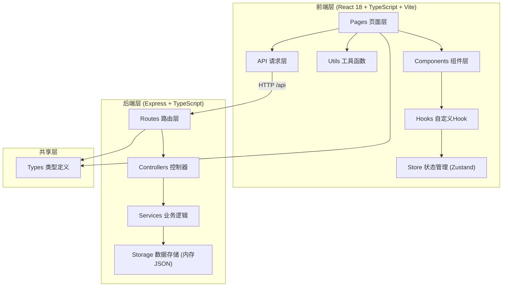
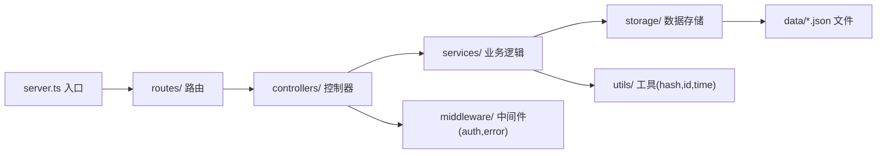
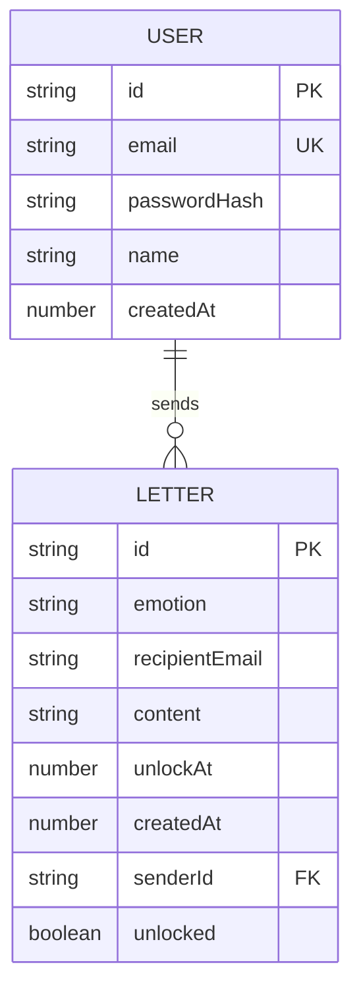

## 1. 架构设计



## 2. 技术描述

- **前端框架**：React 18 + TypeScript 5（严格模式，目标ES2020）
- **构建工具**：Vite 5，配置 `/api` 代理到后端3001端口
- **样式方案**：原生CSS + CSS Modules（不用Tailwind，保持设计独特性），CSS变量管理主题色
- **状态管理**：Zustand（用户认证状态、全局UI状态）
- **路由**：React Router v6（createBrowserRouter）
- **后端框架**：Express 4 + TypeScript，CORS中间件
- **数据存储**：开发阶段使用内存JSON文件持久化（无需数据库），`server/data/` 目录
- **ID生成**：uuid库裁剪为8位大写字母数字组合
- **Markdown渲染**：marked库 + DOMPurify防XSS
- **音频**：Web Audio API原生实现，解锁音效

## 3. 路由定义

| 路由 | 页面 | 权限 | 说明 |
|------|------|------|------|
| `/` | HomePage | 公开 | 首页，品牌介绍和入口 |
| `/create` | CreateLetter | 登录用户 | 写信页面 |
| `/letter/:id` | ViewLetter | 公开 | 收信页面，通过链接访问 |
| `/login` | LoginPage | 访客 | 登录页 |
| `/register` | RegisterPage | 访客 | 注册页 |
| `/dashboard` | Dashboard | 登录用户 | 个人面板，统计和历史 |
| `*` | NotFoundPage | 公开 | 404页面 |

## 4. API 定义

### 4.1 TypeScript 类型

```typescript
// shared/types.ts
export type Emotion = 'happy' | 'sad' | 'expect' | 'emotion';

export interface Letter {
  id: string;              // 8位ID
  emotion: Emotion;
  recipientEmail: string;
  content: string;         // Markdown
  unlockAt: number;        // 解锁时间戳(ms)
  createdAt: number;
  senderId: string | null; // 未登录用户发送为null
  unlocked: boolean;       // 是否已被阅读过(冗余标记)
}

export interface User {
  id: string;
  email: string;
  passwordHash: string;    // 简单SHA256哈希(开发阶段)
  name: string;
  createdAt: number;
}

export interface Session {
  token: string;
  userId: string;
  expiresAt: number;
}

// 请求/响应
export interface CreateLetterReq {
  emotion: Emotion;
  recipientEmail: string;
  content: string;
  unlockAt: number;
}
export interface CreateLetterRes {
  id: string;
  shareUrl: string;
}

export interface GetLetterRes {
  id: string;
  emotion: Emotion;
  recipientEmail: string;
  unlockAt: number;
  createdAt: number;
  content?: string;        // 仅当server时间>=unlockAt时返回
  isUnlocked: boolean;
}

export interface ServerTimeRes {
  serverTime: number;      // ms时间戳
}

export interface RegisterReq { email: string; password: string; name: string; }
export interface LoginReq { email: string; password: string; }
export interface AuthRes { token: string; user: { id: string; email: string; name: string; }; }

export interface LetterListItem {
  id: string;
  recipientEmail: string;
  unlockAt: number;
  createdAt: number;
  emotion: Emotion;
  status: 'sent' | 'unlocked' | 'expired';
}
export interface LetterListRes {
  total: number;
  items: LetterListItem[];
}
```

### 4.2 接口列表

| Method | Path | 认证 | 说明 |
|--------|------|------|------|
| POST | `/api/auth/register` | 否 | 用户注册，返回token |
| POST | `/api/auth/login` | 否 | 用户登录，返回token |
| GET | `/api/auth/me` | Bearer | 获取当前用户信息 |
| POST | `/api/letters` | Bearer(可选) | 创建信件，未登录也可发 |
| GET | `/api/letters/:id` | 否 | 获取信件（根据解锁时间决定是否返回content） |
| GET | `/api/time` | 否 | 获取服务器当前时间戳，用于同步 |
| GET | `/api/user/letters` | Bearer | 当前用户发送的信件列表（分页） |
| GET | `/api/user/stats` | Bearer | 当前用户统计（已发送/已收到数量） |

所有响应统一格式：`{ code: 0, data: T, message?: string }`，code非0为错误。

## 5. 后端分层架构



- **server.ts**：Express初始化、中间件注册、错误处理、端口监听
- **routes/**：每个资源一个路由文件，挂载到 `/api/xxx`
- **controllers/**：解析请求参数、调用service、返回响应（无业务逻辑）
- **services/**：核心业务逻辑（创建信件校验日期、查询判断解锁等）
- **storage/**：抽象JSON文件读写层，提供CRUD接口（模拟Repository）
- **middleware/**：auth中间件校验Bearer token，error统一错误格式

## 6. 数据模型

### 6.1 ER 图



### 6.2 数据文件结构

```
server/data/
  users.json     // { [userId]: User }
  letters.json   // { [letterId]: Letter }
  sessions.json  // { [token]: Session }
```

初始为空对象 `{}`，服务启动时检查不存在则创建。

### 6.3 索引与查询

- 信件查询：按 `id` 主键 O(1)
- 用户信件列表：遍历 letters，筛选 `senderId === userId`，按 `createdAt` 倒序
- 认证：按 `email` 查找用户（遍历users，可加emailMap索引优化）
