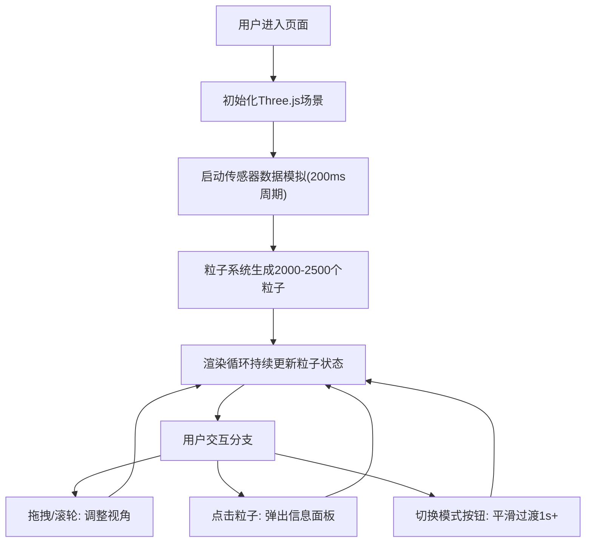

## 1. 产品概述
3D粒子气候系统交互可视化应用，基于实时模拟传感器数据动态渲染三维粒子，解决科学数据在三维空间内直观呈现的问题。
- 主要面向科研人员、气象教育工作者和数据可视化爱好者，提供沉浸式的气候数据探索体验
- 通过粒子系统将抽象的温度、湿度等气象属性转化为可交互的三维视觉形态，提升数据理解效率

## 2. 核心功能

### 2.1 功能模块
1. **3D粒子场景模块**：粒子生成、生命周期管理、运动物理、颜色/大小动态映射、拖尾辉光效果
2. **传感器数据模拟模块**：周期性生成2000-2500个粒子的位置、速度、温度、湿度数据
3. **交互控制模块**：轨道控制器（拖拽旋转、滚轮缩放）、粒子点击拾取、信息面板弹出
4. **气候模式切换模块**：夏季高温、冬季寒流、雷暴三种模式，带平滑过渡动画
5. **控制面板UI模块**：模式切换按钮、粒子计数显示、FPS监控、响应式折叠

### 2.2 页面详情
| 页面名称 | 模块名称 | 功能描述 |
|-----------|-------------|---------------------|
| 主页面 | 全屏3D场景 | Three.js渲染2000+粒子，支持拖拽旋转和滚轮缩放 |
| 主页面 | 控制面板 | 左上角半透明磨砂玻璃风格面板，包含模式切换按钮、粒子计数、FPS |
| 主页面 | 粒子信息面板 | 点击粒子弹出浮层，显示ID、位置(x/y/z)、温度、湿度、生命周期 |
| 主页面 | 移动端适配 | 768px以下控制面板折叠为浮动图标，点击展开 |

## 3. 核心流程
用户进入页面后，3D场景自动初始化并开始生成粒子数据。用户可通过鼠标自由探索场景，切换气候模式观察粒子变化，点击特定粒子查看详细属性。

## 4. 用户界面设计

### 4.1 设计风格
- **主色调**：深蓝紫(#1a1a3e) → 暗青(#0d3b4a) 渐变背景
- **强调色**：夏季(橙红#ff6b35)、冬季(青蓝#4fc3f7)、雷暴(紫黄#b388ff)
- **控制面板**：暗色磨砂玻璃(backdrop-filter: blur(20px)，半透明RGBA)
- **按钮风格**：圆角矩形，hover发光，点击缩放脉冲动画
- **字体**：JetBrains Mono（等宽科技感），搭配System UI
- **布局**：全屏Canvas覆盖，左上角绝对定位控制面板
- **视觉特效**：粒子拖尾辉光、消散渐变透明缩小、模式切换颜色平滑插值

### 4.2 页面设计概述
| 页面名称 | 模块名称 | UI元素 |
|-----------|-------------|-------------|
| 主页面 | 3D粒子场景 | 粒子颜色随温度冷暖渐变，大小随湿度变化，运动带拖尾 |
| 主页面 | 控制面板 | 深蓝紫→暗青渐变边框，磨砂玻璃背景，发光按钮，等宽字体数据展示 |
| 主页面 | 信息面板 | 跟随粒子位置浮动，暗色背景配彩色属性标签 |
| 主页面 | 移动端浮动按钮 | 圆形渐变按钮，点击展开/折叠控制面板 |

### 4.3 响应式设计
- **桌面端(>768px)**：控制面板常驻左上角，宽度280px
- **移动端(≤768px)**：控制面板默认折叠为右下角56px圆形浮动按钮，点击后全屏抽屉展开
- **触摸优化**：支持双指缩放，增大按钮点击区域至44px以上

### 4.4 3D场景指导
- **环境氛围**：深空背景，径向渐变从中心深蓝向边缘深紫过渡，微弱星点粒子层
- **光照设置**：AmbientLight(0.3) + PointLight随模式动态变化颜色和强度
- **相机设置**：PerspectiveCamera(fov=60)，初始距离150，OrbitControls启用阻尼
- **构图焦点**：粒子分布在半径100的球形空间内，中心略微密集
- **交互动画**：模式切换时粒子颜色/速度/位置通过lerp在1.5秒内平滑过渡
- **后处理效果**：轻微Bloom辉光增强粒子发光感，UnrealBloomPass
- **性能预算**：2500粒子@60FPS，单帧更新≤16ms，使用BufferGeometry + PointsMaterial
