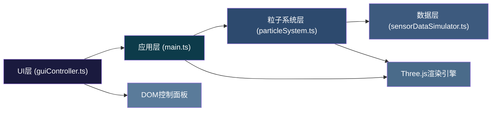

## 1. 架构设计



## 2. 技术选型说明
- **前端框架**：原生TypeScript + Three.js r152+（无React，符合用户文件组织要求）
- **构建工具**：Vite 5.x，提供快速HMR和生产构建
- **类型系统**：TypeScript严格模式(strict: true)，目标ES2020
- **3D引擎**：Three.js r152+，使用BufferGeometry + Points实现高性能粒子渲染
- **控制器**：OrbitControls（拖拽旋转、滚轮缩放、阻尼效果）
- **后处理**：EffectComposer + UnrealBloomPass（粒子辉光效果）
- **UI方案**：原生DOM + CSS（backdrop-filter磨砂玻璃、CSS渐变、CSS动画）
- **数据生成**：内置传感器模拟器，200ms周期推送新数据

## 3. 文件结构与职责
| 文件路径 | 职责定义 | 核心导出 |
|----------|----------|----------|
| package.json | 项目依赖与脚本配置 | dev/build脚本，three及类型声明 |
| vite.config.js | Vite构建配置 | TypeScript支持、路径别名 |
| tsconfig.json | TypeScript编译配置 | strict模式、ES2020、moduleResolution |
| index.html | 入口页面 | 全屏viewport、挂载点#app |
| src/main.ts | 主入口 | 场景/相机/渲染器初始化、渲染循环、事件绑定 |
| src/particleSystem.ts | 粒子系统核心 | ParticleSystem类（生成/更新/生命周期/拾取） |
| src/sensorDataSimulator.ts | 数据模拟 | SensorDataSimulator类（200ms周期生成粒子数据） |
| src/guiController.ts | UI控制 | GUIController类（控制面板构建、模式切换、FPS统计） |

## 4. 核心数据结构

### 4.1 粒子数据接口
```typescript
interface ParticleData {
  id: number;
  position: { x: number; y: number; z: number };
  velocity: { x: number; y: number; z: number };
  temperature: number;  // -10 ~ 45 °C
  humidity: number;     // 0 ~ 100 %
  birthTime: number;    // 生成时间戳
  lifespan: number;     // 生命周期(ms)，固定5000ms
}

type ClimateMode = 'summer' | 'winter' | 'storm';

interface ClimateParams {
  baseTemp: number;
  tempRange: [number, number];
  baseHumidity: number;
  humidityRange: [number, number];
  speedMultiplier: number;
  colorBias: number;    // 颜色映射偏移
  distribution: 'uniform' | 'bottom-heavy' | 'turbulent';
}
```

## 5. 性能优化策略

| 优化点 | 方案 | 预期效果 |
|--------|------|----------|
| 粒子渲染 | BufferGeometry + Points，单次draw call | 2500粒子单帧<1ms渲染 |
| 数据更新 | TypedArray(Float32Array)批量更新position/color/size属性 | CPU→GPU数据传输最小化 |
| 生命周期 | 对象池复用粒子对象，避免频繁GC | GC暂停<5ms |
| 拾取检测 | Raycaster + 自定义LOD，仅在点击时执行检测 | 拾取计算<2ms |
| 过渡动画 | requestAnimationFrame + lerp插值，不使用setTimeout | 平滑60FPS过渡 |
| FPS监控 | 帧时间滑动窗口平均，避免DOM频繁更新 | UI更新节流至200ms |
| 渲染循环 | 仅在需要时重绘(不过对于粒子动画需要持续渲染)，使用deltaTime计算物理 | 运动与帧率解耦 |

## 6. 关键算法

### 6.1 温度→颜色映射算法
- 温度范围-10°C ~ 45°C映射到HSL色轮
- 冷色(HSL 220°) → 暖色(HSL 20°)
- 公式：`hue = 220 - ((temp + 10) / 55) * 200`，饱和度0.9，亮度0.55

### 6.2 湿度→大小映射算法
- 湿度0% → 基础尺寸0.8
- 湿度100% → 最大尺寸2.5
- 线性插值：`size = baseSize + (humidity / 100) * (maxSize - baseSize)`

### 6.3 粒子生命周期消散
- 剩余寿命<500ms：alpha线性淡出 1→0
- 尺寸缩放至原大小0.3倍
- 速度逐渐衰减至0.7倍

### 6.4 模式平滑过渡
- transitionDuration = 1500ms
- 每帧lerp：`currentValue = startValue + (targetValue - startValue) * (elapsed / duration)`
- 应用于：颜色映射、速度倍率、分布形态参数
