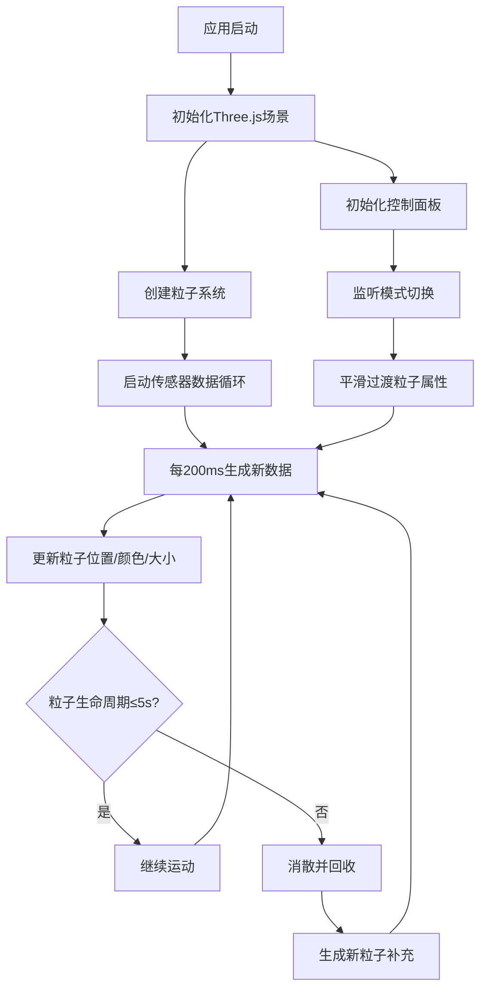
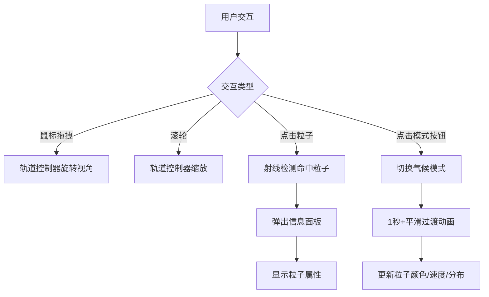

## 1. 产品概述

基于实时模拟传感器数据的3D粒子气候交互可视化系统，解决科学数据在三维空间内直观呈现的问题。通过动态粒子系统展示气候模式变化，支持用户自由漫游探索和交互式数据查询。

- 目标用户：气候科研人员、数据可视化爱好者、教育工作者
- 核心价值：将抽象的气候数据转化为直观、可交互的三维粒子场景，实现科学数据的沉浸式感知

## 2. 核心功能

### 2.1 功能模块

1. **3D粒子场景页**：全屏Three.js粒子系统、轨道控制器、粒子交互、气候模式切换
2. **控制面板**：模式切换按钮、粒子计数、FPS监控、响应式折叠

### 2.2 页面详情

| 页面名称 | 模块名称 | 功能描述 |
|----------|----------|----------|
| 3D粒子场景 | 粒子渲染系统 | 渲染2000-2500个粒子，颜色随温度变化（冷色→暖色），大小随湿度变化 |
| 3D粒子场景 | 传感器数据模拟 | 每200ms生成一批粒子数据（位置、速度、温度-10~45℃、湿度0-100） |
| 3D粒子场景 | 粒子生命周期 | 粒子生成后运动5秒消散，持续生成新粒子保持总数稳定 |
| 3D粒子场景 | 轨道控制器 | 鼠标拖拽旋转、滚轮缩放、自由3D漫游 |
| 3D粒子场景 | 粒子点击交互 | 点击粒子弹出信息面板，显示完整属性数据 |
| 3D粒子场景 | 气候模式切换 | 夏季高温/冬季寒流/雷暴三种模式，平滑过渡≥1秒 |
| 3D粒子场景 | 粒子拖尾辉光 | 运动轨迹拖尾效果，消散时渐变透明并缩小 |
| 控制面板 | 模式切换按钮 | 三个气候模式按钮，切换时缩放脉冲动画反馈 |
| 控制面板 | 实时监控 | 粒子计数显示、FPS实时监控 |
| 控制面板 | 响应式折叠 | 768px断点下自动折叠为浮动图标，点击展开 |

## 3. 核心流程

## 4. 用户界面设计

### 4.1 设计风格

- 主色调：深蓝紫（#1a0a3e）到暗青（#0a2e2e）渐变
- 面板风格：暗色磨砂玻璃（backdrop-filter: blur + 半透明深色背景）
- 按钮：圆角胶囊形，激活态发光脉冲效果
- 字体：Orbitron（科技感显示字体）+ Source Sans 3（UI正文字体）
- 布局：全屏3D画布 + 左上角浮动控制面板

### 4.2 页面设计概览

| 页面名称 | 模块名称 | UI元素 |
|----------|----------|--------|
| 3D粒子场景 | 全屏画布 | WebGL画布覆盖整个视口，深色太空感背景 |
| 3D粒子场景 | 控制面板 | 左上角半透明磨砂玻璃面板，深蓝紫→暗青渐变边框 |
| 3D粒子场景 | 模式按钮 | 胶囊形按钮，激活态发光+缩放脉冲，未激活态半透明 |
| 3D粒子场景 | FPS/计数 | 小型等宽字体数字显示，实时更新 |
| 3D粒子场景 | 信息弹窗 | 点击粒子后浮出属性卡片，毛玻璃背景，显示温度/湿度/位置/速度 |
| 3D粒子场景 | 移动端折叠 | 768px以下面板折叠为圆形浮动图标，点击滑出展开 |

### 4.3 响应式设计

- 桌面端（>768px）：控制面板完整展示在左上角
- 移动端（≤768px）：控制面板折叠为右下角浮动圆形图标，点击后滑出展开面板
- 触控优化：移动端支持双指缩放和单指旋转

### 4.4 3D场景指引

- 环境：深色太空感场景，微弱环境光
- 光照：无定向光源，粒子自发光（PointMaterial/ShaderMaterial）
- 相机：透视相机，初始距离30，FOV 60°，近裁面0.1，远裁面1000
- 构图：粒子群分布在以原点为中心、半径15的球形区域内
- 交互：OrbitControls自由旋转/缩放，Raycaster点击检测
- 后处理：AdditiveBlending实现辉光拖尾效果
- 性能预算：2000-2500粒子下保持60FPS，使用BufferGeometry+Points
