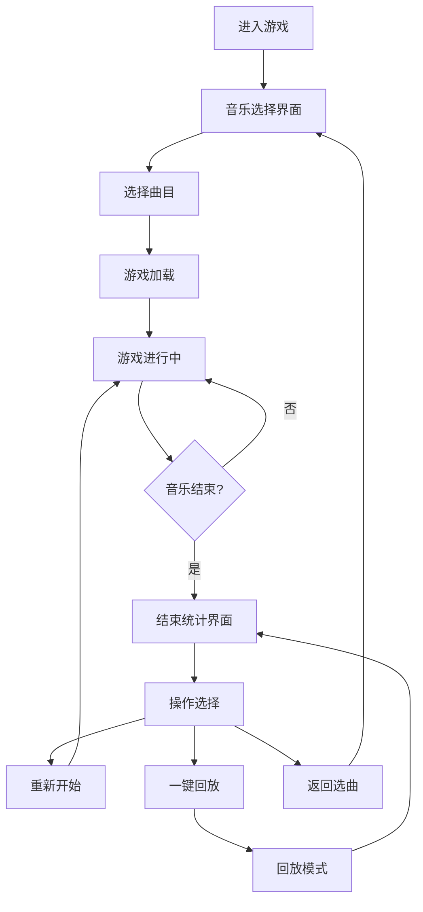

# 影音幻境 - 产品需求文档

## 1. 产品概述

「影音幻境」是一款基于Web的节奏互动游戏，玩家通过点击屏幕上飞过的音符光点，配合背景音乐的节拍，触发绚丽的粒子特效与场景切换。游戏融合了音乐节奏玩法与视觉艺术表现，为玩家带来沉浸式的视听体验。

- **目标用户**：音乐游戏爱好者、休闲玩家
- **核心价值**：低门槛、高沉浸感的节奏游戏体验，配合绚丽视觉特效
- **运行平台**：现代浏览器（Chrome、Firefox、Safari）

## 2. 核心功能

### 2.1 用户角色

| 角色 | 注册方式 | 核心权限 |
|------|----------|----------|
| 玩家 | 无需注册，直接游玩 | 选择曲目、进行游戏、查看得分统计、回放游戏 |

### 2.2 功能模块

1. **音乐选择界面**：曲目列表展示、难度标识、主题色预览
2. **游戏主界面**：音符飞过、点击判定、粒子特效、得分与连击显示、场景色调动态变化
3. **结束统计界面**：得分展示、命中率统计、最高连击、星级评价、一键回放
4. **控制系统**：播放/暂停、音效开关、键盘控制
5. **回放系统**：时间轴重放、音符与点击记录重现

### 2.3 功能详情

| 功能模块 | 子功能 | 详细描述 |
|----------|--------|----------|
| 音符系统 | 音符生成 | 根据BPM自动生成圆形、三角形、菱形三种音符 |
| 音符系统 | 飞过动画 | 音符从屏幕右侧匀速飞向左端判定线 |
| 判定系统 | 点击判定 | 判定线±30px为成功命中，±10px为完美命中 |
| 判定系统 | 键盘控制 | F、G、H键分别对应圆形、三角形、菱形音符 |
| 粒子特效 | 成功命中 | 彩色粒子环沿圆周扩散并逐渐消失 |
| 粒子特效 | 完美命中 | 星形光芒粒子爆裂效果 |
| 粒子特效 | 失误 | 音符变暗并以哀伤弧线坠落 |
| 连击系统 | 连击计数 | 连续命中累计连击数 |
| 连击系统 | 10连击 | 进入连击状态，屏幕边缘金色光晕，得分×1.5 |
| 连击系统 | 20连击 | 触发全屏短暂闪烁效果 |
| 连击系统 | 中断 | 光晕消退，得分恢复基础值 |
| 音乐系统 | 曲目选择 | 三首预设曲目：快乐圆舞曲、迷幻电子、战斗进行曲 |
| 音乐系统 | 动态难度 | 根据BPM自动生成对应难度的音符序列 |
| 音乐系统 | 场景过渡 | 曲目切换时主色调平滑过渡（暖橙→冷蓝紫→暗红） |
| 统计系统 | 结束展示 | 得分、命中率、最高连击、星级评价 |
| 统计系统 | 一键回放 | 按时间轴重放音符与点击记录 |

## 3. 核心流程

### 3.1 主要用户流程

1. 玩家进入游戏，看到音乐选择界面
2. 选择曲目后，游戏加载并开始
3. 音符从右侧飞过，玩家点击或按键进行判定
4. 成功/失误触发不同粒子特效，累计得分与连击
5. 音乐结束后展示统计结果
6. 玩家可选择重新开始、回放或返回选曲

### 3.2 流程图

## 4. 用户界面设计

### 4.1 设计风格

**整体风格**：赛博朋克·幻境风格
- 深色基调配合绚丽粒子光效
- 毛玻璃效果卡片
- 流畅的过渡动画
- 随音乐动态变化的场景色调

**主色调**：
- 深空紫 (#0B0A1A) → 暗靛蓝 (#1A1A3A) 径向渐变背景
- 主题色随曲目变化：暖橙 (#FF8C42)、冷蓝紫 (#845EC2)、暗红 (#D65A5A)
- 判定线：半透明白色发光 (#EEE)
- 连击光晕：金色 (#FFD700)
- 音符颜色：圆形 (#FF6B6B)、三角形 (#4ECDC4)、菱形 (#FFD93D)

**字体**：
- 标题使用现代感强的无衬线字体
- 数字使用等宽字体提升可读性

**动效**：
- 连击数缩放弹跳动画（1.2倍→1倍，0.3s）
- 卡片悬停上浮6px + 柔和阴影
- 按钮悬停放大1.1倍，点击下压2px
- 场景色调平滑过渡

### 4.2 页面设计概览

| 页面 | 模块 | UI元素 |
|------|------|--------|
| 音乐选择页 | 标题区域 | "影音幻境"标题，副标题 |
| 音乐选择页 | 曲目卡片 | 毛玻璃卡片、曲名、时长、难度图标、悬停动效 |
| 游戏主界面 | 背景 | 径向渐变、动态主题色 |
| 游戏主界面 | 音符区域 | 中央80%高度、飞过音符、判定线 |
| 游戏主界面 | 顶部信息 | 得分、连击数（带缩放动画） |
| 游戏主界面 | 底部控制 | 播放/暂停、音效开关图标 |
| 游戏主界面 | 特效层 | 粒子特效、连击光晕、全屏闪烁 |
| 结束统计页 | 统计信息 | 得分、命中率、最高连击、星级评价 |
| 结束统计页 | 操作按钮 | 重新开始、回放、返回选曲 |

### 4.3 响应式设计

- **桌面优先**，适配移动端
- 宽度 < 768px 时：
  - 音符缩小15%
  - 判定线宽度不变
  - 连击显示移至顶部居中
  - 曲目卡片单列排布

### 4.4 性能优化

- 使用 requestAnimationFrame 保持60FPS
- 粒子系统上限500个，超出淘汰最旧粒子
- 音频分析与游戏循环延迟 ≤ 50ms
