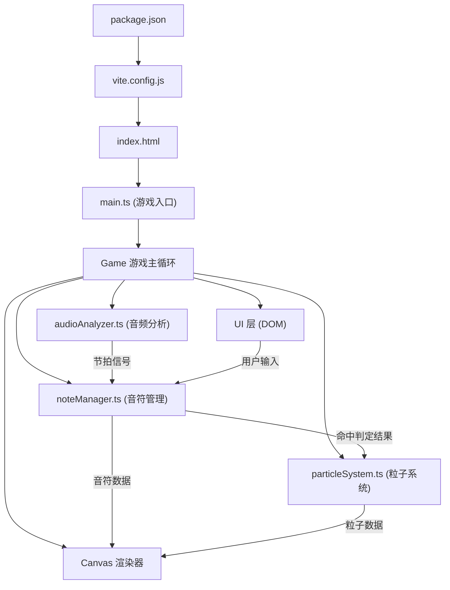

# 影音幻境 - 技术架构文档

## 1. 架构设计



**数据流向**：
1. `audioAnalyzer.ts` 解析音频BPM和节拍点，实时输出节拍信号给 `noteManager.ts`
2. `noteManager.ts` 根据节拍生成音符，管理音符位置，接收用户输入进行命中判定，输出命中结果给 `particleSystem.ts`
3. `particleSystem.ts` 接收命中事件，生成粒子动画数据
4. `main.ts` 作为游戏入口，统筹各模块，将音符和粒子数据渲染到 Canvas，同时更新 UI 层

## 2. 技术栈说明

- **构建工具**：Vite 5.x（支持HMR热更新）
- **语言**：TypeScript 5.x（严格模式，目标ES2020）
- **渲染**：HTML5 Canvas 2D
- **音频**：Web Audio API
- **UI**：原生HTML/CSS（毛玻璃效果使用 backdrop-filter）
- **状态管理**：模块内状态，主循环驱动

## 3. 文件结构与职责

| 文件路径 | 职责描述 | 输出 |
|----------|----------|------|
| `package.json` | 项目依赖与脚本配置 | - |
| `vite.config.js` | Vite构建配置（HMR、基础开发服务器） | - |
| `tsconfig.json` | TypeScript编译配置（严格模式、ES2020） | - |
| `index.html` | 入口页面，深色渐变背景，标题 | - |
| `src/main.ts` | 游戏入口：初始化Canvas、加载音频、启动游戏循环、协调各模块 | 渲染帧、UI更新 |
| `src/noteManager.ts` | 音符生成与管理：根据节拍生成音符、位置更新、命中判定 | 命中判定结果、音符列表 |
| `src/particleSystem.ts` | 粒子特效系统：接收命中事件，生成彩环/爆裂/坠落粒子 | 粒子列表 |
| `src/audioAnalyzer.ts` | 音频分析：解析BPM和节拍点，实时返回节拍信号 | 节拍事件、BPM数据 |
| `src/types.ts` | 类型定义（可选） | 共享类型 |

## 4. 核心模块设计

### 4.1 audioAnalyzer.ts

**职责**：音频加载、BPM分析、节拍检测

**核心接口**：
```typescript
interface AudioAnalyzer {
  loadAudio(url: string): Promise<void>;
  start(): void;
  pause(): void;
  stop(): void;
  getBPM(): number;
  getCurrentTime(): number;
  getDuration(): number;
  onBeat(callback: (time: number) => void): void;
}
```

**实现要点**：
- 使用 Web Audio API 的 AudioContext
- 使用 AnalyserNode 进行频率分析
- 基于能量峰值检测节拍
- 预设三首曲目的BPM数据作为模拟

### 4.2 noteManager.ts

**职责**：音符生成、位置更新、命中判定

**核心接口**：
```typescript
type NoteShape = 'circle' | 'triangle' | 'diamond';

interface Note {
  id: number;
  shape: NoteShape;
  x: number;
  y: number;
  speed: number;
  color: string;
  spawnTime: number;
  hit?: boolean;
  missed?: boolean;
}

interface HitResult {
  note: Note;
  type: 'perfect' | 'good' | 'miss';
  position: { x: number; y: number };
}

interface NoteManager {
  setBPM(bpm: number): void;
  spawnNote(shape: NoteShape): void;
  update(deltaTime: number): void;
  hitTest(shape?: NoteShape): HitResult | null;
  getNotes(): Note[];
  onHit(callback: (result: HitResult) => void): void;
  onMiss(callback: (note: Note) => void): void;
  getCombo(): number;
  getScore(): number;
}
```

**实现要点**：
- 判定线位于屏幕左侧约15%宽度处
- 成功判定范围：±30px
- 完美判定范围：±10px
- 三种音符形状，对应F/G/H三个按键
- 连击计数与得分计算

### 4.3 particleSystem.ts

**职责**：粒子生成、更新、渲染数据管理

**核心接口**：
```typescript
interface Particle {
  id: number;
  x: number;
  y: number;
  vx: number;
  vy: number;
  life: number;
  maxLife: number;
  color: string;
  size: number;
  type: 'ring' | 'star' | 'fall';
}

interface ParticleSystem {
  spawnRingParticles(x: number, y: number, color: string, perfect?: boolean): void;
  spawnFallParticles(note: Note): void;
  update(deltaTime: number): void;
  getParticles(): Particle[];
  maxParticles: number;
}
```

**实现要点**：
- 粒子上限500个，超出淘汰最旧粒子
- 三种粒子类型：环形扩散、星形爆裂、哀伤坠落
- 使用生命周期管理粒子

### 4.4 main.ts

**职责**：游戏主循环、Canvas渲染、UI更新、事件绑定

**核心功能**：
- requestAnimationFrame 游戏循环
- Canvas 2D 渲染（音符、粒子、判定线）
- DOM UI 层（得分、连击、控制按钮）
- 键盘事件监听
- 窗口大小变化适配
- 游戏状态管理（选曲/游戏中/结束/回放）

## 5. 游戏状态定义

```typescript
type GameState = 'menu' | 'loading' | 'playing' | 'paused' | 'ended' | 'replay';
```

**状态流转**：
- `menu` → `loading` → `playing` ↔ `paused` → `ended` → `menu` / `replay`

## 6. 性能约束实现

| 约束 | 实现方式 |
|------|----------|
| 60FPS稳定帧率 | requestAnimationFrame + 时间差计算 |
| 粒子上限500 | 粒子数组长度检查，超出移除首项 |
| 音频延迟≤50ms | 节拍预测 + 时间戳校准 |
| 内存管理 | 及时清理过期粒子和音符 |

## 7. 预设曲目数据

```typescript
const tracks = [
  {
    id: 'waltz',
    name: '快乐圆舞曲',
    bpm: 120,
    duration: 60,
    themeColor: '#FF8C42',
    difficulty: 1,
    color: 'warm'
  },
  {
    id: 'electronic',
    name: '迷幻电子',
    bpm: 140,
    duration: 65,
    themeColor: '#845EC2',
    difficulty: 2,
    color: 'cool'
  },
  {
    id: 'battle',
    name: '战斗进行曲',
    bpm: 160,
    duration: 55,
    themeColor: '#D65A5A',
    difficulty: 3,
    color: 'dark'
  }
];
```

## 8. 响应式适配策略

| 屏幕宽度 | 适配策略 |
|----------|----------|
| ≥ 768px | 默认尺寸，音符标准大小，顶部分左右显示得分和连击 |
| < 768px | 音符缩小15%，判定线宽度不变，连击显示移至顶部居中，曲目卡片单列 |

## 9. 构建与运行

- **安装依赖**：`npm install`
- **开发模式**：`npm run dev`
- **生产构建**：`npm run build`
