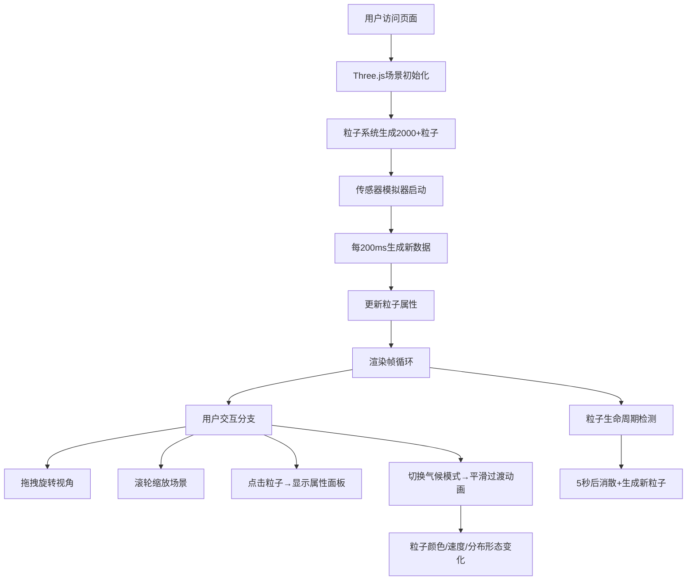

## 1. 产品概述
基于实时传感器模拟数据的3D粒子气候系统交互可视化应用，解决科学数据在三维空间内直观呈现的问题，通过粒子系统动态展示气候变化。

- 主要目的：将抽象的气候科学数据（温度、湿度、风速等）转化为直观可交互的三维粒子可视化效果
- 目标用户：气象研究人员、科学教育工作者、数据可视化爱好者
- 产品价值：提供沉浸式的气候数据探索体验，让用户能够自由漫游、点击查看、模式切换，深入理解气候模式的空间分布特征

## 2. 核心功能

### 2.1 功能模块
1. **全屏3D场景**：沉浸式粒子气候可视化主界面
2. **粒子系统**：2000-2500个粒子的实时渲染，包含位置、速度、温度、湿度属性
3. **传感器数据模拟器**：每200ms生成一批模拟传感器数据
4. **轨道控制器**：鼠标拖拽旋转、滚轮缩放、自由3D漫游
5. **粒子信息面板**：点击粒子弹出详细属性信息面板
6. **气候模式切换**：夏季高温、冬季寒流、雷暴三种模式平滑过渡
7. **生命周期管理**：粒子自动生成/消散，总数稳定
8. **控制面板**：半透明磨砂玻璃风格UI，模式切换、统计显示
9. **响应式适配**：移动端控制面板自动折叠

### 2.2 页面详情
| 页面名称 | 模块名称 | 功能描述 |
|---------|---------|---------|
| 主场景 | 3D粒子系统 | 渲染2000+粒子，颜色随温度、大小随湿度动态变化 |
| 主场景 | 轨道控制器 | 鼠标拖拽旋转视角、滚轮缩放、自由漫游 |
| 主场景 | 粒子交互 | 点击粒子显示完整属性面板（位置、温度、湿度、速度、生命周期） |
| 主场景 | 生命周期管理 | 粒子5秒生命周期，持续生成新粒子维持总数 |
| 控制面板 | 模式切换按钮 | 夏季/冬季/雷暴模式切换，带脉冲动画反馈，过渡动画≥1秒 |
| 控制面板 | 粒子计数显示 | 实时显示当前粒子数量 |
| 控制面板 | FPS监控 | 实时显示帧率，目标60FPS |
| 控制面板 | 响应式折叠 | ≤768px自动折叠为浮动图标，可展开 |

## 3. 核心流程

用户进入应用 → 3D场景初始化 → 粒子系统生成2000个粒子 → 传感器模拟器每200ms推送数据 → 粒子按属性渲染（颜色/大小/运动） → 用户可：
  - 拖拽旋转/滚轮缩放视角
  - 点击粒子查看详情
  - 切换气候模式（平滑过渡动画）
  - 观察粒子生命周期（生成→运动→消散）

## 4. 用户界面设计

### 4.1 设计风格
- **主题色系**：深蓝紫 (#1a1040) → 暗青 (#0d2840) 渐变背景
- **控制面板**：暗色磨砂玻璃效果，backdrop-filter: blur(12px)，半透明rgba(13,20,40,0.75)
- **粒子颜色映射**：
  - 冷色(低温)：深蓝 #1e90ff → 青色 #00ced1
  - 中温：绿色 #32cd32 → 黄色 #ffd700
  - 暖色(高温)：橙色 #ff8c00 → 红色 #ff4500
- **按钮样式**：圆角8px，渐变边框，hover时亮度提升，切换时脉冲缩放动画(scale 1→1.15→1，0.4s)
- **字体**：使用 Google Fonts - Orbitron（科技感标题）+ JetBrains Mono（数据显示）
- **布局**：全屏Canvas覆盖视口，左上角固定控制面板

### 4.2 页面设计概览
| 页面名称 | 模块名称 | UI元素 |
|---------|---------|--------|
| 主场景 | 3D画布 | 全屏视口覆盖，深色渐变背景，粒子辉光拖尾效果 |
| 主场景 | 粒子渲染 | 圆形精灵粒子，Additive混合模式，温度→颜色，湿度→大小 |
| 主场景 | 粒子拖尾 | 轨迹线+辉光，使用ShaderMaterial实现 |
| 主场景 | 消散效果 | 透明度渐变0→1反向 + 缩放缩小至0 |
| 控制面板 | 容器 | 磨砂玻璃面板，圆角12px，深蓝色内阴影 |
| 控制面板 | 标题 | Orbitron字体，渐变文字(蓝→青)，"CLIMATE SYSTEM" |
| 控制面板 | 模式按钮组 | 3个并排按钮，选中态发光边框 |
| 控制面板 | 统计区 | JetBrains Mono等宽字体，双列布局(FPS/粒子数) |
| 控制面板 | 移动端 | 折叠为圆形浮动按钮(右下)，点击展开抽屉式面板 |

### 4.3 响应式设计
- **桌面端 (>768px)**：左上角固定控制面板，宽280px，完整显示所有控件
- **移动端 (≤768px)**：控制面板折叠为右下浮动圆形图标(56px)，点击展开全屏抽屉，带遮罩层
- **触控优化**：按钮最小触控区域48px，双指捏合缩放支持

### 4.4 3D场景指导
- **环境与氛围**：深色深空背景，径向渐变(中心略亮)，营造科技感宇宙空间
- **光照设置**：AmbientLight(0x334466, 0.4) + PointLight(0x00ffff, 1, 100) + PointLight(0xff6600, 0.8, 100)
- **相机设置**：PerspectiveCamera(fov:60, aspect:window.aspect, near:0.1, far:2000)，初始位置(0,0,80)
- **相机运动**：OrbitControls，enableDamping=true，dampingFactor=0.08，minDistance=20，maxDistance=300
- **构图焦点**：粒子云集中在原点周围±50单位空间，形成球状集群
- **交互动画**：模式切换时粒子位置、颜色、速度1.5s缓动过渡(easeInOutCubic)
- **后处理效果**：UnrealBloomPass(strength:0.6, radius:0.5, threshold:0.2)实现粒子辉光
- **性能预算**：2500粒子@60FPS，单帧CPU<8ms，GPU<10ms
