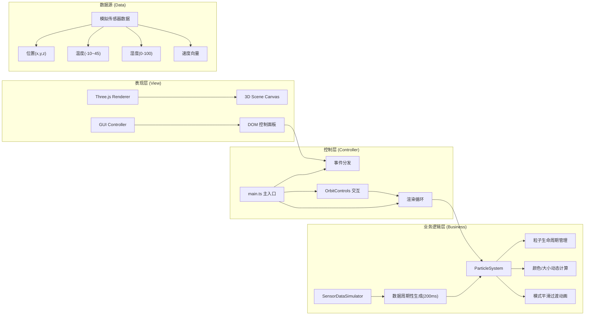

## 1. 架构设计



## 2. 技术选型说明

| 分类 | 技术栈 | 版本要求 | 选型理由 |
|-----|-------|---------|---------|
| 开发语言 | TypeScript | 5.0+ | 严格类型检查，提升大型项目可维护性，符合用户要求 |
| 构建工具 | Vite | 5.0+ | 极速HMR，原生ESM支持，开发体验优秀 |
| 3D渲染引擎 | Three.js | r152+ | 用户明确要求，生态完善，粒子系统支持好 |
| 类型定义 | @types/three | 0.152+ | Three.js的TypeScript类型声明 |
| UI样式 | 原生CSS3 | - | 磨砂玻璃效果、渐变动画无需额外CSS框架 |
| 动画方案 | requestAnimationFrame | - | 高性能帧同步动画，与Three.js渲染循环整合 |
| 数学插值 | 自定义缓动函数 | - | easeInOutCubic实现平滑过渡，无外部依赖 |

## 3. 文件结构定义

```
项目根目录/
├── package.json          # 依赖配置：three, @types/three，脚本：npm run dev
├── vite.config.js        # Vite构建配置，启用TypeScript，端口3000
├── tsconfig.json         # TS配置：严格模式(strict:true)，target:ES2020, module:ESNext
├── index.html            # 入口页面，全屏viewport，引入Google Fonts
└── src/
    ├── main.ts           # 主入口：场景/相机/渲染器初始化，渲染循环，OrbitControls，射线拾取
    ├── particleSystem.ts # 粒子系统核心：粒子类、缓冲区管理、生命周期、模式过渡、颜色映射
    ├── sensorDataSimulator.ts # 模拟数据源：每200ms生成粒子属性，三种气候模式分布算法
    └── guiController.ts  # UI控制器：DOM面板构建、事件绑定、FPS计算、响应式折叠
```

## 4. 核心数据模型

### 4.1 粒子数据结构 (ParticleData)
```typescript
interface ParticleData {
  id: number;              // 粒子唯一ID
  position: { x: number; y: number; z: number };  // 三维坐标 ±50范围
  velocity: { x: number; y: number; z: number };  // 速度向量
  temperature: number;     // 温度 -10°C ~ 45°C
  humidity: number;        // 湿度 0% ~ 100%
  birthTime: number;       // 出生时间戳(ms)
  lifespan: number;        // 生命周期 固定5000ms
  opacity: number;         // 当前透明度 0~1
  scale: number;           // 当前缩放 0~1
  mode: ClimateMode;       // 当前所属气候模式
}
```

### 4.2 气候模式枚举 (ClimateMode)
```typescript
enum ClimateMode {
  SUMMER = 'summer',       // 夏季高温：温度30-45，分布偏上
  WINTER = 'winter',       // 冬季寒流：温度-10-10，分布偏下
  THUNDERSTORM = 'thunderstorm'  // 雷暴：高湿度+剧烈垂直运动
}
```

### 4.3 模式配置 (ModeConfig)
```typescript
interface ModeConfig {
  name: string;
  label: string;
  icon: string;
  tempRange: [number, number];    // 温度范围
  humidityRange: [number, number]; // 湿度范围
  velocityScale: number;          // 速度倍率
  distribution: 'sphere' | 'disk' | 'column'; // 空间分布形态
  biasY: number;                  // Y轴偏移
  colorStops: Array<{ t: number; color: string }>;  // 温度色阶
}
```

## 5. 关键算法与实现方案

### 5.1 粒子渲染性能优化
- **Points + BufferGeometry**：使用单个Points对象渲染所有粒子，而非2500个Mesh，Draw Call = 1
- **TypedArray缓冲区**：Float32Array存储position/color/size属性，一次性上传GPU
- **Additive Blending**：`THREE.AdditiveBlending` 实现辉光叠加，无需额外后处理也有发光效果
- **精灵圆形贴图**：Canvas生成256x256径向渐变圆形纹理，避免球体几何高开销

### 5.2 温度→颜色映射算法
```
输入: temperature (-10 ~ 45)
归一化: t = (temp + 10) / 55  →  0.0 ~ 1.0
多段线性插值色阶:
  t=0.0 → #1e90ff (深蓝)
  t=0.2 → #00ced1 (青色)
  t=0.4 → #32cd32 (绿色)
  t=0.6 → #ffd700 (黄色)
  t=0.8 → #ff8c00 (橙色)
  t=1.0 → #ff4500 (红色)
输出: THREE.Color RGB值
```

### 5.3 湿度→大小映射
```
输入: humidity (0 ~ 100)
线性映射: size = lerp(0.3, 2.5, humidity / 100)
叠加生命周期缩放: finalSize = size * particle.scale (消散时scale→0)
```

### 5.4 模式平滑过渡 (easeInOutCubic)
```typescript
// 过渡参数
transitionProgress = 0;
transitionDuration = 1500; // 1.5秒 ≥ 要求1秒

// 每帧更新
transitionProgress += deltaTime / transitionDuration;
t = Math.min(1, transitionProgress);
eased = t<.5 ? 4*t*t*t : 1 - Math.pow(-2*t+2,3)/2;

// 粒子属性插值
particle.pos = lerp(oldPos, newPos, eased);
particle.temp = lerp(oldTemp, newTemp, eased);
particle.vel = lerp(oldVel, newVel, eased);
```

### 5.5 生命周期管理
```
目标粒子数: MIN_COUNT=2000, MAX_COUNT=2500
每帧检查:
  1. 遍历粒子池，lifespan < 0 → 标记dead，释放slot
  2. 统计当前aliveCount
  3. 如果 aliveCount < MIN_COUNT:
       每帧生成 Math.ceil((MIN_COUNT - aliveCount) / 30) 个新粒子
       (分散生成，避免单帧卡顿)
  4. 新粒子随机位置 + 初始属性
```

### 5.6 FPS实时监控算法
```
采样窗口: 最近60帧
frameTimes: number[] = []
每帧 push(now - lastFrameTime)
if frameTimes.length > 60: frameTimes.shift()
avgFrameTime = sum(frameTimes) / frameTimes.length
FPS = 1000 / avgFrameTime
```

### 5.7 粒子点击拾取 (Raycaster)
```
1. 监听 pointerdown 事件，获取NDC坐标 (-1~1)
2. Raycaster.setFromCamera(ndc, camera)
3. intersectObject = raycaster.intersectObject(points)
4. 命中后获取 intersect.index → 粒子ID
5. 从粒子数据池查找完整属性 → 弹出信息面板
```

## 6. 性能保障措施

| 性能指标 | 目标值 | 保障方案 |
|---------|-------|---------|
| FPS | ≥ 60 | BufferGeometry单Draw Call，TypedArray高效内存访问 |
| 粒子更新间隔 | ≤ 16ms | 增量式更新，每帧只更新变化量，避免全量遍历 |
| 拖拽流畅度 | 无卡顿 | OrbitControls enableDamping阻尼平滑，requestAnimationFrame |
| 内存占用 | ≤ 100MB | 粒子对象池复用，避免频繁GC，TypedArray连续内存 |
| GPU显存 | ≤ 256MB | 单张256x256粒子贴图，VBO缓冲区复用 |
