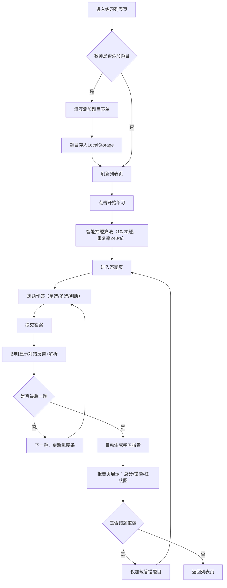

## 1. 产品概述

在线教育互动式智能练习评测系统，为教师提供快速生成互动式练习题的能力，为学生提供即时作答、错题解析和自动化学习报告的完整学习闭环。通过智能抽题算法保证每次练习质量，辅以多维度数据分析助力个性化学习提升。

- **核心价值**：缩短教师出题周期，提升学生练习效率，用数据驱动学习效果
- **目标用户**：K12及成人在线教育场景中的教师与学生

## 2. 核心功能

### 2.1 用户角色

| 角色 | 注册方式 | 核心权限 |
|------|----------|----------|
| 教师 | 直接使用（无需注册） | 添加新题目、管理题库、查看练习列表 |
| 学生 | 直接使用（无需注册） | 参与练习、查看解析、生成学习报告、错题重做 |

### 2.2 功能模块

1. **练习列表页**：练习卡片展示、随机抽题入口、题目添加表单
2. **答题页**：题目卡片渲染、多题型支持、答题进度、即时反馈
3. **结果报告页**：总分展示、错题列表、题型正确率柱状图、错题重做入口

### 2.3 页面详情

| 页面名称 | 模块名称 | 功能描述 |
|----------|----------|----------|
| 练习列表页 | 练习卡片网格 | 展示各练习信息，响应式布局（手机1列/平板2列/桌面3列） |
| 练习列表页 | 随机抽题模块 | 从20道预设题中随机抽取10道，与上次练习重复率≤40% |
| 练习列表页 | 添加题目表单 | 教师可添加题型、题干、选项、正确答案、解析，存入LocalStorage |
| 答题页 | 题目卡片组件 | 支持单选/多选/判断三种题型，选项悬停微缩放，点击涟漪动画 |
| 答题页 | 进度条组件 | 显示题号/总题数，渐变填充动画（#3182CE→#63B3ED） |
| 答题页 | 答案即时反馈 | 提交后正确绿色（#38A169）/错误红色（#E53E3E）渐变，0.3s淡入，显示解析（富文本HTML） |
| 结果报告页 | 总分与统计 | 总分、每题对错统计、按题型分布的正确率柱状图（Canvas绘制） |
| 结果报告页 | 错题列表 | 展示答错题目，对比错误答案与正确答案 |
| 结果报告页 | 错题重做 | 仅显示答错题目重新作答，更新报告数据 |

## 3. 核心流程

用户进入应用后浏览练习列表，教师可先添加题目扩充题库。学生选择练习后系统智能抽题（保证重复率≤40%），进入答题页逐题作答，每题提交后即时显示正确答案与解析。全部完成后自动生成学习报告，包含总分统计、错题详情和题型正确率分布图。学生可在报告页发起错题重做，重做后重新计算分数并更新报告。

## 4. 用户界面设计

### 4.1 设计风格

- **主色调**：柔和蓝灰 `#F0F4F8`（背景），深蓝 `#1A365D`（强调色）
- **反馈色**：正确 `#38A169`，错误 `#E53E3E`，进度渐变 `#3182CE → #63B3ED`
- **按钮风格**：圆角卡片式，悬停微缩放 `scale(1.02)`，点击CSS涟漪动画
- **字体选择**：标题使用「思源黑体 Bold」，正文使用「思源宋体 Regular」，搭配衬线/无衬线混排提升阅读质感
- **布局风格**：卡片式布局，白色卡片配柔和阴影，间距以8px为基础单位
- **图标风格**：Lucide Vue 线性图标，线条粗细统一为 1.5px

### 4.2 页面设计概览

| 页面名称 | 模块名称 | UI元素 |
|----------|----------|--------|
| 练习列表页 | 顶部导航 | Logo+标题、添加题目按钮（悬浮固定右下） |
| 练习列表页 | 练习卡片 | 卡片标题、题目数量预览、开始按钮、hover阴影加深+微上移动画 |
| 练习列表页 | 添加题目弹窗 | 表单分区（题型选择/题干输入/选项管理/答案设置/解析编辑），遮罩模糊背景 |
| 答题页 | 顶部进度区 | 进度条+题目标识+用时计时，渐变色平滑填充动画 |
| 答题页 | 题目卡片 | 大号题干、选项列表（悬停缩放1.02+涟漪）、提交按钮、解析折叠面板 |
| 结果报告页 | 顶部摘要卡 | 总分大字显示、环形进度指示、用时统计、正确率百分比 |
| 结果报告页 | 柱状图区 | Canvas渐变填充柱图，hover显示数值tooltip，坐标轴标签 |
| 结果报告页 | 错题列表 | 逐条展示错题、错误答案（红色删除线）/正确答案（绿色下划线）对比、重做按钮 |

### 4.3 响应式设计

- **桌面端（≥1280px）**：列表页3列网格，答题页最大宽度960px居中，报告页双栏布局
- **平板端（768px~1279px）**：列表页2列网格，答题页宽度100%，报告页单栏堆叠
- **手机端（<768px）**：列表页1列网格，选项按钮全宽，柱状图自适应宽度
- **触摸优化**：所有可点击区域最小44×44px，按钮间距≥8px，禁用双击缩放

### 4.4 动效与性能

- 页面切换使用路由过渡（淡入淡出+轻微位移，200ms ease）
- 选项按钮悬停 `transform: scale(1.02)` 过渡 150ms，点击涟漪用伪元素实现
- 正确/错误反馈使用 `background-color` + `opacity` 双属性过渡 300ms
- 柱状图首次加载采用从下到上高度增长动画（requestAnimationFrame，60fps）
- 所有交互反馈延迟目标≤100ms，页面首次加载≤2s，答题提交/报告生成≤500ms
