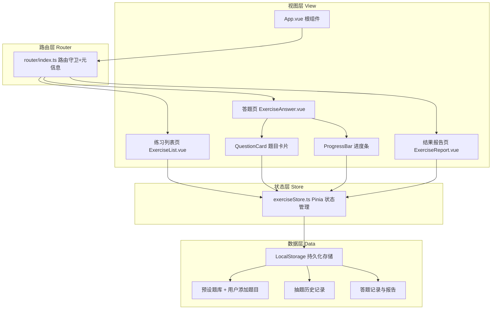

## 1. 架构设计

本项目为纯前端SPA应用，采用分层架构模式，各层职责清晰、数据单向流动。



**数据流向说明**：
1. 组件 → dispatch Action → Store 异步读写 LocalStorage → 更新 State → 组件响应式渲染
2. 路由变化 → 触发对应生命周期 → Store 加载对应练习/报告数据
3. QuestionCard emit('answer') → 父组件调用 Store → 记录答案并更新进度

## 2. 技术说明

| 层级 | 技术选型 | 版本要求 | 用途 |
|------|----------|----------|------|
| 前端框架 | Vue | ^3.4.0 | Composition API + `<script setup lang="ts">` |
| 构建工具 | Vite | ^5.0.0 | 极速开发构建，HMR |
| 状态管理 | Pinia | ^2.1.0 | 集中式状态管理，替代 Vuex |
| 路由 | Vue Router | ^4.2.0 | 路由守卫与 meta 元信息 |
| 类型系统 | TypeScript | ^5.3.0 | 严格模式，composite + declaration |
| 样式方案 | Sass | ^1.69.0 | SCSS 变量 + mixin + 全局注入 |
| 数据持久化 | LocalStorage API | - | 题库/抽题历史/答题记录本地存储 |
| 图表渲染 | Canvas 2D | - | 题型正确率柱状图，60fps 动画 |
| 图标库 | Lucide Vue Next | ^0.294.0 | 线性 SVG 图标组件 |

**初始化方式**：使用 `npm init vite-init@latest . -- --template vue-ts --force` 脚手架生成基础项目结构后，手动补充 Pinia、Sass、Lucide 等依赖。

## 3. 路由定义

| 路由路径 | 页面名称 | 组件路径 | meta 元信息 |
|----------|----------|----------|-------------|
| `/` | 练习列表页 | `@/pages/ExerciseList.vue` | `{ title: '练习中心', showNav: true }` |
| `/exercise/:id` | 答题页 | `@/pages/ExerciseAnswer.vue` | `{ title: '答题中', showNav: false, exerciseId: ':id' }` |
| `/report/:id` | 结果报告页 | `@/pages/ExerciseReport.vue` | `{ title: '学习报告', showNav: false, exerciseId: ':id' }` |
| `/review/:id` | 错题重做页 | `@/pages/ExerciseAnswer.vue` | `{ title: '错题重做', showNav: false, exerciseId: ':id', isReview: true }` |

**路由守卫逻辑**：
- 全局前置守卫 `beforeEach`：校验目标路由对应练习ID是否存在，不存在则重定向至列表页
- 全局后置钩子 `afterEach`：更新 document.title 并触发 exerciseStore 加载对应数据

## 4. 数据模型

### 4.1 TypeScript 类型定义

```typescript
// 题型枚举
type QuestionType = 'single' | 'multiple' | 'judge';

// 选项接口
interface QuestionOption {
  key: string;       // 'A' | 'B' | 'C' | 'D' ...
  content: string;   // 选项文本，支持HTML
}

// 题目接口
interface Question {
  id: string;                    // UUID
  type: QuestionType;            // 题型
  stem: string;                  // 题干，支持HTML
  options: QuestionOption[];     // 选项列表（判断题为2项：正确/错误）
  answer: string | string[];     // 正确答案（单选/判断为string，多选为string[]）
  analysis: string;              // 解析，支持富文本HTML
  createdAt: number;             // 创建时间戳
}

// 单次作答记录
interface AnswerRecord {
  questionId: string;
  userAnswer: string | string[]; // 用户答案
  isCorrect: boolean;
  timeSpent: number;             // 用时(ms)
  answeredAt: number;            // 作答时间戳
}

// 练习会话
interface ExerciseSession {
  id: string;                    // 练习ID
  title: string;                 // 练习标题
  questionIds: string[];         // 抽中的题目ID列表（共10题）
  answers: AnswerRecord[];       // 每题作答记录
  startedAt: number;             // 开始时间
  finishedAt?: number;           // 结束时间
  isReview?: boolean;            // 是否错题重做
  sourceSessionId?: string;      // 错题重做来源会话ID
}

// 抽题历史追踪（用于重复率控制）
interface DrawHistory {
  sessionId: string;
  questionIds: string[];
  drawnAt: number;
}

// 学习报告聚合数据
interface LearningReport {
  sessionId: string;
  totalScore: number;            // 满分100
  correctCount: number;
  wrongCount: number;
  totalTime: number;             // 总用时(ms)
  accuracyByType: {              // 按题型正确率
    single: number;
    multiple: number;
    judge: number;
  };
  wrongQuestions: {              // 错题详情
    question: Question;
    userAnswer: string | string[];
    correctAnswer: string | string[];
  }[];
}
```

### 4.2 LocalStorage Key 设计

| Key | 存储内容 | 过期策略 |
|-----|----------|----------|
| `iep_question_bank` | 完整题库 `Question[]` | 永不过期，手动增删 |
| `iep_sessions` | 所有练习会话 `ExerciseSession[]` | 保留最近20条，FIFO淘汰 |
| `iep_draw_history` | 抽题历史 `DrawHistory[]` | 保留最近5次 |
| `iep_current_session_id` | 当前进行中会话ID | 会话完成后清除 |

## 5. 文件结构与调用关系

```
src/
├── App.vue                      # 根组件：注入Router+Pinia，监听路由→触发store加载
├── main.ts                      # 入口：挂载应用，初始化全局样式
├── router/
│   └── index.ts                 # 路由表+守卫，meta携带exerciseId
├── stores/
│   └── exerciseStore.ts         # Pinia核心：题库/会话/报告，读写LocalStorage
├── pages/
│   ├── ExerciseList.vue         # 列表页：卡片网格+抽题+添加题目
│   ├── ExerciseAnswer.vue       # 答题页：集成ProgressBar+QuestionCard循环
│   └── ExerciseReport.vue       # 报告页：总分+柱状图+错题列表+重做入口
├── components/
│   ├── QuestionCard.vue         # 题目卡片：题型渲染+答案校验+emit('answer')
│   ├── ProgressBar.vue          # 进度条：CSS渐变动画，监听currentIndex
│   ├── BarChart.vue             # 柱状图：Canvas绘制+hover tooltip
│   ├── AddQuestionModal.vue     # 添加题目弹窗：表单校验+提交store
│   └── ExerciseCard.vue         # 练习卡片：列表页卡片组件
├── types/
│   └── index.ts                 # 全局TS类型定义（见4.1）
├── utils/
│   ├── storage.ts               # LocalStorage工具函数
│   ├── drawQuestions.ts         # 智能抽题算法（重复率≤40%）
│   ├── answerChecker.ts         # 答案校验工具
│   └── reportGenerator.ts       # 学习报告聚合生成器
├── data/
│   └── presetQuestions.ts       # 20道预设初始题库
└── styles/
    ├── variables.scss           # 全局SCSS变量（颜色/间距/动效时长）
    ├── mixins.scss              # 响应式断点mixin+涟漪动画mixin
    └── global.scss              # 全局样式重置+基础样式
```

**核心调用链路**：
1. `ExerciseList.vue` → `exerciseStore.generateSession()` → `drawQuestions.ts` → 写入`sessions` → `router.push('/exercise/:id')`
2. `ExerciseAnswer.vue` → 渲染 `QuestionCard` → emit `answer` → `exerciseStore.recordAnswer()` → 更新`ProgressBar`
3. 最后一题作答 → `exerciseStore.finishSession()` → `reportGenerator.ts` → `router.push('/report/:id')`
4. `ExerciseReport.vue` → 渲染 `BarChart` + 错题列表 → 错题重做 → `exerciseStore.startReviewSession()` → 跳转答题页

## 6. 核心算法与性能保障

### 6.1 智能抽题算法（重复率≤40%）

```
输入：题库Q(≥20题)、历史抽题记录H(最近5次)、目标抽题数N=10
输出：本次抽题结果R，保证与H[0]交集大小≤4

1. 若H为空：Fisher-Yates洗牌Q，取前10作为R，结束
2. lastSet = H[0].questionIds
3. maxOverlap = floor(40% × N) = 4
4. repeatCount = 0
5. candidateR = 洗牌Q取前N
6. overlapSize = |candidateR ∩ lastSet|
7. 若 overlapSize ≤ maxOverlap：R = candidateR，结束
8. 否则 repeatCount++，若 repeatCount < 20 回到步骤5
9. 兜底：取 lastSet 中4个 + Q\lastSet 中6个，合并为R
```

### 6.2 Canvas 柱状图 60fps 绘制

- 使用 `requestAnimationFrame` 驱动柱状图高度增长动画，duration=600ms
- Easing函数：`easeOutCubic = 1 - (1-t)^3`
- Hover检测：缓存每根柱子坐标，mousemove时O(M)线性扫描（M=3题型，可忽略）
- 设备像素比适配：`canvas.width = cssWidth × devicePixelRatio`，避免模糊

### 6.3 性能指标保障

| 指标 | 目标 | 实现策略 |
|------|------|----------|
| 首屏加载 | ≤2s | Vite按需编译+组件懒加载路由级分割，gzip后≤150KB |
| 答题提交响应 | ≤500ms | 纯本地计算，答案校验复杂度O(K)，K为选项数 |
| 报告生成 | ≤500ms | 遍历10条记录聚合，无IO等待，<1ms可完成 |
| 交互反馈延迟 | ≤100ms | CSS transition优先，JS事件处理避免长任务 |
| 柱状图画帧率 | 60fps | rAF驱动，每帧绘制<8ms（Chrome DevTools Performance验证） |
