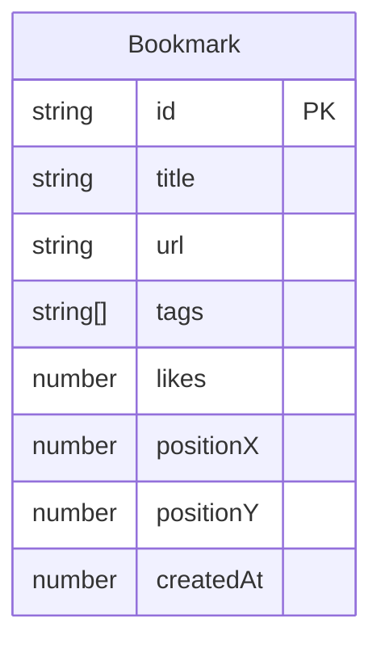

## 1. 架构设计

```mermaid
flowchart TB
    subgraph "前端层"
        "Vue 3 + TypeScript"
        "Pinia 状态管理"
        "Vite 构建"
    end
    subgraph "组件层"
        "BookmarkWall.vue"
        "BookmarkCard.vue"
    end
    subgraph "数据层"
        "LocalStorage 持久化"
        "BroadcastChannel 实时同步"
    end
    "Vue 3 + TypeScript" --> "Pinia 状态管理"
    "Pinia 状态管理" --> "BookmarkWall.vue"
    "BookmarkWall.vue" --> "BookmarkCard.vue"
    "Pinia 状态管理" --> "LocalStorage 持久化"
    "Pinia 状态管理" --> "BroadcastChannel 实时同步"
```

## 2. 技术说明

- 前端：Vue 3 + TypeScript + Pinia + Vite 5
- 初始化工具：vite-init（vue-ts 模板）
- 后端：无
- 数据库：LocalStorage 模拟持久化
- 实时通信：BroadcastChannel API（模拟3个本地标签页）
- 样式：Sass + 毛玻璃设计

## 3. 路由定义

| 路由 | 用途 |
|------|------|
| / | 书签墙主页面，包含所有功能 |

## 4. 数据模型

### 4.1 数据模型定义



### 4.2 数据结构

```typescript
interface Bookmark {
  id: string
  title: string
  url: string
  tags: string[]
  likes: number
  positionX: number
  positionY: number
  createdAt: number
}

interface BookmarkState {
  bookmarks: Bookmark[]
  searchQuery: string
  selectedTag: string
  allTags: string[]
}
```

## 5. 文件结构

```
├── package.json
├── vite.config.js
├── tsconfig.json
├── index.html
└── src/
    ├── main.ts
    ├── App.vue
    ├── stores/
    │   └── bookmarkStore.ts
    └── components/
        ├── BookmarkWall.vue
        └── BookmarkCard.vue
```

## 6. 关键实现要点

### 6.1 BroadcastChannel 同步

- 使用 `new BroadcastChannel('bookmark-wall')` 创建频道
- 添加书签时广播 `{ type: 'ADD', payload: bookmark }`
- 点赞时广播 `{ type: 'LIKE', payload: id }`
- 其他标签页监听消息并更新本地状态

### 6.2 拖拽与磁吸网格

- 使用 HTML5 Drag & Drop API 或 pointer events 实现拖拽
- 松开时计算最近网格线位置，使用 CSS transition 平滑归位
- 网格间距约 20px，确保卡片对齐

### 6.3 动画规范

- 卡片飞入：淡入 + translateY 弹跳，0.4s
- 点赞反馈：scale 缩放脉冲，0.2s
- 筛选消失：scale(0.8) + opacity(0)，0.3s
- 所有过渡：0.3s ease

### 6.4 响应式策略

- 桌面端（>768px）：四列 CSS Grid 布局
- 移动端（≤768px）：单列瀑布流布局
- 使用 `@media` 断点切换布局
- 拖拽功能在移动端使用 touch events

### 6.5 性能保障

- 使用 CSS transform/opacity 驱动动画（GPU加速）
- 避免 layout thrashing，拖拽时仅修改 transform
- 使用 requestAnimationFrame 优化拖拽渲染
- 目标：60FPS 拖拽和动画
