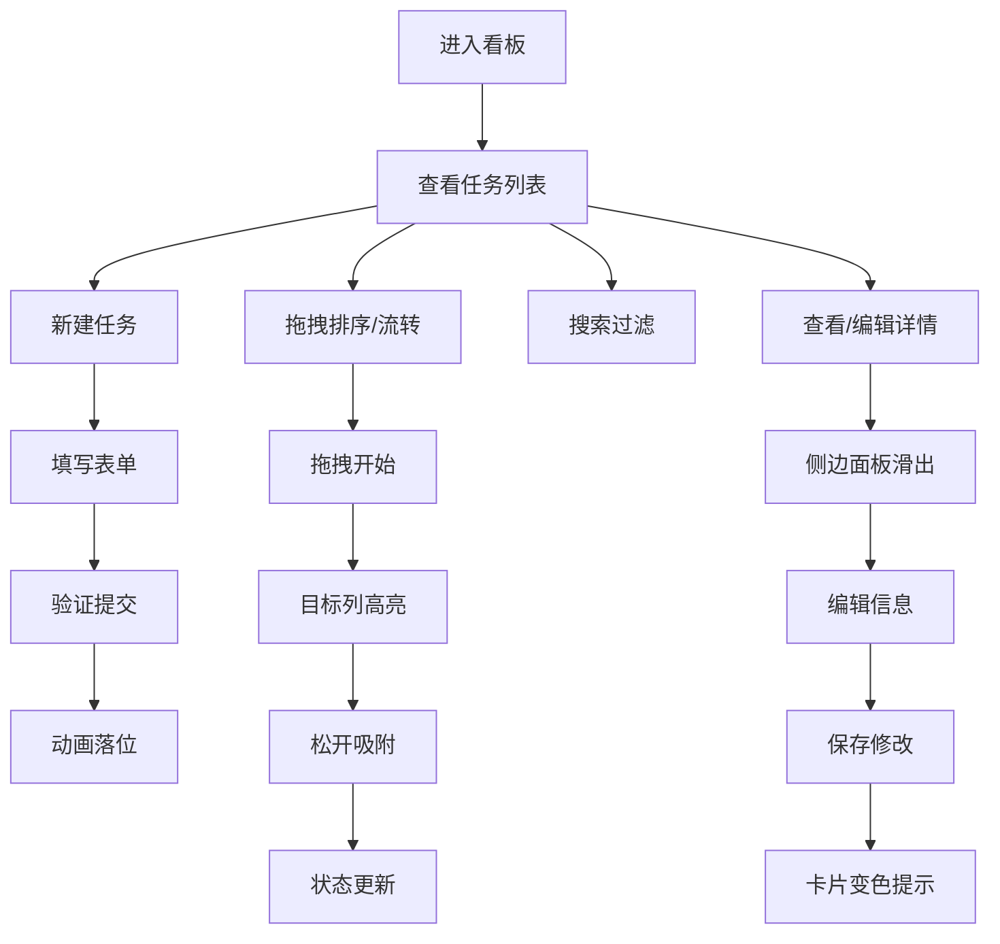

## 1. 产品概述

团队工作流看板应用，提供可视化的任务管理和状态流转功能，支持拖拽排序、实时同步和响应式布局，帮助团队高效管理工作进度。

- 主要用途：团队任务规划、工作流可视化、状态追踪
- 目标用户：项目团队、产品团队、开发团队
- 核心价值：通过直观的看板界面提升协作效率，实时掌握任务进度

## 2. 核心功能

### 2.1 功能模块

1. **看板主界面**：多列布局、任务卡片展示、拖拽交互
2. **任务管理**：新建任务、编辑任务、任务详情
3. **搜索过滤**：关键词搜索、过期任务筛选
4. **列管理**：自定义列名、新增列、任务计数

### 2.2 页面详情

| 页面名称 | 模块名称 | 功能描述 |
|---------|---------|---------|
| 看板主页 | 顶部工具栏 | 全局搜索栏、过期任务开关、新建任务按钮 |
| 看板主页 | 列容器 | 多列横向布局、列标题、任务计数、新增列入口 |
| 看板主页 | 任务卡片 | 标题显示、优先级徽章、截止日期、拖拽交互 |
| 侧边详情 | 详情面板 | 任务完整信息、编辑表单、保存/取消操作 |
| 新建弹窗 | 表单弹窗 | 任务标题、优先级选择、日期选择器、提交按钮 |

## 3. 核心流程

### 3.1 任务创建流程
用户点击新建按钮 → 弹出任务表单 → 填写标题/优先级/截止日期 → 提交验证 → 卡片以缩放动画落入对应列

### 3.2 拖拽流转流程
用户按住任务卡片 → 卡片半透明跟随鼠标 → 拖拽到目标列 → 目标列高亮提示 → 松开鼠标 → 卡片吸附到新位置 → 状态同步更新

### 3.3 任务编辑流程
用户点击任务卡片 → 侧边面板滑出 → 显示完整任务信息 → 修改字段 → 保存 → 卡片文字变色提示 → 面板收起

## 4. 用户界面设计

### 4.1 设计风格

- **设计基调**：浅色卡片风格，简洁清爽，专业感
- **主色调**：#3B82F6（蓝色，列标题）
- **强调色**：#F59E0B（紧急标签黄）、#EF4444（紧急红色）
- **背景色**：#F7F9FC（页面背景）、#FFFFFF（卡片背景）
- **中性色**：灰色系用于低优优先级和辅助文字
- **卡片样式**：圆角矩形、柔和阴影、层次感
- **字体**：现代无衬线字体，清晰易读

### 4.2 页面设计概览

| 页面名称 | 模块名称 | UI元素 |
|---------|---------|--------|
| 看板主页 | 顶部工具栏 | 搜索输入框（带图标）、切换开关、主按钮 |
| 看板主页 | 列头区域 | 蓝色背景、白色文字、任务计数徽章、圆角 |
| 看板主页 | 任务卡片 | 白色背景、阴影、标题文字、优先级小徽章、日期文字 |
| 看板主页 | 拖拽状态 | 半透明卡片、scale:1.05放大、阴影加深 |
| 侧边详情 | 滑入面板 | 从右侧滑入、半透明遮罩、表单布局 |
| 新建弹窗 | 模态窗口 | 居中显示、表单字段、底部操作按钮 |

### 4.3 动效设计

- **卡片入场**：0.3秒缩放动画（由小变大）
- **拖拽反馈**：卡片半透明、轻微放大（scale: 1.05）
- **列接收高亮**：0.5秒淡黄色背景闪烁
- **过期警示**：边框每1秒闪烁一次红色
- **编辑提示**：卡片文字变色提示修改
- **侧边面板**：平滑滑入/滑出动画

### 4.4 响应式布局

- **大屏（≥1024px）**：三列均分，横向排列
- **平板（≥768px）**：两列布局，换行展示
- **手机（<768px）**：单列堆叠，纵向滚动
- 列与列之间保持明显间距和圆角阴影区分

## 5. 性能要求

- 拖拽/排序操作响应延迟不超过50ms
- 列表重渲染时仅更新发生变化的卡片DOM节点
- 使用 React.memo 优化组件渲染性能
- 拖拽操作使用原生拖拽API或高效状态更新策略
