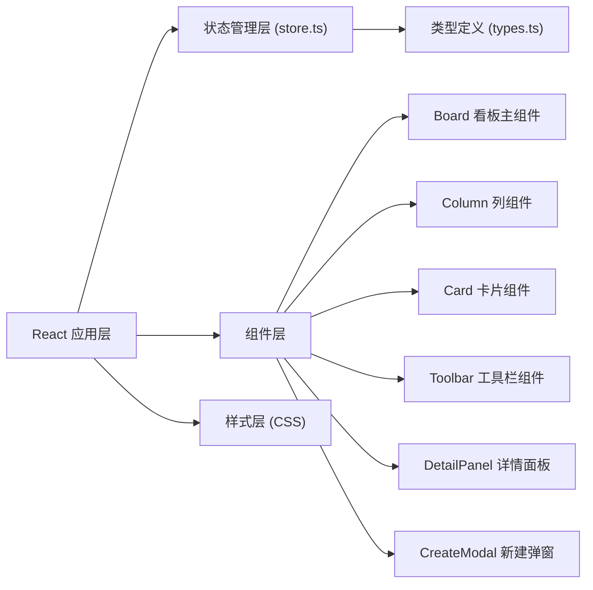

## 1. 架构设计



## 2. 技术描述

- **前端框架**：React 18 + TypeScript
- **构建工具**：Vite + @vitejs/plugin-react
- **状态管理**：React useState/useReducer（轻量级，无需额外库）
- **拖拽实现**：原生 HTML5 Drag and Drop API
- **样式方案**：CSS Modules / 内联样式（使用 CSS 变量管理主题色）
- **动画方案**：CSS transitions + keyframes 动画

## 3. 项目结构

```
src/
├── types.ts           # 类型定义：Todo, Column, Priority 等
├── store.ts           # 状态逻辑：列管理、任务增删改、拖拽排序
├── main.tsx           # 应用入口
├── App.tsx            # 根组件
├── index.css          # 全局样式和 CSS 变量
└── components/
    ├── Board.tsx      # 看板主组件，列布局和拖拽容器
    ├── Column.tsx     # 单列组件，任务列表渲染
    ├── Card.tsx       # 任务卡片组件，可拖拽
    ├── Toolbar.tsx    # 顶部工具栏（搜索、筛选）
    ├── DetailPanel.tsx # 侧边详情编辑面板
    └── CreateModal.tsx # 新建任务弹窗
```

## 4. 数据模型

### 4.1 类型定义

```typescript
// 优先级枚举
type Priority = 'urgent' | 'normal' | 'low';

// 任务接口
interface Todo {
  id: string;
  title: string;
  priority: Priority;
  dueDate: string; // ISO date string
  columnId: string;
  order: number;
  isNew?: boolean; // 用于入场动画标记
  isModified?: boolean; // 用于编辑后变色提示
}

// 列接口
interface Column {
  id: string;
  title: string;
  isHighlighted?: boolean; // 接收新卡片时高亮
}

// 看板状态
interface BoardState {
  columns: Column[];
  todos: Todo[];
  searchQuery: string;
  showOverdue: boolean;
}
```

### 4.2 初始数据

- 默认三列：待办、进行中、已完成
- 预置若干示例任务，分布在不同列中

## 5. 核心功能实现方案

### 5.1 拖拽排序

- 使用 HTML5 Drag and Drop API
- 拖拽开始：记录被拖拽卡片的 ID 和源列 ID
- 拖拽经过：更新目标位置指示器
- 拖拽放下：计算新位置，重新排序，更新状态
- 使用 `React.memo` 避免不必要的重渲染

### 5.2 性能优化

- 列表渲染使用唯一 key（任务 ID）
- Card 组件使用 `React.memo` 包裹
- 使用 `useCallback` 缓存事件处理函数
- 拖拽过程中避免频繁 setState，使用 ref 追踪拖拽状态

### 5.3 动画效果

- 卡片入场：CSS scale 动画 + opacity
- 拖拽状态：CSS transform + opacity
- 列高亮：CSS background-color transition
- 过期闪烁：CSS keyframes 动画
- 侧边面板：CSS transform translate 动画

## 6. 响应式布局

- 使用 CSS Grid 布局
- 媒体查询断点：
  - ≥1024px：grid-template-columns: repeat(3, 1fr)
  - ≥768px：grid-template-columns: repeat(2, 1fr)
  - <768px：grid-template-columns: 1fr

## 7. 入口与配置

| 文件 | 作用 |
|------|------|
| package.json | 依赖声明和脚本配置 |
| vite.config.js | Vite 构建配置，React 插件 |
| tsconfig.json | TypeScript 严格模式配置 |
| index.html | HTML 入口文件 |
