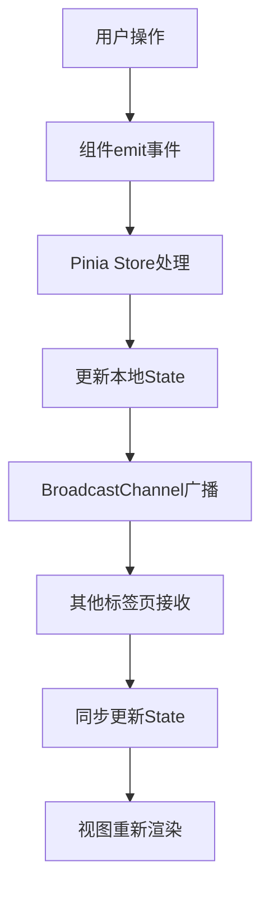

## 1. 产品概述
实时创意投票与排名应用，帮助创意设计团队快速对产品概念进行视觉化投票和排序，支持多用户实时同步协作。

- **核心价值**：提升团队决策效率，通过可视化投票和实时同步，快速收集集体偏好
- **目标用户**：创意设计团队成员、产品经理、设计师
- **市场价值**：替代传统线下投票方式，提供即时反馈和数据可视化

## 2. 核心功能

### 2.1 用户角色
| 角色 | 注册方式 | 核心权限 |
|------|----------|----------|
| 团队成员 | 无需注册，标签页独立身份 | 提交创意、投票、删除自有创意、查看排名 |

### 2.2 功能模块
1. **创意提交**：通过浮动按钮打开对话框，填写标题、描述、颜色标签
2. **投票系统**：每张卡片可投票一次，投票后实时更新排名
3. **实时同步**：多标签页通过BroadcastChannel实现状态同步
4. **排序筛选**：按票数/时间排序，按颜色标签多选筛选
5. **排名展示**：动态排名序号，第一名金色边框发光效果
6. **删除功能**：长按卡片弹出删除确认对话框

### 2.3 页面详情
| 页面名称 | 模块名称 | 功能描述 |
|-----------|-------------|---------------------|
| 主页面 | 顶部导航栏 | 应用标题、在线标签页数量显示 |
| 主页面 | 工具栏 | 排序选项、颜色筛选复选框组 |
| 主页面 | 虚拟滚动网格 | 视口内卡片渲染，性能优化 |
| 主页面 | 浮动添加按钮 | 打开新创意提交对话框 |
| 主页面 | 创意卡片 | 展示详情、投票、长按删除 |
| 对话框 | 创意表单 | 标题/描述/颜色输入与验证 |
| 对话框 | 删除确认 | 确认删除操作 |

## 3. 核心流程

**创意提交流程**：
用户点击浮动按钮 → 弹出表单对话框 → 填写信息并验证 → 提交 → Pinia store更新 → BroadcastChannel广播 → 所有标签页同步显示新卡片（淡入+上浮动画）

**投票流程**：
用户点击投票按钮 → 检查投票状态（localStorage标识）→ 未投票则票数+1 → 标记已投票 → store更新 → 广播同步 → 按钮变灰禁用 → 卡片重排动画

**删除流程**：
用户长按卡片（500ms）→ 弹出确认对话框 → 确认删除 → store移除 → 广播同步 → 卡片淡出消失

## 4. 用户界面设计

### 4.1 设计风格
- **主背景**：暖灰色 #f5f0eb
- **卡片底色**：纯白 #ffffff
- **主色调**：橙色 #e67e22（投票按钮）
- **颜色标签**：红/蓝/绿/橙/紫
- **第一名金色**：#ffd700
- **卡片阴影**：box-shadow: 0 2px 8px rgba(0,0,0,0.1)
- **圆角**：12px
- **卡片尺寸**：固定宽度280px，高度自适应

### 4.2 字体
- **标题**：18px 半粗体 #222
- **描述**：14px #666
- **按钮文字**：14px

### 4.3 动画效果
- **卡片进入**：opacity 0→1 + translateY(20px)→0，0.5秒 ease-out
- **投票按钮**：点击缩放0.3秒反馈
- **筛选淡出**：非选中卡片0.3秒淡出
- **第一名呼吸**：@keyframes pulseGlow 1秒周期，金色发光
- **按钮悬浮**：放大1.05倍 + 阴影加深

### 4.4 页面设计概述
| 页面名称 | 模块名称 | UI元素 |
|-----------|-------------|-------------|
| 主页面 | 导航栏 | 标题、在线人数、简洁布局 |
| 主页面 | 工具栏 | 下拉排序、颜色复选框组、内边距 |
| 主页面 | 虚拟滚动容器 | 固定高度、滚动条、动态渲染 |
| 主页面 | 卡片网格 | CSS Grid、minmax(280px, 1fr)、响应式 |
| 主页面 | 浮动按钮 | 圆形、悬浮效果、固定右下角 |
| 创意卡片 | 色带 | 左侧4px宽彩色竖条 |
| 创意卡片 | 排名徽章 | 左上角序号、第一名金色 |
| 创意卡片 | 内容区 | 标题、描述、图片占位 |
| 创意卡片 | 投票按钮 | 右下角大拇指图标、橙色 |

### 4.5 响应式设计
- **桌面端**：多列网格，自适应列数
- **平板端**：2-3列
- **移动端(≤768px)**：单列布局，卡片宽度100%

### 4.6 交互细节
- **长按检测**：mousedown/touchstart 启动500ms定时器，mouseup/touchend/mouseleave 清除定时器
- **投票去重**：localStorage存储tab唯一标识 + 已投票创意ID集合
- **虚拟滚动**：仅渲染视口内+上下缓冲区的卡片，计算滚动位置动态渲染
