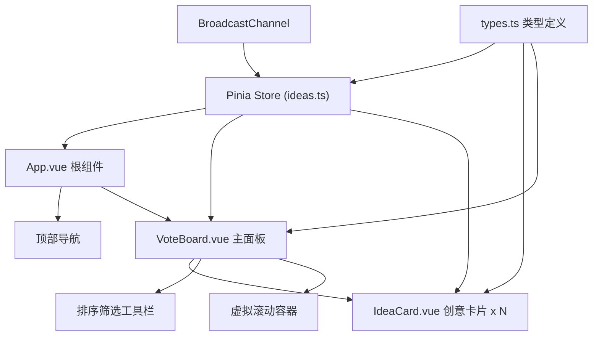
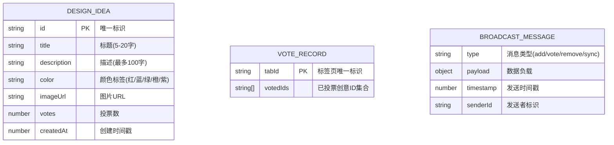

## 1. 架构设计



## 2. 技术描述
- **前端框架**：Vue@3.4 + TypeScript@5.4
- **构建工具**：Vite@5.2
- **状态管理**：Pinia@2.1
- **样式方案**：Sass@1.77
- **虚拟滚动**：vue-virtual-scroller@2.0（或手动实现）
- **实时通信**：BroadcastChannel API
- **本地存储**：localStorage（投票去重标识）
- **初始化工具**：vite-init

## 3. 文件结构与数据流向

| 文件 | 职责 | 调用关系 | 数据流向 |
|------|------|----------|----------|
| [package.json](file:///C:/Users/Administrator/Desktop/VersionFastPro/tasks/auto29/package.json) | 依赖管理、脚本配置 | 被npm读取 | 无 |
| [vite.config.js](file:///C:/Users/Administrator/Desktop/VersionFastPro/tasks/auto29/vite.config.js) | Vite构建配置、Vue插件 | 被Vite读取 | 无 |
| [tsconfig.json](file:///C:/Users/Administrator/Desktop/VersionFastPro/tasks/auto29/tsconfig.json) | TypeScript配置、严格模式 | 被TS编译器读取 | 无 |
| [index.html](file:///C:/Users/Administrator/Desktop/VersionFastPro/tasks/auto29/index.html) | 入口HTML | 引入main.ts | 无 |
| [src/main.ts](file:///C:/Users/Administrator/Desktop/VersionFastPro/tasks/auto29/src/main.ts) | 应用入口、初始化Pinia | 导入App.vue、store、types | 创建App → 安装Pinia → 挂载 |
| [src/types.ts](file:///C:/Users/Administrator/Desktop/VersionFastPro/tasks/auto29/src/types.ts) | 类型定义：DesignIdea、SortType、ColorTag | 被store、组件import | 定义接口 → 供全局使用 |
| [src/stores/ideas.ts](file:///C:/Users/Administrator/Desktop/VersionFastPro/tasks/auto29/src/stores/ideas.ts) | Pinia状态管理、CRUD、投票、广播 | 导入types、BroadcastChannel | 接收action → 更新state → 广播消息 → 其他标签页同步 |
| [src/components/IdeaCard.vue](file:///C:/Users/Administrator/Desktop/VersionFastPro/tasks/auto29/src/components/IdeaCard.vue) | 单个创意卡片展示与交互 | 导入types、store | 接收props:idea → 渲染 → 用户操作emit → 调用store action |
| [src/components/VoteBoard.vue](file:///C:/Users/Administrator/Desktop/VersionFastPro/tasks/auto29/src/components/VoteBoard.vue) | 主面板、虚拟滚动、筛选排序 | 导入types、store、IdeaCard | 从store读取ideas → 筛选排序 → 虚拟滚动渲染IdeaCard |
| [src/App.vue](file:///C:/Users/Administrator/Desktop/VersionFastPro/tasks/auto29/src/App.vue) | 根组件、整体布局 | 导入VoteBoard | 包含导航栏 + VoteBoard → 整体布局 |

## 4. 核心数据模型



## 5. 关键实现方案

### 5.1 虚拟滚动实现
```
滚动容器高度固定 → 监听scroll事件 → 计算scrollTop → 
推算可见区域起始/结束索引 → 只渲染可见项 + 上下缓冲区 → 
使用transform: translateY偏移模拟滚动位置
```

### 5.2 实时同步机制
```
操作触发 → store更新 → 生成BroadcastMessage → 
channel.postMessage → 其他标签页message事件 → 
验证senderId(避免自循环) → 时间戳检查延迟 → 
更新本地store → 视图刷新
```

### 5.3 投票去重实现
```
页面加载 → 检查localStorage.tabId → 不存在则生成 → 
点击投票 → 检查tabId对应的votedIds集合 → 
未投票则允许 → 添加到votedIds → 持久化到localStorage → 
按钮禁用
```

### 5.4 性能优化策略
1. **虚拟滚动**：50张卡片仅渲染视口内约5-8张
2. **列表记忆化**：computed缓存筛选排序结果
3. **v-memo**：卡片组件使用v-memo减少不必要渲染
4. **will-change**：动画元素优化GPU加速
5. **广播节流**：高频率操作时使用消息队列批量发送

## 6. BroadcastChannel延迟测试方案
在store中添加消息发送/接收时间戳对比：
- 发送时记录timestamp到消息体
- 接收时计算 Date.now() - message.timestamp
- 日志输出延迟，超过200ms警告
- 必要时实现消息队列，每16ms(60fps)批量发送
