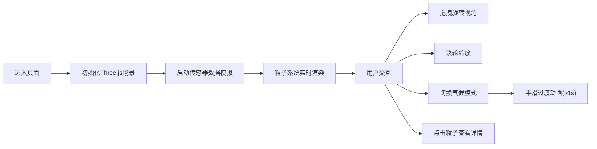

## 1. 产品概述

3D粒子气候系统是一个基于实时传感器数据（模拟生成）的交互式科学可视化应用，解决气候数据在三维空间内的直观呈现问题。通过2000+粒子的动态渲染，让用户能够沉浸式观察不同气候模式下的温度、湿度分布与粒子运动规律。

目标用户：科研人员、气象爱好者、教育工作者
核心价值：将抽象的气候数据转化为直观可交互的三维视觉体验

## 2. 核心特性

### 2.1 用户角色
| 角色 | 注册方式 | 核心权限 |
|------|----------|----------|
| 普通用户 | 无需注册 | 浏览3D场景、切换气候模式、查看粒子属性 |

### 2.2 功能模块
1. **3D粒子系统**：2000-2500个粒子实时渲染，颜色随温度、大小随湿度动态变化
2. **传感器数据模拟**：每200ms生成一批模拟数据（位置、温度、湿度、速度）
3. **气候模式切换**：夏季高温、冬季寒流、雷暴三种模式，带平滑过渡动画
4. **粒子生命周期管理**：5秒存活周期，自动生成与消散，保持总数稳定
5. **交互控制**：鼠标拖拽旋转、滚轮缩放、点击粒子查看详情
6. **控制面板**：模式切换、粒子计数、FPS监控，响应式折叠

### 2.3 页面详情
| 页面名称 | 模块名称 | 功能描述 |
|----------|----------|----------|
| 主场景 | 3D粒子系统 | 全屏Three.js场景，粒子带拖尾辉光效果，消散渐变动画 |
| 主场景 | 控制面板 | 左上角半透明磨砂玻璃面板，模式切换按钮带脉冲动画 |
| 主场景 | 粒子详情面板 | 点击粒子弹出，显示完整属性数据（位置、温度、湿度、速度） |
| 主场景 | 响应式UI | 移动端(768px以下)控制面板折叠为浮动图标 |

## 3. 核心流程

用户进入页面 → 自动初始化3D场景与粒子系统 → 实时数据驱动粒子运动 → 用户可拖拽/缩放浏览 → 点击模式按钮切换气候模式（平滑过渡） → 点击单个粒子查看详情 → 移动端点击浮动图标展开控制面板

## 4. 用户界面设计

### 4.1 设计风格
- **主色调**：深蓝紫(#1a1a3e) 到 暗青(#0d3b3b) 渐变背景
- **面板风格**：暗色磨砂玻璃（backdrop-filter: blur），半透明
- **粒子颜色**：冷色(蓝)到暖色(红/橙)渐变，映射温度-10°C~45°C
- **按钮样式**：圆角胶囊按钮，选中态有缩放脉冲动画
- **字体**：现代无衬线字体，清晰科技感
- **整体氛围**：科技感、沉浸感、数据可视化风格

### 4.2 页面设计概览
| 页面名称 | 模块名称 | UI元素 |
|----------|----------|--------|
| 主场景 | 3D粒子系统 | 带拖尾辉光的粒子、深空背景、环境光+点光源 |
| 主场景 | 控制面板 | 磨砂玻璃面板、模式切换按钮组、FPS计数器、粒子数显示 |
| 主场景 | 粒子详情面板 | 数据卡片、属性键值对、关闭按钮 |
| 主场景 | 移动端浮动按钮 | 圆形悬浮按钮、展开/收起动画 |

### 4.3 响应式
- 桌面端：左上角固定控制面板，完整展示所有控件
- 移动端(≤768px)：控制面板折叠为右下角浮动圆形按钮，点击展开全屏抽屉
- 触摸优化：支持双指缩放、单指拖拽

### 4.4 3D场景指引
- **环境**：深空渐变背景，营造宇宙/大气层空间感
- **光照**：环境光(0.4) + 两盏点光源(冷暖各一)，增强粒子体积感
- **相机**：PerspectiveCamera，初始距离15，fov 60°
- **控制器**：OrbitControls，启用阻尼效果，拖拽流畅
- **粒子效果**：AdditiveBlending 混合模式，拖尾由粒子透明度渐变实现
- **消散动画**：透明度渐变至0 + 尺寸缩小至0
- **性能预算**：2000-2500粒子，目标60FPS，单帧更新≤16ms
