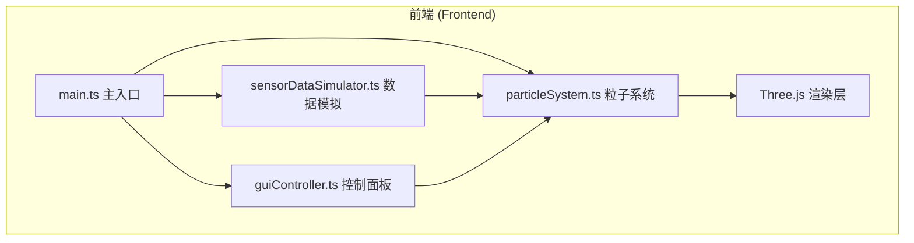

## 1. 架构设计



## 2. 技术描述

- **前端框架**：原生 TypeScript + Three.js (r152+)
- **构建工具**：Vite 5.x
- **3D引擎**：Three.js @0.152+ + OrbitControls
- **样式方案**：原生 CSS + CSS 变量
- **语言**：TypeScript 严格模式，ES2020 语法

## 3. 项目结构

```
├── package.json          # 依赖与脚本
├── vite.config.js        # Vite 构建配置
├── tsconfig.json         # TypeScript 配置
├── index.html            # 入口页面
└── src/
    ├── main.ts           # 主入口：场景/相机/渲染器初始化，启动循环
    ├── particleSystem.ts # 粒子系统核心：生成/更新/生命周期/颜色大小计算
    ├── sensorDataSimulator.ts # 传感器数据模拟器
    └── guiController.ts  # UI控制面板：模式切换/FPS/粒子数/响应式
```

## 4. 核心数据模型

### 4.1 粒子数据结构
```typescript
interface ParticleData {
  id: number;
  position: { x: number; y: number; z: number };
  velocity: { x: number; y: number; z: number };
  temperature: number; // -10 ~ 45 °C
  humidity: number;    // 0 ~ 100 %
  birthTime: number;
  lifetime: number;    // 5000 ms
}
```

### 4.2 气候模式配置
```typescript
type ClimateMode = 'summer' | 'winter' | 'thunderstorm';

interface ClimateConfig {
  name: string;
  baseTemperature: number;
  temperatureRange: [number, number];
  baseHumidity: number;
  humidityRange: [number, number];
  speedMultiplier: number;
  distribution: 'spread' | 'clustered' | 'turbulent';
  particleColor: string;
}
```

## 5. 核心模块设计

### 5.1 ParticleSystem (粒子系统)
- **职责**：管理粒子池，处理生命周期，更新GPU缓冲区
- **核心方法**：
  - `init(count: number)` - 初始化粒子
  - `update(deltaTime: number)` - 每帧更新粒子位置/颜色/大小
  - `setMode(mode: ClimateMode, transitionDuration: number)` - 切换模式
  - `getParticleAt(raycaster: THREE.Raycaster)` - 射线检测点击粒子
  - `spawnParticle()` - 生成单个粒子
  - `killParticle(index: number)` - 销毁粒子
- **性能优化**：使用 BufferGeometry + Points，单Draw Call，GPU Instancing

### 5.2 SensorDataSimulator (数据模拟器)
- **职责**：周期性生成模拟传感器数据
- **核心方法**：
  - `start(interval: number)` - 启动数据生成
  - `stop()` - 停止
  - `getBatch(): ParticleData[]` - 获取一批新数据
  - `setMode(mode: ClimateMode)` - 设置气候模式影响数据分布
- **数据生成策略**：基于Perlin噪声的连续流动，不同模式有不同参数

### 5.3 GUIController (界面控制)
- **职责**：DOM控制面板，状态展示，用户交互
- **核心功能**：
  - 模式切换按钮组（带脉冲动画）
  - FPS实时计数器
  - 粒子数量显示
  - 粒子详情弹出面板
  - 响应式折叠/展开
  - 事件派发（模式切换事件）

### 5.4 main.ts (主入口)
- 初始化 Scene、Camera、Renderer
- 初始化 OrbitControls
- 创建 ParticleSystem 实例
- 创建 SensorDataSimulator 并启动
- 创建 GUIController 并绑定事件
- 启动 requestAnimationFrame 渲染循环
- 处理窗口 resize

## 6. 性能优化策略

1. **BufferGeometry 重用**：所有粒子共享一个 Points 对象，更新缓冲区而非创建新对象
2. **TypedArray 操作**：直接操作 Float32Array 更新位置、颜色、大小
3. **粒子池化**：固定大小粒子池，循环复用，避免 GC 抖动
4. **数据节流**：传感器数据200ms更新一次，渲染帧插值过渡
5. **frustumCulled**：关闭粒子的视锥体剔除（Points默认行为）
6. **AdditiveBlending**：使用加法混合减少overdraw感知

## 7. 性能指标

| 指标 | 目标值 |
|------|--------|
| 粒子数量 | 2000-2500 |
| 帧率 | ≥ 60 FPS |
| 单帧更新 | ≤ 16 ms |
| 模式过渡时长 | ≥ 1000 ms |
| 数据更新间隔 | 200 ms |
| 粒子生命周期 | 5000 ms |
