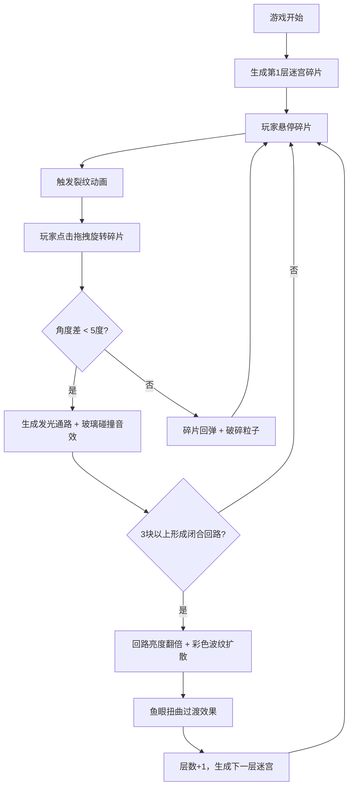

## 1. 产品概述

碎镜迷宫是一款浏览器端的交互式镜面解谜游戏。玩家通过旋转六边形镜面碎片，调整反射角度使碎片对齐形成闭合回路，逐层深入探索无限反射的碎片空间。

- 核心玩法：拖拽旋转镜面碎片，使相邻碎片角度对齐（误差<5度）形成发光通路，当3块以上碎片形成闭合回路时通关进入下一层
- 目标用户：喜欢解谜、视觉艺术和互动体验的玩家
- 产品价值：提供沉浸式的镜面反射视觉体验和渐进式的解谜乐趣

## 2. 核心功能

### 2.1 功能模块

1. **迷宫主界面**：全屏Canvas渲染，六边形镜面碎片分布，渐变背景，星尘粒子阵
2. **碎片交互系统**：悬停裂纹动画、点击拖拽旋转、角度对齐检测、发光通路连接
3. **视觉反馈系统**：金属光泽描边、反射效果、冷银白到暖金色过渡、彩色波纹扩散、鱼眼扭曲过渡
4. **音效系统**：玻璃碰撞音效、回路激活波纹音效
5. **层数进度系统**：左上角层数显示、右下角通路计数、迷宫生成与过渡切换

### 2.2 页面详情

| 页面名称 | 模块名称 | 功能描述 |
|-----------|-------------|---------------------|
| 迷宫主界面 | 渐变背景层 | 烟灰蓝(#5A6B7C)到暗夜紫(#2D1B4E)径向渐变，全屏铺满 |
| 迷宫主界面 | 星尘粒子阵 | 1-3px白色半透明粒子，缓慢漂移，深邃背景感 |
| 迷宫主界面 | 六边形镜面碎片 | 随机分布，边缘金属光泽描边(#C0C8D0)，缝隙透出底光 |
| 迷宫主界面 | 悬停裂纹动画 | 光标经过时从光标位置扩散的玻璃碎裂效果 |
| 迷宫主界面 | 旋转交互 | 以点击点为中心旋转，边缘颜色从冷银白过渡到暖金色(#FFD700) |
| 迷宫主界面 | 通路连接 | 角度差<5度时生成淡蓝光粒子流动通路，播放玻璃碰撞音效 |
| 迷宫主界面 | 回弹效果 | 角度差>5度时弹回原位，飘散浅灰色破碎粒子 |
| 迷宫主界面 | 回路激活 | 3块以上碎片闭合时亮度翻倍，彩色波纹扩散，鱼眼扭曲过渡到下一层 |
| 迷宫主界面 | UI信息层 | 左上角"Lv.N"层数显示（纤细等宽#8888AA），右下角发光六边形通路计数图标 |

## 3. 核心流程

玩家进入游戏后看到第一层迷宫，鼠标悬停在碎片上会触发裂纹动画。玩家点击并拖拽碎片进行旋转：
- 如果松开时与相邻碎片角度差小于5度，两块碎片之间生成发光通路并播放清脆玻璃音效
- 如果角度差大于5度，碎片回弹并飘散破碎粒子

当任意3块或以上碎片通过通路形成闭合回路时，整个回路点亮并扩散彩色波纹，界面经过鱼眼扭曲效果后切换到下一层迷宫（碎片图案重新随机生成，但保留上一层的旋转角度记忆）。

## 4. 用户界面设计

### 4.1 设计风格

- **主色调**：烟灰蓝(#5A6B7C) → 暗夜紫(#2D1B4E)渐变背景
- **强调色**：金属银(#C0C8D0)描边、暖金色(#FFD700)旋转高光、淡蓝色通路粒子
- **字体**：纤细等宽字体（monospace），#8888AA颜色
- **视觉风格**：极简暗色、深邃神秘、镜面反射、万花筒套叠感
- **动效风格**：流畅丝滑、物理感（回弹、扩散）、玻璃质感

### 4.2 页面设计概览

| 页面名称 | 模块名称 | UI元素 |
|-----------|-------------|-------------|
| 迷宫主界面 | 背景层 | 径向渐变 + 星尘粒子阵 + 缝隙底光 |
| 迷宫主界面 | 碎片层 | 六边形镜面 + 金属描边 + 反射效果 + 裂纹动画 |
| 迷宫主界面 | 通路层 | 淡蓝色发光粒子流动 + 暖金色高亮 |
| 迷宫主界面 | 特效层 | 彩色波纹扩散 + 鱼眼扭曲过渡 |
| 迷宫主界面 | UI层 | 左上角层数文本 + 右下角六边形计数图标 |

### 4.3 响应式

- 采用全屏Canvas，自适应窗口大小，无需断点适配
- 桌面端鼠标交互为主（点击、拖拽、悬停）
- 响应窗口resize事件，动态调整Canvas尺寸和碎片位置

### 4.4 性能要求

- 交互帧率不低于50fps
- 碎片数量200块以内无卡顿
- 所有动画使用requestAnimationFrame驱动
