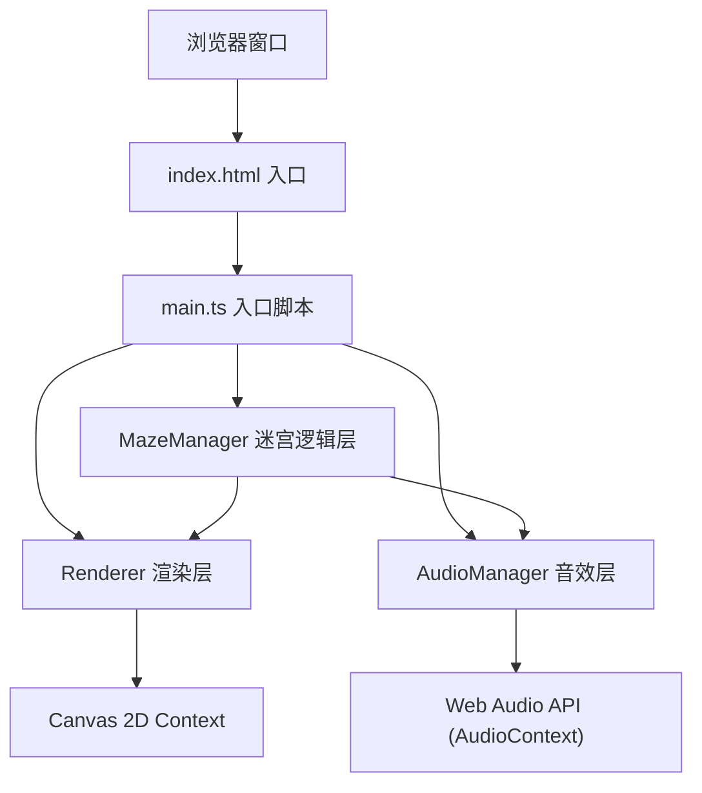

## 1. 架构设计



架构说明：
- **入口层**：index.html + main.ts 负责初始化和启动主循环
- **逻辑层**：MazeManager 负责碎片生成、对齐检测、回路判断、层数切换
- **渲染层**：Renderer 负责所有Canvas绘制：背景、碎片、裂纹、通路粒子、波纹特效
- **音效层**：AudioManager 负责用AudioContext合成音效

## 2. 技术描述

- **前端框架**：原生 TypeScript（无框架，纯Canvas 2D）
- **构建工具**：Vite 5.x，支持HMR
- **语言**：TypeScript 5.x，严格模式，目标 ES2020
- **图形API**：HTML5 Canvas 2D Context
- **音频API**：Web Audio API (AudioContext)
- **动画驱动**：requestAnimationFrame
- **后端**：无（纯前端项目）
- **数据库**：无

## 3. 项目文件结构

| 文件路径 | 作用 |
|-------|---------|
| `package.json` | 项目配置、依赖（typescript、vite）、启动脚本 |
| `vite.config.js` | Vite基础配置，支持HMR |
| `tsconfig.json` | TypeScript严格模式配置，目标ES2020 |
| `index.html` | 入口页面，深色背景，无滚动条，标题"碎镜迷宫" |
| `src/main.ts` | 入口脚本：初始化Canvas，启动迷宫循环，协调各管理器 |
| `src/mazeManager.ts` | 迷宫逻辑：碎片生成、对齐检测、闭合回路判断、层数切换 |
| `src/renderer.ts` | 渲染逻辑：绘制碎片、光泽描边、反射、裂纹、通路粒子、波纹、星尘 |
| `src/audioManager.ts` | 音效管理：玻璃碰撞音效、回路激活波纹音效 |

## 4. 核心数据结构定义

```typescript
// 六边形镜面碎片
interface MirrorShard {
  id: number;
  x: number;           // 中心x坐标
  y: number;           // 中心y坐标
  radius: number;      // 六边形半径
  rotation: number;    // 当前旋转角度（弧度）
  targetRotation: number; // 目标旋转角度（回弹用）
  baseRotation: number;   // 初始/基准旋转角度
  isDragging: boolean;
  dragOffset: number;  // 拖拽时鼠标角度与碎片角度的差值
  neighbors: number[]; // 相邻碎片的id列表
  crackAnim: CrackAnimation | null; // 当前裂纹动画
  edgeGlowIntensity: number; // 边缘发光强度 (0-1)
  edgeGlowColor: { r: number; g: number; b: number }; // 边缘发光颜色插值
}

// 裂纹动画
interface CrackAnimation {
  originX: number;
  originY: number;
  startTime: number;
  duration: number;
  lines: CrackLine[];
}

// 单条裂纹线
interface CrackLine {
  startX: number;
  startY: number;
  endX: number;
  endY: number;
  progress: number; // 0-1 扩散进度
}

// 发光通路
interface LightPath {
  fromShardId: number;
  toShardId: number;
  startTime: number;
  particles: PathParticle[];
}

// 通路粒子
interface PathParticle {
  t: number; // 在线段上的位置 0-1
  speed: number;
  size: number;
  alpha: number;
}

// 波纹动画
interface RippleAnimation {
  x: number;
  y: number;
  startTime: number;
  duration: number;
  maxRadius: number;
  colorHue: number;
}

// 破碎粒子
interface BreakParticle {
  x: number;
  y: number;
  vx: number;
  vy: number;
  size: number;
  alpha: number;
  life: number;
}

// 星尘粒子
interface StarDust {
  x: number;
  y: number;
  size: number;
  alpha: number;
  driftSpeed: { x: number; y: number };
}
```

## 5. 核心算法

### 5.1 六边形网格生成
1. 计算适配屏幕的六边形半径
2. 采用轴向坐标系(q, r)生成蜂窝网格
3. 对每个碎片随机偏移位置和初始旋转角度
4. 通过距离检测建立相邻关系（neighbors列表）

### 5.2 角度对齐检测
1. 碎片旋转结束时，遍历其neighbors
2. 计算两碎片rotation的差值（归一化到 [0, π) 区间）
3. 若角度差 < 5°（0.0873弧度），判定为对齐
4. 已对齐的通路存入路径集合，避免重复

### 5.3 闭合回路检测（Union-Find）
1. 使用并查集(Union-Find)数据结构
2. 每条通路将两块碎片合并到同一集合
3. 对每个集合，检查碎片数量 ≥ 3 且存在环路
4. 环路判断：DFS遍历，若访问到已访问节点且不是父节点则存在环路

### 5.4 旋转拖拽
1. mousedown时记录点击点到碎片中心的角度A，以及碎片当前角度R，偏移量 = R - A
2. mousemove时计算当前鼠标角度B，设置碎片角度 = B + 偏移量
3. mouseup时触发角度对齐检测或回弹动画

### 5.5 鱼眼扭曲过渡
1. 回路激活后启动过渡计时器
2. 绘制阶段：对整个Canvas使用径向映射
3. 离屏Canvas先正常绘制，再通过像素操作或非线性变换采样
4. 过渡强度随时间从0增加到峰值再减少到0，完成切换
