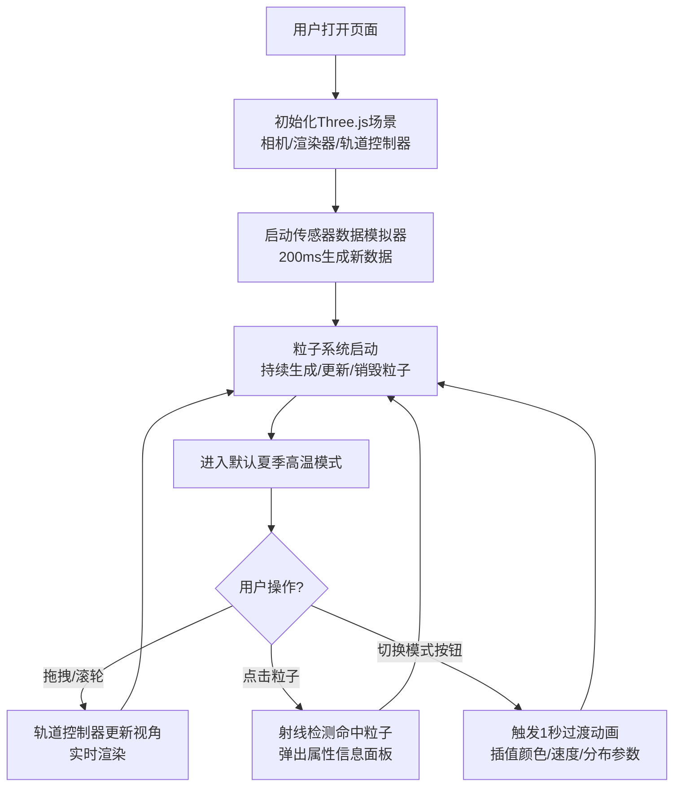

## 1. 产品概述
基于Three.js构建的3D气候粒子系统交互可视化平台，用于科学数据的三维空间直观呈现与探索。
- 核心目标：将抽象的气候传感器数据转化为可交互、可感知的3D粒子动态效果，帮助科研人员和教育工作者直观理解气候模式变化
- 市场价值：填补科学数据三维可视化领域中实时动态粒子系统与气候模式模拟结合的空白，兼具教育展示与科研辅助功能

## 2. 核心特性

### 2.1 用户角色
| 角色 | 使用场景 | 核心权限 |
|------|----------|----------|
| 科研/教育用户 | 气候模式演示、数据分析、教学展示 | 完整交互控制、模式切换、粒子详情查看 |

### 2.2 功能模块
1. **3D粒子气候场景**：2000-2500粒子实时渲染、拖尾辉光、生命周期动画
2. **传感器数据模拟引擎**：200ms周期生成位置/速度/温度/湿度数据
3. **交互式控制面板**：模式切换、FPS监控、粒子计数显示、响应式折叠
4. **粒子交互系统**：点击粒子弹出属性面板、轨道控制器自由漫游

### 2.3 页面详情
| 页面名称 | 模块名称 | 功能描述 |
|----------|----------|----------|
| 主页面（全屏3D场景） | 3D粒子系统 | 实时渲染2000+粒子，颜色随温度渐变，大小随湿度变化，运动带拖尾辉光 |
| 主页面 | 轨道控制器 | 鼠标拖拽旋转视角、滚轮缩放、平移操作，60FPS流畅体验 |
| 主页面 | 粒子信息面板 | 点击任意粒子弹出半透明浮层，显示完整属性（坐标、速度、温度、湿度、剩余生命周期） |
| 主页面 | 气候模式切换 | 夏季高温/冬季寒流/雷暴三种模式，1秒+平滑过渡动画，切换时颜色/速度/分布形态渐变 |
| 主页面 | 控制面板 | 左上角暗色磨砂玻璃风格，模式按钮带脉冲反馈，FPS与粒子计数实时更新 |
| 主页面 | 响应式适配 | 768px断点以下控制面板折叠为浮动图标，点击展开 |

## 3. 核心流程
用户打开页面后自动加载3D场景与粒子系统，默认夏季模式持续运行。用户可通过轨道控制器自由探索三维空间，点击粒子查看详情，通过控制面板切换气候模式观察粒子系统的动态演变。

## 4. 用户界面设计

### 4.1 设计风格
- **主色调渐变**：深蓝紫(#1a1a3e) → 暗青(#0f2847)，控制面板背景使用带透明度的磨砂玻璃效果(backdrop-filter: blur)
- **粒子色谱**：温度冷色(#0066ff蓝)→(#00ffcc青)→(#ffff00黄)→(#ff3300红)暖色渐变
- **按钮风格**：圆角胶囊形，选中态发光描边，切换时scale(1.1)脉冲动画
- **字体**：展示文字使用Orbitron（科技感），正文使用JetBrains Mono，中文回退使用PingFang SC
- **布局风格**：全屏沉浸式3D画布，左上角浮动控制面板，点击粒子时中心偏右弹出信息卡片
- **视觉元素**：控制面板边框微光、粒子拖尾Additive Blending辉光、背景微噪点深空感

### 4.2 页面设计概览
| 页面名称 | 模块名称 | UI元素 |
|----------|----------|--------|
| 主页面 | 3D背景 | 深蓝紫径向渐变背景 + 微弱星点粒子 + 雾效(FogExp2)营造深空氛围 |
| 主页面 | 控制面板（桌面端） | 固定左上角，280px宽，磨砂玻璃(backdrop-filter: blur(16px) saturate(180%))，rgba(15,20,50,0.75)背景，1px半透明白边，内边距20px，模块间距16px |
| 主页面 | 控制面板按钮组 | 三个胶囊按钮横向排列，夏季☀️/冬季❄️/雷暴⛈️emoji+文字，未选中灰蓝色，选中态对应主题色+外发光+脉冲缩放 |
| 主页面 | 数据指标区 | 两行指标卡片，FPS/粒子计数，大号等宽字体数值，小字标签 |
| 主页面 | 粒子信息面板 | 点击出现，右侧320px宽卡片，顶部粒子ID标题，属性网格布局（图标+标签+数值），3秒无操作自动淡出 |
| 主页面 | 移动端浮动按钮 | <768px时控制面板隐藏，右下角显示56px圆形浮动按钮（渐变主题色+控制图标），点击展开抽屉式面板 |

### 4.3 响应式设计
- **桌面优先（>768px）**：完整控制面板固定左上角，信息面板右侧弹出
- **平板（768px-1024px）**：控制面板宽度压缩至240px，字体缩小一级
- **移动端（≤768px）**：控制面板默认隐藏为右下角浮动图标，点击后从底部滑出全屏高度抽屉，信息面板改为底部sheet弹出
- **触摸优化**：按钮最小触控区48px，支持双指捏合缩放、单指滑动旋转

### 4.4 3D场景指导
- **环境与氛围**：深蓝紫深空背景配合FogExp2(0x0a0a2a, 0.0015)指数雾效，营造深远空间感，轻微环境光+半球光
- **光照设置**：AmbientLight(0x404080, 0.4) + HemisphereLight(0x6060ff, 0x202040, 0.5)，不使用强直射光避免过曝粒子
- **相机设置**：PerspectiveCamera(70, aspect, 0.1, 2000)，初始位置(0, 0, 120)看向原点，OrbitControls启用阻尼感(dampingFactor=0.08)
- **构图与焦点**：粒子云团围绕原点球形分布（半径60），夏季模式偏上扩散、冬季偏下收缩、雷暴模式带垂直闪电状分布
- **交互与动画**：粒子生命周期5秒，从0渐入→稳定运动→最后1秒淡出缩小，模式切换使用linear插值1.5秒平滑过渡所有参数
- **后处理效果**：UnrealBloomPass（强度0.6，阈值0.4，半径0.8）实现粒子辉光，轻微FXAA抗锯齿
- **性能预算**：粒子系统使用BufferGeometry + ShaderMaterial + Points，单Draw Call，目标60FPS（每帧<16ms）

