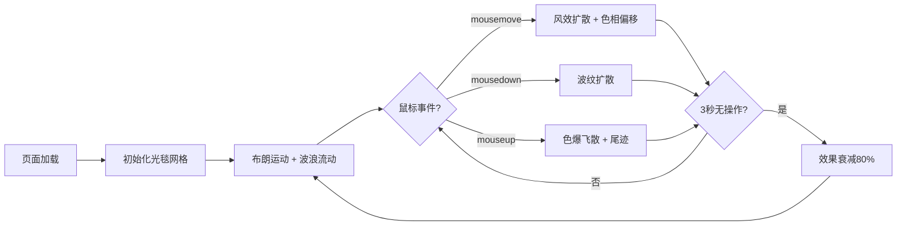

## 1. 产品概述

「液态光毯」是一款在浏览器中运行的交互式生成艺术作品，观众可通过鼠标与一片由数千个动态色块组成的流动光毯进行实时互动。色块像液体一样相互交融、分裂和变形，形成不断变化的抽象图案。

- 主要用途：数字艺术展示、互动体验装置、视觉疗愈
- 目标用户：数字艺术家、艺术爱好者、展览观众
- 市场价值：探索人机交互的边界，创造沉浸式视觉艺术体验

## 2. 核心功能

### 2.1 用户角色

| 角色 | 注册方式 | 核心权限 |
|------|----------|----------|
| 观众 | 无需注册 | 通过鼠标与光毯互动，体验视觉效果 |

### 2.2 功能模块

1. **光毯渲染系统**：六边形色块网格渲染，流动波浪效果，布朗运动
2. **鼠标交互系统**：移动风效、按下波纹、弹起色爆
3. **色彩系统**：冷暖色调渐变、方向色相偏移、饱和度动态变化
4. **物理模拟系统**：色块位移、回弹、尾迹效果
5. **休眠衰减系统**：3秒无操作后效果衰减，恢复休眠状态

### 2.3 功能详情

| 功能模块 | 子模块 | 功能描述 |
|----------|--------|----------|
| 光毯渲染系统 | 六边形网格 | 800-1000个30x30像素六边形色块，错位排列形成蜂窝结构 |
| 光毯渲染系统 | 波浪流动 | 色块基于正弦波计算位置偏移，整体形成流动效果 |
| 光毯渲染系统 | 布朗运动 | 静止时色块做随机微弱位移和颜色变化 |
| 鼠标交互系统 | 移动风效 | 鼠标移动时周围色块向外扩散，速度越快幅度越大 |
| 鼠标交互系统 | 方向色相 | 左偏蓝、右偏红、上偏紫、下偏绿 |
| 鼠标交互系统 | 波纹扩散 | 鼠标按下产生向外扩散的波纹，色块变亮、饱和度提升 |
| 鼠标交互系统 | 色爆效果 | 鼠标弹起50px内色块飞散，带明亮尾迹，1.5秒内回归 |
| 色彩系统 | 基础渐变 | 冷色调（深蓝#1A2B4C到紫罗兰#4A2A6A）过渡到暖色调（暗橙#6B3A1A到深红#4C1A1A） |
| 色彩系统 | 交互色彩 | 交互时变为高饱和对比色（亮蓝、亮绿、亮粉） |
| 色彩系统 | 平滑过渡 | ease-in-out缓动，0.3-1.5秒过渡时间 |
| 物理模拟系统 | 位移回弹 | 色块受外力后弹簧回弹效果 |
| 物理模拟系统 | 尾迹效果 | 色爆时飞散轨迹留下0.5秒尾迹 |
| 休眠衰减系统 | 效果衰减 | 3秒无操作后流动速度降低80% |
| 休眠衰减系统 | 状态恢复 | 逐步恢复布朗运动和微变色休眠状态 |

## 3. 核心流程

用户打开页面 → 光毯初始化，开始布朗运动和波浪流动 →  
用户移动鼠标 → 色块随风扩散，方向产生色相偏移 →  
用户按下鼠标 → 落点产生波纹向外扩散 →  
用户抬起鼠标 → 触以色爆，色块飞散后回归 →  
停止操作3秒 → 效果衰减，恢复休眠状态 →  
等待下一次交互

## 4. 用户界面设计

### 4.1 设计风格

- 主色调：纯黑色背景 #000000
- 配色方案：冷暖渐变光谱，从深蓝到紫罗兰到暗橙到深红
- 交互色：亮蓝 #00D4FF、亮绿 #00FF88、亮粉 #FF44AA、亮紫 #AA44FF
- 无UI控件：全屏沉浸式体验，无按钮、无滚动条
- 视觉风格：液态流体、有机流动、高对比度、梦幻感

### 4.2 页面设计

| 页面 | 模块 | UI元素 |
|------|------|--------|
| 主画布 | 全屏Canvas | 黑色背景、六边形色块网格、流动波浪效果、交互反馈 |

### 4.3 响应式设计

- Canvas 占满整个浏览器视口
- 监听 window.resize 事件动态调整画布尺寸
- 网格列数根据视口宽度自动计算
- 触摸设备支持 touchstart/touchmove/touchend 事件

### 4.4 性能优化

- 基于 requestAnimationFrame 动画循环
- 色块使用离屏缓存减少重复绘制
- 对象池复用减少 GC
- 1080p 分辨率下维持 60 FPS
- 交互响应延迟 < 50ms
- 位置更新频率 ≥ 30次/秒
